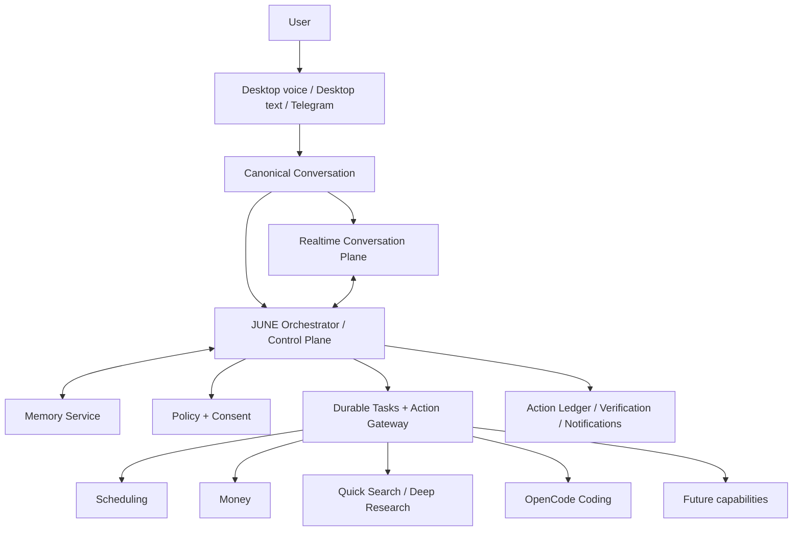

# JUNE Master Architecture

**Version:** 0.1  
**Status:** Founder-approved JUNE 0.1 baseline with Voice, Memory, and Orchestrator system designs  
**Last updated:** 15 August 2026  
**Canonical repository at time of baseline:** `C:\dev\june`  
**Current repository checkpoint:** `04c462571b6cc6251cb08964ad8c940f9af37252`  
**Product name:** JUNE  
**Historical/internal name:** Nightjar

> **Document authority**  
> This document is the top-level architecture baseline for JUNE. It defines product boundaries, system ownership, data authority, safety rules, V1 scope, and migration direction. Detailed subsystem documents and Architecture Decision Records may refine implementation details, but they must not silently contradict this document. Any deliberate override must name the affected section, explain the evidence, and record the new decision.

> **Baseline, not blind permanence**  
> Ownership and safety boundaries in this document are intended to be durable. Time-sensitive provider choices, exact libraries, latency thresholds, embedding models, and retrieval tuning remain reviewable. JUNE must be able to replace providers without replacing JUNE.

> **Versioning policy**  
> The master architecture remains **v0.1 for the entire JUNE 0.1 product baseline**. Normal refinements, added subsystem designs, and implementation clarifications update the Git history and `Last updated` date; they do not increment this document to v0.2 or v0.3. The version changes only when the product architecture moves to a new JUNE release baseline.

## Contents

1. Executive summary  
2. Product definition and strategic thesis  
3. Architecture principles  
4. Scope: baseline product and future product  
5. Current-state baseline  
6. Target system architecture  
7. Cross-system contracts and canonical state  
8. Conversation and channel system design  
9. Voice system design  
10. JUNE Orchestrator system design  
11. Tool and capability system design  
12. Memory system design  
13. Scheduling and reminder system design  
14. Money tracking system design  
15. Telegram channel design  
16. Search and research system design  
17. OpenCode coding capability design  
18. Notifications, identity, data, security, and reliability  
19. Key end-to-end workflows  
20. Baseline product acceptance criteria  
21. Future capability architecture  
22. Migration from the current repository  
23. Implementation order  
24. Decision register and deferred decisions  
25. Risks and architectural safeguards  
26. Glossary  
Appendices: canonical entities, event vocabulary, evidence basis

# 1. Executive summary

JUNE is a voice-first, memory-rich personal assistant intended to become the user's smooth interface to their digital world. The immediate product priority is not broad feature count. It is to make JUNE feel like speaking to a human personal assistant who responds naturally, remembers the user, maintains continuity, and can reliably complete a small set of useful tasks.

The baseline product has three primary product systems:

1. **Voice** - JUNE's human conversation layer.
2. **Memory** - JUNE's durable understanding of the user, relationships, projects, preferences, decisions, and open loops.
3. **Orchestration and capabilities** - JUNE's controlled ability to route work, ask for permission, track tasks, and act through specialised systems.

The initial useful capabilities are deliberately narrow:

- Scheduling, reminders, tasks, and a local calendar.
- Manual money and expense tracking, budgets, summaries, and export.
- Private one-to-one Telegram access to the same JUNE account.
- Quick search and deep research as separate knowledge capabilities.
- OpenCode as a specialised coding capability.

The target architecture separates conversation from action authority:

- **OpenAI Realtime API with `gpt-realtime-2.1`** supplies JUNE Voice V1's live speech-to-speech conversation through WebRTC.
- **JUNE owns the canonical conversation, memory, permissions, tasks, actions, and audit history.** Provider sessions are temporary projections, not systems of record.
- **The JUNE Orchestrator is the control plane.** It routes requests and enforces policy; it does not contain every capability's implementation.
- **Search and research are separate capabilities beneath the orchestrator.** The orchestrator decides when to use them and tracks their lifecycle.
- **OpenCode is the coding specialist.** It is not the permanent universal assistant brain.
- **MCP is an adapter option, not JUNE's complete tool architecture.** JUNE owns capability identity, permissions, task state, action receipts, and retries.

The foundational rule is simple:

> The realtime model may understand and propose. JUNE software authorizes, executes, records, recovers, and remains accountable.



# 2. Product definition and strategic thesis

## 2.1 Product definition

> **JUNE is a voice-first personal operating layer that speaks naturally, remembers the user over time, understands ongoing context, and reliably acts across the user's digital world.**

JUNE should feel less like opening a chatbot and more like speaking to a persistent personal assistant. Over time, it should know the user's people, projects, routines, preferences, communication style, unfinished tasks, and trust boundaries.

## 2.2 Strategic moat

JUNE's defensibility is the combined system, not any single provider or model:

```text
Voice quality x personal context x action depth x accumulated relationship
```

A competitor may use the same frontier models and speech APIs. It should still be unable to recreate six months of the user's corrections, preferences, history, trust, and workflows immediately.

## 2.3 Current priority order

1. Human-feeling realtime voice.
2. Durable, user-controlled personal memory.
3. Voice and text control of a small set of reliable capabilities.
4. Broader digital-world access after trust and reliability are proven.
5. Advanced JARVIS capabilities such as richer vision, CAD, device control, and physical-world interfaces.

## 2.4 Product filter

Roadmap and architecture work should normally pass at least one of these tests:

- Does it make JUNE faster or more natural to speak with?
- Does it improve personal continuity or memory quality?
- Does it let JUNE complete a useful task reliably?
- Does repeated use make JUNE materially better for this user?
- Does it increase trust, control, safety, or recoverability?

# 3. Architecture principles

## 3.1 JUNE owns the user relationship

The canonical user profile, memories, conversations, tasks, permissions, actions, and results must remain in JUNE-controlled systems. OpenAI, Fireworks, OpenCode, Telegram, MCP servers, and future providers receive only the context needed for a bounded operation.

## 3.2 Providers are adapters, not owners

Provider-specific session IDs, events, tool formats, and retention rules stay behind adapter boundaries. JUNE's application logic uses JUNE-owned contracts.

## 3.3 One assistant, specialised systems

The user experiences one JUNE. Internally, JUNE routes work to specialised capabilities: voice, scheduling, finance, research, coding, browser, CAD, and future integrations. Specialisation must not create a fragmented personality or multiple disconnected histories.

## 3.4 Models propose; deterministic software governs

LLMs can infer intent, recommend a capability, plan work, and draft action arguments. They do not directly grant themselves permission or define whether a real-world action succeeded. Deterministic components own:

- Permission checks.
- Idempotency and duplicate protection.
- Task and action state.
- Retries and reconciliation.
- Audit history.
- Secret access.
- Provider routing.

## 3.5 Conversation and action cancellation are different

Stopping JUNE's speech is not automatically pausing or cancelling a background task. The system must distinguish:

```text
stop speaking
pause task
resume task
cancel task
reopen task
restart from scratch
discard task and artifacts
```

The model interprets user intent. The orchestrator performs the state transition. Ambiguous, consequential cases require one short clarification.

## 3.6 Privacy is enforced by architecture

Terms and conditions are not sufficient. JUNE must enforce:

- No intentional cloud microphone audio before activation.
- No cloud voice without consent and valid credentials.
- No permanent raw-audio storage by default.
- Clear local-listening versus cloud-active indicators.
- Minimal provider context.
- User-controlled memory inspection, correction, export, and deletion.
- Accurate statements about encryption and retention; ordinary cloud inference is not described as Signal-style end-to-end encryption.

## 3.7 Progressive autonomy

JUNE earns broader authority gradually. Read-only and low-risk private actions may be automatic. External, destructive, financial, public, or security-sensitive actions require stronger confirmation and audit.

## 3.8 Durable tasks survive conversation changes

Research, coding, scheduling, and future browser or commerce tasks may outlive one voice response or one provider session. They must survive restarts, reconnects, and the user discussing something else.

## 3.9 Single-user first; user-scoped always

V1 is a single-user product, but every important record includes `user_id` from day one. This prevents memory leakage and allows future multi-device or multi-user support without a foundational migration.

## 3.10 One bounded PR per session

Architecture and implementation work follows the established rule: one bounded pull request per session, with explicit scope, acceptance criteria, and stop conditions.

# 4. Scope: baseline product and future product

## 4.1 Baseline product scope

| Area | Included in baseline product |
|---|---|
| Voice | Local wake/audio control, OpenAI Realtime speech-to-speech, shared voice/text chat, interruption, follow-up mode, privacy modes |
| Memory | Founder-approved Memory V1: encrypted local canonical memory, typed and temporal records, provenance, separate conversation evidence, structured/lexical/semantic retrieval, corrections, genuine forgetting, Memory Centre, and Temporary Conversation mode |
| Conversation | Canonical conversations and turns across desktop voice/text; Telegram uses the same account and conversation service |
| Orchestrator | Capability registry, permission engine, durable tasks, action ledger, routing, pause/resume/cancel/reconcile, result routing |
| Scheduling | Tasks, reminders, recurrence, local calendar, completion, rescheduling, desktop/Telegram notifications |
| Money | Manual expense tracking, categories, budgets, recurring expenses, summaries, corrections, deletion, CSV export |
| Telegram | Private one-to-one channel for talking to JUNE, creating reminders/expenses, checking tasks/schedule, research status, and notifications |
| Knowledge | Quick search and deep research as separate capabilities with sources, citations, checkpoints, pause/resume/cancel |
| Coding | OpenCode adapter for repository inspection, coding, diagnostics, tests, and Git under explicit policy |
| Platform | Identity, secure local IPC, secrets, audit, observability, provider adapters, migration, export/deletion foundations |

## 4.2 Explicitly outside baseline scope

- Bank-account scraping, payment initiation, UPI transfers, investments, or regulated financial advice.
- Production email sending, external calendar mutation, public posting, food/grocery ordering, travel booking, or purchases.
- Full browser and operating-system control.
- Group-chat Telegram operation.
- Mobile clients and broad multi-device sync.
- Fully productionized vision/CAD/device-control workflows.
- Dynamic multi-agent teams, autonomous personal app-builder workflows, general computer-use workers, cloud-computer execution, or credential/session brokering.
- Autonomous completion of assessments, identity checks, legal declarations, financial transfers, or other tasks that require the user's personal judgment or presence.
- Cross-device/cloud memory sync, a full knowledge graph, per-user model fine-tuning, multimodal memory, and agent-team procedural memory.
- Supporting every realtime voice provider in V1.

## 4.3 Future capabilities to preserve architecturally

The master architecture must permit, without redesigning the control plane:

- Email reading, drafting, sending, and organisation.
- Google and Microsoft calendars.
- WhatsApp/SMS and other messaging where platform access permits.
- Swiggy food ordering, Instamart/grocery ordering, delivery tracking, substitutions, returns, and refunds.
- Browser tasks, forms, travel research, bookings, and purchases.
- Files, documents, desktop applications, OS settings, and devices.
- Smart-home and phone integration.
- Vision, screen understanding, camera understanding, CAD, and multimodal workspaces.
- Controlled temporary teams of research, coding, testing, privacy/security, and integration workers for complex projects.
- A personal app-builder workflow for bounded requests such as a small game, private period tracker, or nutrition tracker.
- Local-first computer-use workers that can operate browser and desktop interfaces under explicit permissions, with immediate user takeover.
- Optional isolated cloud workers for scheduled tasks when the user's device is unavailable, only through explicit opt-in.
- A credential/session broker, sandboxed worker runtime, verification gate, and agent-activity interface.

Future inclusion in this document is an architectural reservation, not an implementation promise.

# 5. Current-state baseline

## 5.1 Repository and runtime baseline

At the architecture baseline date:

- Canonical repository: `C:\dev\june`.
- Branch and checkpoint: clean `main` at `04c462571b6cc6251cb08964ad8c940f9af37252`.
- OpenCode submodule: `research/opencode`, pinned at `7a8e7c88f495acf5af3e7584e8ec1dbab2fe04ec`.
- Active development environments include `phase2-mcp\venv`, `browser-use-mcp\venv`, `phase-cad\.venv`, the Electron UI dependencies, and OpenCode Bun dependencies.
- The previous Nightjar checkout and temporary audit worktrees were removed after verified recovery and cleanup.

## 5.2 Working product evidence

A founder smoke test on the clean Windows repository confirmed that the Electron application launched and that text chat, BYOK cloud chat, microphone capture, wake activation, speech recognition, TTS, settings, and general UI interaction worked. The CAD setup smoke test also passed. A repeated scheduler `task_poller.py` error was observed but did not block the main app or voice path.

This is meaningful operational evidence, but it is not yet a production acceptance matrix.

## 5.3 Transitional architecture

The current voice path is approximately:

```text
local wake detection
-> fixed command capture
-> local faster-whisper
-> separate hidden OpenCode voice session
-> selected model
-> full buffered reply
-> one Kokoro/Misaki WAV
-> local WebSocket event
-> renderer playback and orb
```

Current limitations include:

- No genuine unified VoiceTurn cancellation.
- No true barge-in; wake scoring is suppressed during playback.
- Voice and typed chat do not share one canonical visible session.
- The complete answer is buffered before speech.
- The local side-channel is unauthenticated.
- Memory and user data are fragmented across several stores.
- OpenCode currently hosts more general-assistant flows than its intended long-term role.
- The real production `Hey JUNE` model remains unresolved.
- Packaging, release operations, and systematic production hardening remain incomplete.

## 5.4 Migration rule

Existing working paths are transitional assets, not disposable code. They should be wrapped behind target interfaces, measured, and replaced incrementally. No large rewrite is authorised merely because the target architecture is cleaner.

# 6. Target system architecture

## 6.1 Layered view

| Layer | Responsibility |
|---|---|
| Channels | Desktop voice, desktop text, Telegram private chat, future channels |
| Local JUNE edge | Wake detection, microphone/speaker control, AEC, VAD/interruption signal, immediate mute, privacy gate, local pre-roll, orb state |
| Realtime conversation plane | OpenAI Realtime API / `gpt-realtime-2.1`, direct audio input/output, natural timing, tone, follow-ups, quick conversational responses |
| Canonical conversation service | Conversations, turns, messages, final transcripts, interrupted-response state, channel mapping, heard/spoken progress |
| JUNE Orchestrator | Intent proposal handling, routing, permissions, durable tasks, action state, retries, reconciliation, notifications, result routing |
| Memory system | Relevant retrieval, profile/context, provenance, corrections, sensitivity, retention, asynchronous memory writes |
| Capability layer | Scheduling, money, quick search, deep research, Telegram adapter, coding/OpenCode, future integrations |
| Shared platform | Identity, secure IPC, secret management, data stores, audit, telemetry, backup/export/deletion, provider adapters |

## 6.1.1 Windows background runtime

Closing the desktop window leaves a single-user JUNE background service running in the Windows system tray. It owns the durable task queue, Telegram long polling, scheduler integration, runtime databases, and capability workers. Explicit `Quit JUNE` stops it through a safe shutdown sequence. JUNE 0.1 does not operate while the PC is off.

## 6.2 Separation of planes

```text
CONVERSATION PLANE
Fast, natural, temporary, interruptible

CONTROL PLANE
Durable, permissioned, accountable, provider-independent

CAPABILITY PLANE
Specialised systems that perform bounded work

DATA PLANE
Canonical user state, history, memories, tasks, expenses, and receipts
```

No provider session is canonical. If OpenAI disconnects, JUNE reconstructs the active conversation from JUNE state.

## 6.3 Primary provider decisions for Voice V1

| Element | Voice V1 decision |
|---|---|
| Provider | OpenAI |
| Service | OpenAI Realtime API |
| Model | `gpt-realtime-2.1` |
| Desktop transport | WebRTC |
| Client credentials | Ephemeral credential; permanent key must not live in the renderer |
| Provider tools | One narrow `june_delegate` handoff, not unrestricted access to all capabilities |
| Canonical provider state | None; provider IDs are metadata only |
| Deeper reasoning | Fireworks-hosted LLM through a JUNE adapter; exact model remains separate and reviewable |
| Coding | OpenCode through a coding capability adapter |

The architecture remains adapter-ready for future challengers, but Voice V1 implements OpenAI only.

# 7. Cross-system contracts and canonical state

## 7.1 Canonical identifiers

Every important operation uses JUNE-owned identifiers:

```text
user_id
conversation_id
voice_session_id
message_id
turn_id
generation_id
task_id
orchestrator_run_id
capability_call_id
action_id
memory_id
notification_id
```

Provider-generated identifiers are stored only as correlated metadata.

## 7.2 Event envelope

A provider-neutral event should include at least:

```json
{
  "schema": "june.event.v1",
  "event_id": "uuid",
  "event_type": "generation.audio.delta",
  "user_id": "uuid",
  "conversation_id": "uuid",
  "voice_session_id": "uuid",
  "turn_id": "uuid",
  "generation_id": "uuid",
  "task_id": "optional-uuid",
  "capability_call_id": "optional-uuid",
  "sequence": 184,
  "causation_id": "uuid",
  "correlation_id": "uuid",
  "privacy_class": "personal",
  "wall_time": "ISO-8601",
  "monotonic_time": "implementation-defined",
  "payload": {}
}
```

Security-critical IDs and policy context are attached by JUNE software, never accepted blindly from a model.

## 7.3 Canonical systems of record

| Domain | Canonical owner |
|---|---|
| User identity and linked channels | JUNE Identity Service |
| Conversations and final messages | JUNE Conversation Service |
| Partial transcripts and audio buffers | Ephemeral VoiceTurn state |
| Memory | JUNE Memory Service |
| Task state and checkpoints | JUNE Durable Task Store |
| Actions and external receipts | JUNE Action Ledger |
| Schedule/reminders | Scheduling Service |
| Expenses and budgets | Money Tracking Service |
| Permission grants and consent | Policy/Consent Store |
| Provider session state | Ephemeral adapter state only |
| Code workspace history | OpenCode/repository, referenced by JUNE action records |

## 7.4 Task and action state

The canonical durable task states are:

```text
PENDING
RUNNING
WAITING_PERMISSION
WAITING_USER
PAUSED
BLOCKED
RECONCILING

COMPLETED
FAILED
CANCELLED
DISCARDED
```

A task describes a durable user objective. Individual capability or external-effect attempts are tracked separately.

- `UNKNOWN` is an **action-attempt outcome**, not a task state.
- A task with an uncertain action enters `RECONCILING`.
- `restart from scratch` creates a new task linked to the old task; it does not rewrite old history.
- Terminal tasks never silently re-enter `RUNNING`.

Effect-bearing actions use a separate write-ahead lifecycle:

```text
PROPOSED
→ VALIDATED
→ APPROVAL_REQUIRED when applicable
→ PREPARED
→ ATTEMPT_STARTED
→ RECEIPT_RECEIVED when available
→ VERIFIED | FAILED_CONFIRMED | UNKNOWN
→ RECONCILING when outcome is uncertain
→ VERIFIED | FAILED_CONFIRMED | COMPENSATED
```

A timeout or disconnect after an external request does not prove failure. JUNE must verify or reconcile before retrying.

## 7.5 Stop, pause, cancel, resume, reopen, restart, and discard

| User intent | Required meaning |
|---|---|
| Stop / be quiet while JUNE speaks | Stop speech only; accepted durable work continues by default |
| Pause the task | Preserve checkpoint and stop new work |
| Resume / continue | Continue the same paused task from checkpoint |
| Cancel the task | Acknowledge cancellation; no new effect-bearing work may begin; preserve recoverable artifacts unless policy says otherwise |
| Reopen cancelled work | Create a new linked task using explicitly retained artifacts/checkpoints |
| Start over / restart from scratch | Create a new linked task without inheriting prior conclusions or completion state |
| Discard / delete it | Remove recoverable task artifacts/state according to retention policy while retaining minimum audit/tombstone records where required |

The model interprets natural language. Deterministic JUNE software performs the state transition. Ambiguous consequential intent requires one short clarification.

# 8. Conversation and channel system design

## 8.1 Purpose

The Conversation System is the canonical home for the user's interaction history across voice and text. It separates durable conversation state from temporary provider sessions.

## 8.2 Voice and desktop text

Voice and typed messages are two input modes for the same visible desktop conversation:

- The orb overlays the active conversation.
- Partial speech transcripts are provisional UI state.
- The final transcript becomes the ordinary user message.
- The assistant response appears in the same conversation.
- Tool activity, confirmations, task progress, and action receipts attach to the same turn.
- When the orb recedes, the conversation remains visible.

## 8.3 Telegram

Telegram is a channel adapter, not a separate assistant. It uses the same user identity, memory, permissions, tasks, and orchestrator. V1 may maintain a Telegram-scoped conversation thread while retaining cross-channel memory and task continuity. The user can reference an existing task from either channel.

## 8.4 Message types

- User text message.
- User final voice transcript.
- Assistant text response.
- Assistant spoken response transcript.
- Interrupted assistant response.
- Confirmation request and response.
- Task progress update.
- Capability result.
- Action receipt.
- Error or recovery notice.
- System status event visible to the user when materially relevant.

## 8.5 Persistence rules

- Partial transcripts are not canonical and are not written to long-term memory.
- Final user transcripts may enter conversation history under the user's privacy policy.
- Assistant messages track `spoken_until` or equivalent so future context does not assume the user heard unplayed text.
- Provider hidden reasoning is never treated as canonical user-visible history.
- Completed tool effects remain attached even if the spoken explanation is interrupted.

# 9. Voice system design

The detailed implementation authority is [`VOICE_SYSTEM_DESIGN.md`](VOICE_SYSTEM_DESIGN.md). This section records the master-level product contract, ownership boundaries, and non-negotiable Voice V1 decisions.

## 9.1 Objective

JUNE Voice V1 should feel like a natural personal assistant: low-latency, emotionally aware from vocal cues, interruptible, able to handle pauses and self-corrections, and continuous across follow-up turns.

## 9.2 Components

| Component | Responsibility |
|---|---|
| Wake service | Local `Hey JUNE` activation and false-wake control |
| Audio front end | Microphone, speaker, device selection, sample conversion, local pre-roll |
| AEC/noise/VAD | Echo cancellation, optional noise suppression, speech onset and interruption signal |
| VoiceTurn controller | Turn identity, state machine, cancellation, stale-event rejection, playback ownership |
| OpenAI Realtime adapter | WebRTC connection, ephemeral credentials, provider event translation, transcripts, audio, cancellation |
| Conversation bridge | Shared desktop conversation, partial/final transcript and interrupted-response semantics |
| Delegation bridge | Narrow `june_delegate` call to the orchestrator |
| Playback engine | Stream buffering, immediate local mute, underrun handling, heard-duration tracking |
| Privacy controller | Natural Conversation Mode, Privacy-Enhanced Mode, clear indicators and fail-closed rules |

## 9.3 Local/cloud boundary

### Inactive

- Wake detection and basic audio activity processing remain local.
- No intentional cloud microphone stream.
- Short pre-roll may exist in volatile memory only.

### Active: Natural Conversation Mode

- A clearly indicated OpenAI realtime session remains open for the active conversation.
- Continuous activated audio allows the best pauses, overlap, follow-up, and barge-in behaviour.

### Active: Privacy-Enhanced Mode

- Local speech detection gates upload during the active conversation.
- The user accepts a possible reduction in conversational smoothness.

In both modes, closing, muting, timing out, or explicitly ending the voice session stops cloud audio.

## 9.4 Interruption contract

When the user takes the floor while JUNE speaks:

1. Local playback is silenced immediately.
2. Queued audio for the old `generation_id` is invalidated.
3. The provider response is cancelled.
4. Late provider audio is dropped unconditionally.
5. The assistant message records what was actually heard.
6. A new user turn opens.
7. Background orchestrator tasks continue unless the user's intent targets them.

## 9.5 Follow-up mode

The user should not repeat `Hey JUNE` after every response. After JUNE speaks, the local edge maintains a clearly indicated, adaptive follow-up window. Exact duration is a tuning decision, not an architecture decision.

## 9.6 Provider delegation

The realtime model receives one conceptual tool:

```text
june_delegate(
  objective,
  capability_hint,
  operation_class,
  desired_result
)
```

It does not receive unrestricted email, browser, calendar, finance, or OpenCode authority.

## 9.7 Voice quality targets

These are provisional product targets until measured on the actual Windows/India deployment:

| Metric | Initial target |
|---|---|
| Wake detected to visible listening state | <=150 ms p95 |
| End of ordinary user turn to first meaningful audio | <=700 ms p50; <=1.2 s p95 |
| Interruption onset to audible silence | <=120 ms p95 |
| Live transcript lag | approximately <=350 ms median |
| Important name/number accuracy | >=97% exact |
| Quiet English WER | <=6% |
| Real-room/noisy English WER | <=10% |
| Blind naturalness target | >=4.2/5 |
| Stale audio after cancellation | zero accepted cases |

## 9.8 Deferred voice decisions

- Exact OpenAI voice preset.
- Detailed personality prompt.
- AEC/VAD library selection.
- Production wake-model technology and training/licensing.
- Exact follow-up timeout.
- Provider challenger implementation after the complete OpenAI product works.

# 10. JUNE Orchestrator system design

## 10.1 Status and authority

The detailed implementation authority is [`ORCHESTRATOR_SYSTEM_DESIGN.md`](ORCHESTRATOR_SYSTEM_DESIGN.md).

The Orchestrator is JUNE's deterministic control plane. It converts authenticated, final user requests into governed work while keeping models, providers, MCP servers, and specialised agents behind JUNE-owned contracts.

> **The model proposes. JUNE validates, authorises, records, executes, verifies, recovers, and remains accountable.**

## 10.2 JUNE 0.1 topology

```text
Voice / Desktop / Telegram
        ↓
Canonical Conversation + Identity
        ↓
Request Intake / Admission
        ↓
Hybrid Router / Planner
        ↓
Plan and Contract Validator
        ↓
Policy / Consent Engine
        ↓
Durable Task Engine
        ↓
Action Gateway
        ↓
Capability adapters
        ↓
Verification / Reconciliation
        ↓
Task State + Action Ledger + Notifications
```

The Windows MVP uses a small JUNE-owned background service and a separate encrypted SQLite runtime database. Closing the window leaves the service running in the system tray; explicit Quit stops it. The MVP does not run while the PC is off.

## 10.3 Core components

```text
RequestIntake
HybridRouter
PlanValidator
CapabilityRegistry
PolicyEngine
ConsentStore
DurableTaskEngine
ResourceBudgetManager
ActionGateway
ActionLedger
VerificationEngine
ReconciliationEngine
ArtifactStore
NotificationRouter
LocalObservability
CapabilityAdapters
```

## 10.4 Work admission

Turn-scoped work normally includes ordinary conversation, bounded memory retrieval, and tiny deterministic lookups.

A durable task is required when work:

- Outlives the current response.
- Has multiple steps or dependencies.
- Waits for permission or user input.
- Is scheduled for later.
- Performs consequential effects.
- Requires retry/recovery/reconciliation.
- Uses a meaningful resource budget.
- Must report a result later.

Only final authenticated user turns or authorised scheduled triggers can create durable/effect-bearing work. Partial voice transcripts can never do so.

## 10.5 Routing and planning

JUNE uses deterministic fast paths for clear commands and a typed model router for ambiguous or compositional requests. Model output is a structured proposal, not executable authority.

Every proposed operation is checked against the trusted Capability Registry for:

- Existence and version.
- Input schema.
- Risk tier.
- Permission requirements.
- Side effects.
- Retry/idempotency class.
- Data-egress policy.
- Budgets and availability.

Unknown or materially ambiguous consequential requests cause one short clarification rather than a guess.

## 10.6 Durable task lifecycle

```text
PENDING
RUNNING
WAITING_PERMISSION
WAITING_USER
PAUSED
BLOCKED
RECONCILING
COMPLETED
FAILED
CANCELLED
DISCARDED
```

Tasks use current-state projections, append-only events, and versioned JSON checkpoints. Safe read-only work may resume after a crash. Uncertain external writes are reconciled before retry.

Every long-running task receives finite limits for:

```text
wall time
model/API spend
model tokens
tool calls
retries
parallel workers
deadline
```

When limits are reached, JUNE preserves progress and asks whether to continue.

## 10.7 Action safety

All effect-bearing work passes through the Action Gateway using:

```text
proposal
→ validation
→ policy
→ exact consent when required
→ PREPARED ledger record
→ execution
→ receipt
→ verification
→ final outcome
```

A timeout means `UNKNOWN`, not automatically failed. External writes are classified as naturally idempotent, keyed idempotent, verify-before-retry, or non-idempotent/unverifiable. Non-idempotent unknown effects are never blindly retried.

## 10.8 Permission tiers

| Tier | Meaning | Default |
|---|---|---|
| R0 | Read-only | Automatic after feature consent |
| R1 | Ordinary reversible local change | Automatic when clearly requested; show result and undo |
| R2 | Protected or consequential local change | Explicit task-scoped approval |
| R3 | External, irreversible, financial, destructive, public, or security-sensitive | Exact-action confirmation immediately before execution; some operations may remain prohibited |

Memory may improve convenience but never grants authority or raises a permission ceiling.

## 10.9 Background runtime and persistence

```text
june_memory.db  — personal memory truth
june_runtime.db — tasks, actions, approvals, checkpoints, notifications
```

The background service is the single owner of the local durable queue. Runtime state is encrypted, versioned, and recoverable. Provider/framework state may be stored only as an adapter checkpoint, never as JUNE's sole task truth.

## 10.10 Initial capability order

1. Fake capabilities and fault injection.
2. Deep Research as the first real durable workload.
3. Scheduling and Money as reversible local writes.
4. OpenCode after policy/action foundations exist.
5. Telegram as a channel over the same canonical tasks and conversations.

## 10.11 What is outside the Orchestrator

- Audio processing and realtime media.
- Memory storage/index/ranking logic.
- Scheduling domain rules.
- Finance/accounting domain truth.
- Search or crawler implementation.
- OpenCode's coding logic.
- Telegram API implementation.
- Browser/CAD/computer-use implementation.

The Orchestrator routes, governs, records, and recovers these systems; it does not absorb them.

# 11. Tool and capability system design

## 11.1 Trusted capability model

Every capability registers a reviewed, versioned JUNE manifest declaring:

- Capability and operation IDs.
- Input/output schemas.
- Runtime and health contract.
- Read/write/long-running class.
- Risk tier and permission scope.
- Side effects and reversibility.
- Pause/resume/cancel behaviour.
- Idempotency and retry class.
- Verification and reconciliation method.
- Secret requirements and data-egress policy.
- Timeouts, default budgets, artifacts, receipts, and deprecation policy.

## 11.2 Standard adapter contract

```text
inspect_contract()
prepare()
execute()
status()
checkpoint()
pause()
resume()
cancel()
verify()
reconcile()
compensate()
```

Unsupported operations are explicit. `prepare()` may resolve and preview an action but cannot create its real-world effect.

## 11.3 Execution authority

No model, provider, MCP server, Research worker, OpenCode worker, Telegram update, memory record, webpage, file, or code comment may bypass the Action Gateway for protected effects.

The model receives the least-privilege subset of operations relevant to the current task. Security-critical IDs and capability tokens are attached by JUNE software.

## 11.4 Retry classes

| Class | Recovery |
|---|---|
| Naturally idempotent | Retry safely within limits |
| Keyed idempotent | Retry exact inputs with the same idempotency key |
| Verify-before-retry | Query actual state; retry only if definitely absent |
| Non-idempotent / unverifiable | Never blind retry; reconcile or ask the user |

## 11.5 Approval binding

Approval binds to the exact canonical action and parameter hash, including recipient, amount, time, address, path, content, destructive scope, task, user, expiry, and risk tier. A material change invalidates the approval.

## 11.6 MCP boundary

MCP remains an interoperability adapter, not JUNE's authority layer:

- Trusted JUNE manifests add policy and execution metadata beyond MCP schemas.
- JUNE validates MCP inputs/outputs independently.
- Remote MCP requires authentication, authorisation, versioning, and trust review.
- Untrusted MCP annotations cannot lower risk or grant permissions.

## 11.7 Capability result

A result includes:

```text
capability_call_id
task_id
action_id
operation
status
effect_state
started_at
completed_at
provider_receipt_id
verification
summary
artifacts
undo_or_compensation_options
privacy_class
```

The assistant's statement that an action completed is never itself proof.

# 12. Memory system design

## 12.1 Status and authority

Memory research is complete and the founder-approved Memory V1 product decisions are final enough for implementation design. The detailed authority is [`MEMORY_SYSTEM_DESIGN.md`](MEMORY_SYSTEM_DESIGN.md). This section records only the master-level ownership, product contract, and non-negotiable boundaries.

The Memory V1 objective is not to store the largest possible amount of personal data. It is to provide ChatGPT-like automatic continuity while remaining time-aware, source-backed, correctable, inspectable, locally owned, and capable of genuinely forgetting information.

## 12.2 Founder-approved product behaviour

- Automatically remember clear, useful, non-sensitive information stated by the user.
- Learn implicit preferences only from repeated evidence; keep them lower-confidence until confirmed.
- Retain encrypted local conversation history separately so JUNE can perform detailed past-chat recall without converting every sentence into a permanent fact.
- Support `global`, `project`, and `conversation` scopes, choosing the narrowest sensible scope by default.
- Ask before making sensitive information durable; never store passwords, OTPs, API keys, recovery codes, private keys, or authentication tokens as memory.
- Use quiet `Memory updated` and `Used memories` affordances rather than interrupting normal conversation.
- Include a searchable Memory Centre in the MVP.
- Support Normal and Temporary Conversation modes in the MVP. Temporary conversations neither read nor write persistent personal memory.
- For the MVP, Telegram memory access requires the user's JUNE PC/service to be running. Always-on cloud memory is deferred.

## 12.3 Ownership and boundaries

| Information | Canonical owner |
|---|---|
| Exact conversation turns and transcripts | Conversation System |
| Durable personal context and preferences | Memory System |
| Tasks, reminders, and completion state | Task/Scheduling System |
| Expenses and budgets | Money Tracking |
| Permissions and consent | Orchestrator Policy Store |
| External effects and receipts | Action Ledger |
| Passwords, tokens, and sessions | Credential/Secret Store |

Memory is evidence, never authority. A remembered preference can improve a proposal, but it cannot authorise a purchase, send a message, delete a file, or expand JUNE's permissions.

## 12.4 Canonical architecture

```text
Final canonical user turn
        |
        +--> asynchronous candidate extraction
        |        |
        |        +--> deterministic write/sensitivity/conflict policy
        |                 |
        |                 +--> encrypted canonical memory store
        |
Current request
        |
        +--> hot context + structured lookup + FTS + dense retrieval
                 |
                 +--> temporal, scope, trust, and sensitivity filters
                          |
                          +--> small provenance-rich memory package
                                   |
                                   +--> Voice / Fireworks / Research / OpenCode
```

The canonical memory store contains atomic typed memories, temporal versions, evidence links, relations, audit events, usage records, and deletion-suppression tombstones. Search indexes, embeddings, caches, summaries, and projections are derived and rebuildable.

## 12.5 MVP storage and retrieval

- **Canonical store:** SQLite encrypted with SQLCipher.
- **Key protection:** a random database key wrapped by Windows DPAPI for the current Windows user.
- **Structured retrieval:** indexed SQLite queries.
- **Lexical retrieval:** SQLite FTS5.
- **Dense retrieval:** a local, derived vector index; LanceDB is the preferred initial candidate, subject to implementation validation.
- **Embeddings:** benchmark a compact local BGE-family model against OpenAI embeddings before final selection.
- **Normal retrieval:** structured + lexical + semantic candidates, followed by deterministic scope, currentness, source-trust, and sensitivity filtering.
- **Voice budget:** usually 4-8 evidence-backed memories and approximately 600-1,200 tokens; ordinary local retrieval targets less than 100 ms p95.

A vector database is never the source of truth. If every derived index is deleted, JUNE must be able to rebuild it from the encrypted canonical database.

## 12.6 Write and update contract

- Partial speech may be used only for speculative reads. It can never create durable memory.
- Candidate extraction begins from the final canonical user turn and runs asynchronously so memory writing adds zero delay to first audio.
- Models propose constrained memory candidates; deterministic JUNE policy chooses `commit`, `pending_confirmation`, `ephemeral_only`, or `discard`.
- Explicit user corrections apply synchronously and supersede old current facts.
- Assistant statements and external webpages/files cannot become durable user facts merely because a model repeated them.
- Repeated evidence may raise confidence, but implicit evidence never silently overrides an explicit user preference.
- Temporal changes retain history. If the user moves from Mumbai to Bengaluru, the Mumbai record becomes previously true rather than being erased as though it was never true.

## 12.7 User control and genuine forgetting

The Memory Centre exposes memory content, category, scope, source, confidence, sensitivity, validity, last use, and cloud-provider egress. Users can inspect, correct, forget, export, and change scope.

Deletion propagates through:

```text
canonical memory
-> FTS/vector indexes
-> hot caches
-> derived summaries and projections
-> relations and usage state
-> suppression tombstone preventing relearning from the same deleted evidence
```

Deleting a conversation offers two distinct operations:

```text
Delete conversation only
Delete conversation and memories learned from it
```

## 12.8 Integration and performance

- A tiny stable profile snapshot may be loaded when a realtime voice session starts.
- Read-only speculative retrieval may begin while speech is stabilising; the final turn determines the actual memory package.
- Ordinary memory misses do not block first audio beyond the memory budget. JUNE answers without memory or starts an explicit Deep Recall task.
- OpenCode receives only project/coding memories. Research receives only context relevant to the research purpose. Neither receives unrestricted personal memory.
- Memory writes and consolidation occur outside the voice critical path.
- `memory_usage` records which memories were used, why they ranked, and whether they were sent to a cloud provider.

## 12.9 Detailed design and acceptance

The standalone design defines schemas, APIs, modes, policy matrices, migration, benchmarks, and the bounded PR sequence. Memory V1 must be evaluated with LongMemEval, LoCoMo, LoCoMo-Plus, Memora, a JUNE-specific longitudinal benchmark, and product-level head-to-head tests against current ChatGPT memory behaviour.
# 13. Scheduling and reminder system design

## 13.1 Baseline scope

- Create, list, modify, complete, pause, resume, and cancel tasks/reminders.
- Date/time and natural-language recurrence.
- Local calendar events.
- Today/this-week agenda.
- Desktop and Telegram notifications.
- Recovery after app restart.
- Timezone-aware operation, initially using the user's configured timezone.

## 13.2 Domain entities

```text
Task
Reminder
LocalCalendarEvent
RecurrenceRule
NotificationDelivery
ScheduleConflict
```

## 13.3 Reliability rules

- Scheduled items are durable and survive app/provider restarts.
- Recurrence expansion is deterministic and testable.
- Completion and rescheduling are idempotent.
- Missed notifications are surfaced after recovery according to policy.
- The scheduler records the planned fire time, actual fire time, and delivery result.

## 13.4 Permission policy

Local reminders and tasks are R1 private reversible writes. Reading the local schedule is R0. External calendar mutation is future R2 and requires provider-specific permission and confirmation policy.

## 13.5 Migration

The current local PIM and reminder implementation should be wrapped as the first scheduling adapter, then consolidated behind canonical task/schedule contracts rather than replaced in one rewrite.

# 14. Money tracking system design

## 14.1 Baseline purpose

Help the user record and understand personal spending through voice, desktop text, or Telegram without connecting to banks or initiating payments.

## 14.2 Baseline capabilities

- Add expense.
- Correct or delete expense.
- Merchant, category, amount, date, payment method, and optional note.
- INR as the initial default currency, with currency stored per record.
- Recurring expenses.
- Budgets and category limits.
- Daily, weekly, and monthly summaries.
- Search and filter.
- CSV export.

## 14.3 Input handling

Example:

```text
“JUNE, I spent Rs 650 on dinner.”
```

The system extracts amount, category, date, and confidence. It asks a short clarification when the amount, currency, or intent is materially ambiguous.

## 14.4 Data model

```text
Expense
Category
Merchant
PaymentMethodReference
RecurringExpenseRule
Budget
BudgetPeriod
FinanceSummary
ExportJob
```

No raw bank credentials or payment secrets belong in this baseline system.

## 14.5 Safety boundary

Baseline money tracking is recordkeeping, not banking or financial action. Excluded:

- Bank scraping.
- UPI or card payments.
- Transfers.
- Investment execution.
- Credit decisions.
- Regulated financial advice.

These require separate legal, security, and product architecture.

# 15. Telegram channel design

## 15.1 Role

Telegram is a secure channel to the same JUNE account, not a separate bot personality or separate memory system.

## 15.2 Baseline functions

- Text JUNE privately.
- Create and check reminders/tasks.
- Add and review expenses.
- Ask schedule questions.
- Ask memory-supported questions.
- Start quick search or deep research.
- Check, pause, resume, or cancel a long-running task.
- Receive reminders, research completion, and task updates.

## 15.3 Identity and linking

- Private one-to-one chats only in V1.
- A one-time secure link flow maps Telegram account/chat identifiers to `user_id`.
- Unlinked chats receive no personal data.
- Group chats are denied or isolated until separately designed.
- Bot tokens are secret and never exposed to the renderer or logs.

## 15.4 Conversation continuity

Telegram messages use the canonical conversation service and same memory/task state. A Telegram-specific conversation may be maintained for usability, while tasks and memories remain cross-channel. Results must return to the initiating channel unless the user has configured cross-channel notification preferences.

## 15.5 Migration

The existing separate Telegram scheduler is treated as a prototype. Its useful logic may be adapted, but baseline architecture connects Telegram directly to JUNE identity, conversation, orchestrator, schedule, and notifications.

# 16. Search and research system design

## 16.1 Boundary

Search and research are separate capabilities under the orchestrator, grouped as the **Knowledge Acquisition System**. They are not embedded inside the orchestrator.

## 16.2 Quick Search

Use for a bounded, current lookup:

- Current fact, weather, price, schedule, or status.
- One or a small number of sources.
- Fast completion within the active conversation when practical.

## 16.3 Deep Research

Use for:

- Multi-source comparison.
- Cited reports.
- Open-ended investigation.
- Long-running work.
- Checkpointing, pause, resume, cancel, reopen, and restart.

Deep research may combine search, page retrieval, source extraction, browser tools, citation validation, and Fireworks reasoning.

## 16.4 Research task state

A research task preserves:

```text
original objective
scope and constraints
sources found
source quality/provenance
notes and extracted evidence
completed questions
remaining questions
checkpoint
current synthesis
final report
```

## 16.5 Source integrity

- Current factual claims require current sources.
- Every material claim in a research report carries provenance.
- Provider/model output is not itself a source.
- The user can inspect sources and task progress.
- Research artifacts remain attached to the durable task, not only to a transient voice session.

# 17. OpenCode coding capability design

## 17.1 Role

OpenCode is JUNE's specialised software-engineering capability. It is not the canonical personal-assistant runtime.

## 17.2 Supported work

- Inspect repositories and project files.
- Plan code changes.
- Edit code.
- Run diagnostics and tests.
- Work with Git under policy.
- Produce diffs, commits, and implementation summaries where authorised.

## 17.3 Orchestrator interface

A conceptual call:

```text
coding.execute(
  workspace,
  objective,
  allowed_paths,
  command_policy,
  git_policy,
  time_budget,
  model_policy
)
```

A structured result:

```text
status
files_changed
diagnostics
tests
diff
commit_or_pr_reference
summary
artifacts
```

## 17.4 Security

- Workspace and path allowlists.
- Shell and network policy.
- Explicit approval for writes and Git mutations according to project rules.
- No access to unrelated personal-memory or finance stores.
- Results return through the orchestrator and conversation system.

# 18. Notifications, identity, data, security, and reliability

## 18.1 Notification system

A shared notification router supports:

- Desktop notification.
- In-app conversation update.
- Telegram message.
- Future mobile, email, or voice notification.

Notifications carry user, task, urgency, privacy, preferred channels, and delivery status. A notification is not proof that the user saw it.

## 18.2 Identity

- V1 single user, all records scoped by `user_id`.
- Secure channel linking.
- Future devices receive device identity and revocable authorisation.
- Memory and capability data must never cross user boundaries.

## 18.3 Logical data stores

| Store | Data |
|---|---|
| Identity/Consent | User, linked channels, permissions, privacy modes |
| Conversation | Conversations, turns, final messages, interruptions, references |
| `june_memory.db` | Durable memories, evidence, temporal versions, deletion tombstones, usage audit; FTS/vector indexes remain derived |
| `june_runtime.db` | Durable tasks, task events, checkpoints, action proposals/attempts, approvals, permission grants, budgets, capability health, notification delivery, outbox/inbox dedupe |
| Scheduling | Reminder/task domain truth: due times, recurrence, deliveries, completion |
| Money | Expense and budget domain truth, summaries, exports |
| Capability Config | Trusted manifests, provider selection, versions, health, egress policy |
| Encrypted Artifact Store | Research notes/reports, code diffs/test logs, large checkpoints, receipts |
| Operational Telemetry | Content-free spans, errors, latency, usage; cloud export off by default |

The Memory and Runtime databases remain separate even if both use SQLCipher/DPAPI infrastructure. Task/action recovery must not risk personal-memory truth, and memory migrations must not alter action history. Service boundaries remain authoritative even where SQLite is reused.

## 18.4 Secure local control plane

The current unauthenticated loopback side-channel must not become the action/control backbone. The target is:

```text
Windows named pipe or equivalently secured local IPC
+ current-user/process ACL
+ high-entropy per-run secret
+ protocol-version handshake
+ sequence numbers
+ authenticated messages
+ stale/replay rejection
```

## 18.5 Secrets

- Permanent provider keys stay outside the renderer.
- OpenAI client access uses ephemeral credentials.
- OAuth tokens and refresh tokens use OS-backed secret storage where available.
- Secrets never appear in ordinary telemetry.
- Capability services receive only the secrets needed for their operation.

## 18.6 Data classifications

```text
PUBLIC
OPERATIONAL
PERSONAL
SENSITIVE
SECRET
```

Normal production telemetry must not contain raw audio, full transcripts, memory contents, email bodies, or secrets by default.

## 18.7 Observability

Each turn/task records content-free timing and state transitions, including:

```text
wake_detected
speech_started
turn_opened
transcript_final
memory_retrieval_finished
delegate_accepted
action_started
action_committed
first_audio
playback_started
interruption_detected
playback_stopped
task_completed
```

Key metrics:

- Voice end-to-end latency and interruption latency.
- False and missed endpointing.
- Task success and failure.
- Duplicate side effects: hard target zero.
- Permission correctness.
- Routing accuracy.
- Memory relevance and correction rate.
- Scheduler delivery delay.
- Provider disconnect and recovery.
- Cost per successful conversation/task.

## 18.8 Reliability principles

- Durable tasks survive process and provider restarts.
- Provider sessions are reconstructable.
- All writes are idempotent where possible.
- Unknown effects are reconciled before retry.
- Privacy fails closed.
- Degraded modes are explicit, never silent provider/privacy switches.
- Tests use fake providers and deterministic event timing before real-device acceptance.

# 19. Key end-to-end workflows

## 19.1 Natural voice conversation

```text
User says “Hey JUNE”
-> local wake activates
-> orb shows active listening
-> JUNE opens OpenAI Realtime session
-> user speaks
-> final transcript is written to shared conversation
-> OpenAI responds with live audio
-> assistant transcript appears in same chat
-> follow-up window remains active
```

## 19.2 Memory-supported question

```text
User asks a personal-context question
-> realtime model delegates or JUNE detects memory need
-> orchestrator requests bounded relevant memory
-> memory service returns evidence + provenance
-> answer context is supplied to OpenAI
-> JUNE responds naturally
-> “used memories” can be inspected
```

## 19.3 Scheduling through voice

```text
“Remind me tomorrow at 8 to call Rahul”
-> conversation turn opens
-> june_delegate(scheduling, write)
-> policy classifies local reversible write
-> scheduling service creates reminder idempotently
-> action ledger records committed reminder
-> OpenAI says confirmation naturally
-> desktop/Telegram notification fires at scheduled time
```

## 19.4 Expense through Telegram

```text
Telegram: “Spent Rs 650 on dinner”
-> linked user identified
-> money capability extracts amount/category/date
-> ambiguous fields clarified if needed
-> expense committed
-> action receipt attached to Telegram conversation
-> JUNE replies with concise confirmation
```

## 19.5 Deep research and interruption

```text
“Research dinosaur evolution deeply”
-> deep research task created
-> OpenAI acknowledges naturally
-> research continues durably
-> user says “Stop” while JUNE speaks
-> speech stops; research continues
-> user says “Pause the dinosaur research”
-> task checkpoint saved and status becomes PAUSED
-> “Resume it” continues same task
-> “Start over” creates a new task
```

## 19.6 Coding request

```text
“Fix the failing tests in this repository”
-> orchestrator routes to coding capability
-> policy applies workspace, shell, network, and Git constraints
-> OpenCode executes bounded coding work
-> tests/diff/result return to orchestrator
-> action record and result appear in the initiating conversation
```

# 20. Baseline product acceptance criteria

The baseline product is ready for founder acceptance when all of the following are demonstrated on the target Windows machine:

## 20.1 Voice

- Voice and typed chat share one visible conversation.
- OpenAI realtime conversation works across normal multi-turn use.
- The user can interrupt and JUNE becomes silent quickly.
- Old audio never resumes after interruption.
- Follow-up works without repeating the wake phrase every turn.
- Both privacy modes behave as described.
- No intentional pre-activation cloud microphone traffic.

## 20.2 Memory

- JUNE automatically remembers clear, useful, non-sensitive information under the approved write policy.
- Encrypted local conversation history supports detailed past-chat recall without becoming the canonical personal-memory store.
- Global, project, and conversation scopes prevent unrelated context leakage.
- The user can inspect, correct, forget, export, and explain memory usage through the Memory Centre.
- Temporary Conversation mode neither reads nor writes persistent personal memory.
- Partial transcripts, assistant claims, external content, secrets, and unapproved sensitive facts cannot create durable memory.
- Explicit corrections affect the very next turn and superseded memories are not returned as current.
- Deletion removes active canonical/index/cache representations and prevents silent relearning from the same deleted evidence.
- Ordinary local retrieval remains below the approved latency budget and does not delay memory writes onto the voice critical path.
- JUNE-MemBench and public memory benchmarks demonstrate a measurable gain over no-memory, raw-history-only, lexical-only, and dense-only baselines.
## 20.3 Orchestrator and tools

- Every capability call passes through policy and the action ledger.
- Pause, resume, cancel, reopen, restart, and discard behave distinctly.
- A cancelled voice response does not incorrectly cancel or duplicate a durable task.
- Duplicate external or local writes are prevented in automated tests.

## 20.4 Baseline capabilities

- Scheduling/reminders survive restart and notify through configured channels.
- Expense entry, correction, summaries, budgets, and CSV export work.
- Telegram private channel uses the same user, tasks, memory, and orchestrator.
- Quick search and deep research return sources and durable results.
- OpenCode coding work is routed as a specialised capability.

## 20.5 Security and reliability

- Security-sensitive local messages cannot be forged through the old unauthenticated path.
- Provider credentials do not exist in renderer-visible storage.
- App/provider/network restart tests recover without state corruption.
- No secret or raw personal content appears in normal telemetry.
- Data export and deletion pathways exist for baseline user data.

# 21. Future capability architecture

## 21.1 Email and messaging

Future email capability should separate read, draft, and send. Sending requires explicit confirmation by default, final recipient/subject/content visibility, idempotency, and provider receipts. Messaging platforms follow similar rules.

## 21.2 External calendars

Google/Microsoft calendar adapters sit behind the same scheduling contract. Read operations may become automatic after consent; event mutation follows external-write policy and conflict handling.

## 21.3 Swiggy, Instamart, groceries, and commerce

A future ordering capability must present before commitment:

- Merchant and items.
- Final quantity and substitutions.
- Delivery address.
- Delivery time.
- Taxes, fees, and final total.
- Payment method.
- Explicit confirmation.

The action ledger must preserve order receipts and prevent duplicate submission. “Stop talking” never cancels or repeats an already committed order. Autonomous recurring purchases are not assumed.

## 21.4 Browser, files, forms, and desktop control

These capabilities require authenticated local control, strong prompt-injection resistance, sandboxing, preview/confirmation, and undo or compensation where possible.

## 21.5 Vision and CAD

Existing prototype vision and CAD systems remain specialised capabilities. Production integration requires explicit input provenance, user-visible artifacts, capability-specific permissions, and safe execution boundaries.

## 21.6 Travel and booking

Research and itinerary preparation may precede booking capability. Booking becomes a consequential commerce action with price, dates, traveller details, cancellation policy, and explicit confirmation.

## 21.7 Controlled agent teams and project execution

Future JUNE may create a temporary team of specialised workers when a project genuinely benefits from parallel work or independent verification. The user continues to interact with one JUNE; worker identities are an internal execution detail managed by the JUNE Orchestrator.

A future team may include:

- A research worker for requirements, evidence, alternatives, and domain constraints.
- A product/architecture worker for scope, interfaces, and implementation planning.
- One or more isolated coding workers, with OpenCode as the default software-engineering capability.
- A test and verification worker that does not merely trust the builder's claims.
- A privacy/security worker for sensitive products such as health, finance, or identity-related applications.
- An integration worker that reconciles artifacts and produces one verified result.

JUNE must use the smallest effective team. A small task may use one builder and one verifier; it must not create an expensive or conflicting swarm by default. Every worker receives a bounded objective, least-privilege tools, an isolated workspace or Git worktree where appropriate, time/cost limits, a cancellation token, checkpointed outputs, and explicit acceptance criteria. Shared artifacts are registered canonically, concurrent edits are isolated, and integration occurs only through a verification gate. External multi-agent frameworks may implement parts of this system, but JUNE owns the project, task, permission, artifact, and audit contracts.

## 21.8 Personal App Builder

A future Personal App Builder may turn a request such as “build me a small game,” “build me a private period tracker,” or “build me a nutrition tracker” into a durable project. The workflow may perform requirements clarification, research, architecture, implementation, testing, privacy review, packaging, and delivery through controlled specialist workers.

The builder must:

- Create a project and preserve the user's objective, constraints, decisions, and artifacts.
- Use sandboxed workspaces and explicit file, command, network, and Git policies.
- Apply stronger privacy and security gates to health, finance, identity, or other sensitive applications.
- Verify that the produced application runs and that important claims are supported by tests or inspection.
- Present the result, limitations, files changed, tests, permissions, and deployment options to the user.
- Require user approval before publishing, deploying, purchasing infrastructure, or connecting real personal data.

## 21.9 Computer-use and digital task execution

A future Computer-Use capability may operate websites and desktop applications when no reliable official API exists. JUNE should prefer official APIs and structured integrations first, then controlled browser or desktop interaction as a fallback.

The default execution mode should be local on the user's device so existing sessions remain under the user's control and the user can watch or take over. An isolated cloud computer may be offered later for scheduled work when the user's device is unavailable, but only as a separate explicit opt-in with a clearly disclosed data and credential boundary.

Computer-use tasks require:

- A durable `task_id`, action ledger, checkpoints, progress, pause/resume/cancel/restart, and recovery after process or provider failure.
- Local hard stop and user takeover controls.
- Preview and confirmation before consequential submission, payment, deletion, public posting, external communication, or account changes.
- Reconciliation and receipts so a timeout cannot cause duplicate orders, messages, bookings, or form submissions.
- Strong prompt-injection resistance and separation between untrusted page content and JUNE's permissions.
- Compliance with platform rules; JUNE must not bypass CAPTCHA, MFA, identity verification, or access controls.

JUNE may open a learning service, navigate to the requested lesson, remind the user, explain material, and assist interactively. It must not silently impersonate the user to complete quizzes, examinations, certifications, identity checks, legal declarations, or other tasks whose value depends on the user's own judgment or performance.

## 21.10 Credential and session broker

Future computer-use and external integrations require a JUNE-owned credential and session broker. Preferred access order is:

1. Official OAuth or delegated API access.
2. An existing authorised browser session.
3. A JUNE-specific isolated browser profile.
4. Manual user login or takeover when required.

Raw passwords, MFA secrets, payment credentials, and long-lived tokens must not be placed in model prompts, ordinary logs, or worker-visible context. The broker supplies narrowly scoped, expiring access to the authorised worker and records which capability used it. Cloud-worker access must be separately consented and must not silently reuse a local session.

## 21.11 Human approval, verification, and activity visibility

Future agent teams and computer-use workers require a common user-control surface. JUNE should show, in product-appropriate detail:

- Which project, task, or worker is active.
- Current objective, progress, checkpoint, and blockers.
- Permissions requested and actions awaiting confirmation.
- Files or records changed, external effects committed, and receipts received.
- Time and cost consumption where material.
- Pause, resume, cancel, restart, discard, and take-over controls.
- Verification results and unresolved limitations.

A builder's completion claim is not sufficient. A separate verification step must check the artifact or external outcome before JUNE reports success. The future delivery order should remain conservative: one controlled worker, then an independent verifier, then small fixed teams, then local computer use for an allowlist of low-risk tasks, followed by credential brokering, scheduled workers, optional cloud workers, and only later dynamic team composition.

# 22. Migration from the current repository

## 22.1 Migration strategy

```text
Current working services
-> compatibility adapters
-> canonical JUNE contracts
-> gradual state migration
-> remove hidden/duplicate paths after acceptance
```

## 22.2 Preserve temporarily

- Existing Electron/React UI and orb.
- Current wake/audio path as a measured fallback during migration.
- Existing PIM/scheduler logic behind an adapter.
- Existing memory implementation behind a temporary memory adapter.
- Existing search, research, browser, CAD, and image/vision capabilities.
- Existing OpenCode submodule for coding and temporary compatibility flows.

## 22.3 Move out of OpenCode first

- Canonical user conversation ownership.
- Voice-turn lifecycle.
- Permission and consent authority.
- Durable personal-assistant task state.
- Scheduling and finance domain records.
- Telegram identity/channel handling.
- General action ledger.

## 22.4 Retire only after replacement proof

- Hidden voice-only session.
- Full-answer single-WAV voice path.
- Unauthenticated side-channel for consequential events.
- Fragmented canonical ownership across localStorage/OpenCode/provider state.
- Local-first defaults that contradict the cloud-quality product direction.

# 23. Implementation order

The order below follows dependency structure and the one-bounded-PR-per-session rule. The Voice, Memory, and Orchestrator subsystem documents are implementation authorities; this master document controls ownership and cross-system ordering.

## Phase 0 - Architecture authority

1. Merge `JUNE_MASTER_ARCHITECTURE.md` as the stable JUNE 0.1 master.
2. Merge `VOICE_SYSTEM_DESIGN.md`, `MEMORY_SYSTEM_DESIGN.md`, and `ORCHESTRATOR_SYSTEM_DESIGN.md`.
3. Inventory current repository services, stores, IPC channels, OpenCode/MCP flows, scheduler, Telegram, and memory sources.

## Phase 1 - Core contracts and visibility

1. Baseline instrumentation for the current working voice and task paths.
2. Canonical IDs, event envelope, conversation/turn model, privacy classes.
3. VoiceTurn controller with cancellation and stale-event rejection.
4. Shared voice/text conversation and interrupted-response semantics.
5. Secure local IPC/control channel and background-service single-owner lease.

## Phase 2 - Deterministic agency foundation

1. Foundation task/action/capability/approval contracts.
2. Orchestrator facade around current behaviour.
3. Encrypted `june_runtime.db`, migrations, events, checkpoints, outbox/inbox dedupe.
4. Trusted Capability Registry and schema validation.
5. Hybrid routing and plan validation.
6. R0–R3 Policy/Consent Engine with exact proposal-bound approvals.
7. Action Gateway, Action Ledger, retry classes, verification and reconciliation.
8. Crash recovery, pause/resume/cancel/restart lineage, budgets and deadlines.
9. Fake capability harness, process-kill campaigns, idempotency and uncertainty tests.

## Phase 3 - Voice V1

1. OpenAI Realtime adapter using WebRTC and ephemeral credentials.
2. Natural multi-turn voice through the shared conversation.
3. Narrow `june_delegate` integration with the Orchestrator.
4. True local interruption, provider cancellation, heard-duration tracking, echo handling, and follow-up mode.
5. Natural Conversation and Privacy-Enhanced modes.

## Phase 4 - Memory V1

1. Introduce the provider-independent Memory Broker around existing behaviour without migrating data.
2. Add encrypted canonical schema, DPAPI-wrapped key, migrations, corrections, deletion, and suppression-tombstone tests.
3. Add deterministic write policy and fake extractor; reject partial speech, assistant claims, external content, secrets, and unapproved sensitive data.
4. Add asynchronous extraction from final turns and FTS5 lexical retrieval.
5. Add local embedding adapter and rebuildable dense index; promote hybrid retrieval only after benchmark evidence.
6. Add Memory Centre, Temporary Conversation mode, provenance, `Used memories`, export, and full forgetting.
7. Run shadow retrieval, JUNE-MemBench, public benchmarks, human tests, and controlled legacy cutover.

## Phase 5 - Baseline capabilities

1. Deep Research adapter as the first real durable workload.
2. Scheduling adapter and durable notifications.
3. Money Tracking domain and reversible local-write flows.
4. OpenCode coding adapter under bounded workspace, policy, and ledger controls.
5. Telegram private channel, secure linking, update dedupe, approvals, and notifications.
6. Quick Search adapter and final Knowledge Acquisition integration.

## Phase 6 - Product hardening

1. Production `Hey JUNE` wake model and acoustic testing.
2. Windows sleep/resume, device changes, noise/echo, long sessions, reconnects, provider outages, and background-service recovery.
3. JUNE-OrchBench, JUNE-MemBench, voice acceptance, fault injection, privacy-egress tests, and soak tests.
4. Security, retention, export/deletion, CI, packaging, signing, update/rollback, backup/restore, and release acceptance.
5. Only after the complete OpenAI product works: benchmark Qwen and other challengers through the same adapter contract.

# 24. Decision register and deferred decisions

## 24.1 Final baseline decisions

| Decision | Status |
|---|---|
| Product priority is voice and memory | Final |
| OpenAI is Voice V1 provider | Final for V1 |
| `gpt-realtime-2.1` is Voice V1 model | Final for V1; reverify availability before integration |
| WebRTC is desktop media transport | Final for OpenAI V1 |
| Wake/audio privacy controls remain local | Final |
| Voice and desktop text share one visible conversation | Final |
| Two active voice privacy modes are user-selectable | Final |
| JUNE owns canonical conversation, memory, tasks, actions, and permissions | Final |
| Orchestrator is deterministic control plane, not one unrestricted model | Final |
| JUNE 0.1 uses a small local SQLite-backed durable task engine rather than a third-party global workflow runtime | Final for Windows MVP |
| Closing the window keeps the single-owner background service running in the Windows tray; explicit Quit stops it | Final |
| `june_runtime.db` remains separate from `june_memory.db` | Final |
| Action Gateway is the sole path for protected effects | Final |
| Permission tiers are R0 read, R1 reversible local write, R2 protected local change, and R3 external/irreversible/high-impact | Final |
| Approval is bound to exact canonical action parameters and expires/is single-use | Final |
| Unknown external outcomes are reconciled and never blindly retried | Final |
| Restart creates a new task with lineage; `UNKNOWN` belongs to an action attempt, not task state | Final |
| Every durable task has finite time/cost/tool/retry/parallelism/deadline budgets | Final |
| Safe well-scoped work begins immediately; proactivity is limited to approved reminders/status/failures/approvals/budget alerts | Final |
| Fake capabilities and fault injection precede risky real capability integration | Final |
| Search/research are separate capabilities beneath orchestrator | Final |
| OpenCode is coding specialist | Final target role |
| V1 capabilities: scheduling, money, Telegram; search/research and coding integrated | Final baseline scope |
| Email, external calendars, Swiggy/grocery, devices, deeper browser/files, vision/CAD production are future | Final scope classification |
| Controlled agent teams and a Personal App Builder are future capabilities beneath the orchestrator | Final architectural reservation; detailed design deferred |
| Computer use is API-first and local-worker-first; cloud workers require explicit opt-in, secure sessions, and user takeover | Final architectural reservation; detailed design deferred |
| JUNE will not silently complete assessments, identity checks, legal declarations, or other non-delegable personal acts | Final future safety boundary |
| Single-user first, `user_id` everywhere | Final |
| Memory V1 uses automatic useful non-sensitive memory plus cautious repeated-evidence inference | Final |
| Encrypted local conversation history remains separate evidence for detailed recall | Final |
| Memory scopes are global, project, and conversation | Final |
| Sensitive durable memory requires explicit consent; secrets are never memory | Final |
| Memory Centre and quiet memory-use/update indicators are MVP features | Final |
| Normal and Temporary Conversation modes are MVP features | Final |
| Telegram memory access requires the user's JUNE PC/service to be running in the MVP | Final |
| SQLCipher-backed SQLite is the canonical Memory V1 store; DPAPI wraps the local key | Final for Windows MVP |
| FTS5 and dense/vector representations are derived, rebuildable indexes rather than canonical truth | Final |
| Models may propose memory; deterministic JUNE policy commits or rejects it | Final |
| Durable memory writes occur only from final canonical turns | Final |
| Memory is evidence and never grants action permission | Final |
| Genuine forgetting propagates across active representations and prevents relearning from the same evidence | Final |

## 24.2 Provisional implementation decisions

- Exact OpenAI voice and personality prompt.
- Exact Fireworks reasoning model.
- Exact backend module/process placement for the Orchestrator inside the current repository.
- Exact SQLite journal/concurrency settings after target-Windows testing.
- Initial expensive-task concurrency and action-ledger retention period.
- Exact internal Research framework and OpenCode worktree/sandbox mechanism.
- Exact AEC/VAD/wake implementation.
- Follow-up timeout.
- Exact local embedding model and whether LanceDB remains the winning dense-index implementation after JUNE-MemBench.
- Retrieval-fusion coefficients and whether a reranker is justified by measured quality.
- Backup-retention duration and legacy-memory migration cut-over timing.
- Notification delivery policy details.
- Exact Telegram linking UX.

## 24.3 Required future research

The broad Voice, Memory, and Orchestrator architecture research is complete for JUNE 0.1. Remaining research is targeted validation or future-scope work:

- Memory V1 implementation benchmarking: local embeddings versus OpenAI baselines, hybrid retrieval, JUNE-MemBench, and ChatGPT parity tests.
- Future memory sync/cloud trust model for 24/7 Telegram and multi-device operation.
- Advanced episodic consolidation, graph/multi-hop retrieval, procedural memory, and per-user ranking models only after MVP evidence.
- Production wake model training/licensing and negative-corpus testing.
- Detailed Indian privacy/legal and provider-retention review before launch.
- Future commerce/email/browser threat models.
- Agent-team coordination, worker isolation, artifact integration, verification, and cost/quality evaluation.
- Computer-use architecture, prompt-injection defence, local-versus-cloud workers, credential/session brokering, human takeover, and platform-policy review.
- Product policy for non-delegable educational, identity, legal, financial, and safety-critical tasks.
- Provider comparison after complete Voice V1.

# 25. Risks and architectural safeguards

| Risk | Safeguard |
|---|---|
| Provider lock-in | JUNE-owned adapter/event contracts and canonical state |
| Voice sounds natural but actions are unreliable | Separate conversation and deterministic action planes |
| Old audio plays after interruption | `turn_id`/`generation_id`, local queue purge, stale-event rejection |
| Duplicate external actions after timeout | Idempotency key, `UNKNOWN` state, reconciliation before retry |
| Memory becomes inaccurate or invasive | Provenance, confidence, corrections, sensitivity, user controls, no partial-STT writes |
| Orchestrator becomes a giant opaque agent | Small deterministic core; specialised capabilities; structured proposals |
| OpenCode expands into universal authority | Coding-only target interface and capability isolation |
| Telegram leaks personal data | Secure account linking, private-chat V1, user scoping, secret isolation |
| Search/research results lose provenance | Source capture and citation requirements in Knowledge Acquisition System |
| Finance scope drifts into payments | Explicit baseline exclusion and separate future architecture gate |
| Local process forges actions | Secure IPC with ACL, per-run authentication, sequencing, replay protection |
| Cloud microphone activates silently | Fail-closed consent and visible local/cloud states |
| Current working product is broken by rewrite | Adapter migration, instrumentation, one bounded PR, retire only after proof |
| Agent teams multiply cost, conflict, or unsupported claims | Smallest effective team, bounded roles/workspaces/budgets, canonical artifacts, independent verification, integration gate |
| Computer-use worker leaks credentials or performs the wrong external action | API-first access, credential/session broker, least privilege, preview/confirmation, local default, receipts, reconciliation, and user takeover |
| Agent impersonates the user for an assessment or protected personal decision | Non-delegable-task policy, user participation, and mandatory handoff at MFA, CAPTCHA, identity, legal, or assessment boundaries |
| Architecture document becomes stale | Stable JUNE 0.1 version label, Git history, last-updated date, ADR override process, and updates on ownership/scope changes |

# 26. Glossary

**Action Ledger** - Canonical record of proposed, authorised, started, committed, failed, unknown, or reconciled real-world effects.

**Capability** - A bounded specialised system, such as scheduling, research, money, or coding.

**Canonical state** - The authoritative JUNE-owned record used to recover and continue operation.

**Conversation plane** - Low-latency voice/text interaction layer.

**Control plane** - Orchestrator, policy, task, action, and routing systems.

**Durable task** - Work that survives provider sessions, conversation turns, and process restarts.

**Generation** - One assistant response attempt for a user turn.

**JUNE Orchestrator** - Deterministic control plane that routes, authorises, tracks, and reconciles capability work.

**MCP** - A protocol/adapter option for connecting tools; not JUNE's full capability architecture.

**OpenCode** - Specialised coding agent used beneath the coding capability.

**Provider adapter** - Boundary translating a vendor API into JUNE-owned events and contracts.

**Realtime model** - Cloud model that receives and emits live audio during an active conversation.

**Turn** - One user conversational contribution and the related JUNE response lifecycle.

**VoiceTurn** - JUNE-owned state machine connecting audio, transcripts, generation, playback, cancellation, and turn identity.

**Agent Team** - A temporary, bounded set of specialist workers coordinated by JUNE for a project that benefits from parallelism or independent verification.

**Computer-Use Worker** - A permissioned local or opt-in cloud worker that operates a browser or desktop interface when a structured API is unavailable.

**Credential and Session Broker** - JUNE-owned security service that supplies narrowly scoped, expiring authorised sessions without exposing raw credentials to models or workers.

**Verification Gate** - Independent check required before JUNE reports that a generated artifact or external action succeeded.

# Appendix A. Canonical entities

```text
User
Device
LinkedChannel
ConsentGrant
PermissionGrant
Conversation
Message
Turn
Generation
VoiceSession
Memory
Task
TaskCheckpoint
CapabilityManifest
CapabilityCall
Action
ActionReceipt
Reminder
LocalCalendarEvent
Expense
Budget
ResearchArtifact
Notification
ProviderSessionMetadata
AuditEvent

FutureAgentTeam
FutureWorkerRun
FutureWorkerWorkspace
FutureComputerTask
FutureCredentialGrant
FutureTakeoverSession
FutureVerificationReport
```

# Appendix B. Cross-system event families

These are provider-neutral cross-system event families, not a second concrete Voice vocabulary. Concrete namespaced Voice events are defined in Appendix A of [`VOICE_SYSTEM_DESIGN.md`](VOICE_SYSTEM_DESIGN.md); those definitions refine these broad families and do not contradict them.

```text
voice.session.activated
voice.session.deactivated
speech.started
speech.ended
turn.opened
turn.transcript.partial
turn.transcript.final
generation.started
generation.text.delta
generation.audio.delta
generation.completed
generation.cancelled
turn.interrupted
delegate.requested
delegate.accepted
delegate.rejected
action.proposed
action.confirmation_required
action.authorised
action.started
action.committed
action.failed
action.cancel_requested
action.cancelled
action.effect_unknown
action.reconciling
task.paused
task.resumed
task.reopened
task.restarted
task.discarded
orchestrator.result.ready
notification.queued
notification.delivered
notification.failed
playback.started
playback.stopped
turn.closed
```

# Appendix C. Evidence and decision basis

This baseline synthesises:

- Founder-approved product direction and scope decisions from the JUNE project discussion.
- **JUNE Authoritative Context Report** - repository truth, current implementation, environments, capabilities, limitations, and migration baseline.
- **JUNE Voice Architecture Contract Research Report** - VoiceTurn ownership, interruption, privacy, memory latency boundary, provider-neutral event semantics, and acceptance targets.
- **JUNE Realtime Voice and Orchestration Architecture: Research, Decision Framework and Implementation Plan** - three-plane architecture, JUNE Orchestrator responsibilities, OpenCode's coding-only role, capability/action contracts, durable work, and secure local control.
- **Realtime Voice Market Review for JUNE** - quality-first recommendation for OpenAI Realtime API with `gpt-realtime-2.1`, WebRTC and sideband control, while preserving provider independence.
- Founder Windows smoke-test evidence after clean setup, which confirmed the working app and core voice/cloud-chat path and superseded older conservative statements that no native Windows audio path had been tested.
- Founder-approved future architecture reservations for controlled agent teams, the Personal App Builder, computer-use workers, credential/session brokering, human takeover, and independent verification.
- **JUNE Memory System: Best-in-Class Personal Context Architecture** - competitive memory behaviours, typed/temporal/provenance-backed memory, local encrypted storage, hybrid retrieval, consent/deletion rules, benchmark gates, and migration sequence.
- Founder-approved Memory V1 decisions: automatic useful non-sensitive memory, encrypted past-chat recall, global/project/conversation scopes, sensitive-memory consent, Memory Centre, Normal/Temporary modes, and PC-online Telegram for the MVP.

Time-sensitive provider and regulatory claims must be reverified before production release. This architecture document records the approved product decision, not a permanent claim that no better provider will ever exist.

---

**End of JUNE Master Architecture v0.1 — JUNE 0.1 baseline**
