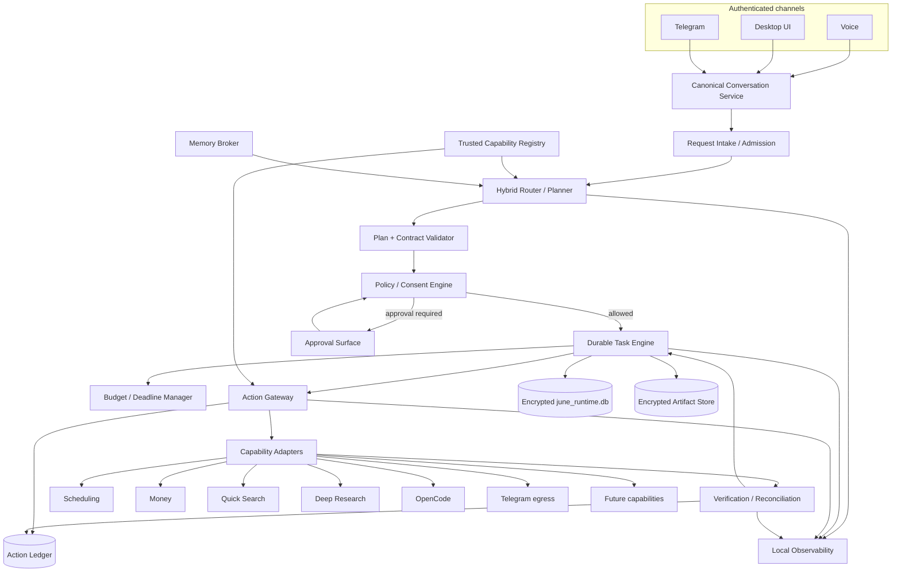

# JUNE 0.1 — Orchestrator and Capability System Design

**Product baseline:** JUNE 0.1  
**Document version:** 0.1  
**Status:** Founder-approved system design baseline  
**Date:** 15 August 2026  
**Canonical repository:** `C:\dev\june`  
**Related authority:** [`JUNE_MASTER_ARCHITECTURE.md`](JUNE_MASTER_ARCHITECTURE.md), [`VOICE_SYSTEM_DESIGN.md`](VOICE_SYSTEM_DESIGN.md), [`MEMORY_SYSTEM_DESIGN.md`](MEMORY_SYSTEM_DESIGN.md)
**Authority relationship:** This document refines [`JUNE_MASTER_ARCHITECTURE.md`](JUNE_MASTER_ARCHITECTURE.md) for the Orchestrator and capability system. It cannot silently contradict the Master, which remains the top-level JUNE 0.1 authority for product and cross-system boundaries; any conflict must be resolved explicitly.

> **Purpose**  
> This document defines how JUNE turns an authenticated user request into controlled, durable, permissioned, observable work. It is the implementation authority for the JUNE 0.1 Orchestrator, Capability Registry, durable task engine, policy and consent layer, Action Gateway, Action Ledger, verification and reconciliation, resource budgets, and capability adapters.

> **Core rule**  
> **Models may understand, propose, plan, and replan. JUNE software validates, authorises, records, executes, verifies, recovers, and remains accountable.**

---

## Contents

1. Executive decision
2. Scope and non-goals
3. System ownership and boundaries
4. Target topology
5. Windows process topology
6. Canonical identifiers and event envelope
7. Request intake and admission
8. Routing and planning
9. Trusted Capability Registry
10. Capability operation contract
11. Durable task model
12. Task lifecycle and legal transitions
13. Action lifecycle and Action Gateway
14. Idempotency, retries, and reconciliation
15. Permission, consent, and risk tiers
16. Human approval UX
17. Resource budgets and runaway prevention
18. Checkpoints, artifacts, and progress
19. Persistence and runtime data model
20. Crash and restart recovery
21. Notifications and cross-channel result delivery
22. Voice integration
23. Memory integration
24. Scheduling integration
25. Money tracking integration
26. Quick Search and Deep Research integration
27. OpenCode integration
28. Telegram integration
29. Secure local control plane
30. Security threat model
31. Observability and audit
32. Testing, benchmarks, and acceptance gates
33. Migration from the current repository
34. Bounded implementation sequence
35. Future compatibility
36. Final decisions and deferred details
37. Appendices

---

# 1. Executive decision

JUNE 0.1 uses a **small, deterministic, JUNE-owned control plane** around probabilistic model reasoning.

The Orchestrator is not one giant autonomous LLM, not OpenCode, not an MCP server, and not a provider-owned agent session. It is ordinary application software that owns the lifecycle and authority of work.

```text
Voice / Desktop / Telegram
            │
            ▼
Canonical Conversation + Identity
            │
            ▼
Request Intake / Admission
            │
            ▼
Hybrid Router / Planner
            │
            ▼
Plan and Contract Validator
            │
            ▼
Policy / Consent Engine
            │
            ▼
Durable Task Engine
            │
            ▼
       Action Gateway
            │
    ┌───────┼───────────────────────────────────────┐
    ▼       ▼          ▼           ▼                ▼
 Memory  Scheduling  Money   Search/Research     OpenCode
                                      + Telegram / future capabilities
            │
            ▼
Verification / Reconciliation
            │
            ▼
Task State + Action Ledger + Artifacts + Observability
```

For the single-user Windows MVP, the canonical runtime is:

```text
JUNE background service
+ local durable workers
+ separate encrypted SQLite runtime database
+ trusted capability manifests
+ model-assisted routing/planning
+ deterministic permissions and execution
```

JUNE does **not** adopt Temporal, LangGraph, Azure Durable Functions, Celery, OpenAI Agents SDK, or another framework as the application-wide source of truth in JUNE 0.1. Such frameworks may be used internally by a capability later, provided they remain behind the JUNE capability contract.

The primary implementation goal is not maximum autonomy. It is:

> **JUNE can start useful work quickly, survive interruption and crashes, know exactly what it has and has not done, request permission at the correct boundary, avoid duplicate effects, and expose one stable contract for every current and future capability.**

---

# 2. Scope and non-goals

## 2.1 In scope for JUNE 0.1

The Orchestrator must support:

- Voice, desktop text, and private Telegram requests.
- Direct conversational responses that do not require durable tasks.
- Memory retrieval through the Memory Broker.
- Local scheduling and reminders.
- Manual expense and budget tracking.
- Quick Search.
- Durable Deep Research.
- OpenCode coding work under repository and approval policy.
- Task creation, status, pause, resume, cancel, discard, and restart lineage.
- Crash and restart recovery.
- Exact confirmation for consequential actions.
- Safe retry and uncertain-outcome reconciliation.
- Per-task time, cost, tool-call, retry, parallelism, and deadline budgets.
- Progress and completion delivery to the initiating channel.
- A stable provider-neutral `june_delegate` boundary from realtime voice.

## 2.2 Explicit non-goals for JUNE 0.1

The Orchestrator does not yet provide:

- General browser or desktop computer control.
- Email sending or external calendar mutation.
- Food, grocery, travel, or purchase execution.
- Banking, UPI, investments, or payment initiation.
- Dynamic agent swarms or autonomous app-building teams.
- Cloud workers that run while the user's PC is off.
- Multi-user or multi-device orchestration.
- A universal autonomous planner that can invent unrestricted tool chains.
- Automatic privilege escalation learned from memory or past approvals.

The interfaces reserve these future capabilities without enabling them.

---

# 3. System ownership and boundaries

## 3.1 Ownership table

| Component | Owns | Must not own |
|---|---|---|
| Conversation Service | Authenticated turns, channels, final transcripts, messages, response association | Task execution or permissions |
| Router / Planner | Intent interpretation, capability selection, step proposals, replanning | Canonical task state, permission grants, effect truth |
| Capability Registry | Trusted capabilities, operations, schemas, risk and execution metadata | User-specific permission decisions |
| Policy Engine | Whether an operation is automatic, needs consent, or is denied | Model planning or domain execution |
| Consent Store | Durable, scoped records of explicit user authorisation | Capability implementation |
| Durable Task Engine | Task lifecycle, dependencies, budgets, waits, checkpoints, pause/resume/cancel | Scheduling, finance, or repository domain truth |
| Action Gateway | Sole gateway for effect-bearing capability operations | Free-form planning |
| Capability Adapter | Actual domain operation | Global policy, conversation state, unrelated memory |
| Verification Engine | Whether an effect occurred and whether postconditions hold | Inferring permission |
| Reconciliation Engine | Resolve uncertain outcomes before retry or user report | Repeating unverifiable effects blindly |
| Action Ledger | Durable history of proposals, approvals, attempts, receipts, verification, uncertainty, compensation | General performance telemetry |
| Memory Broker | Relevant personal and project evidence | Permissions, task state, transaction truth |
| Notification Router | Delivery attempts and channel routing | Canonical task outcome |
| Observability | Diagnostic traces, metrics, health, latency, errors | Canonical audit history or raw personal content by default |

## 3.2 Canonical system-of-record rule

A subsystem remains authoritative for its own domain:

| Domain | Canonical owner |
|---|---|
| What the user said | Conversation Service |
| Long-term user/project context | Memory Service |
| Task lifecycle and checkpoints | Durable Task Store |
| Action attempts and receipts | Action Ledger |
| Permission and consent | Policy/Consent Store |
| Reminder due time and recurrence | Scheduling Service |
| Expense and budget records | Money Tracking Service |
| Source evidence and research artifacts | Research capability artifact set |
| Repository files, Git state, tests | Repository/OpenCode, referenced by JUNE records |
| Provider session state | Ephemeral provider adapter only |

Memory may suggest that the user prefers reminders 15 minutes early; Scheduling still owns the actual reminder. Memory may suggest a likely expense category; Money Tracking owns the transaction. A provider may report an action; JUNE verifies and records the canonical outcome.

---

# 4. Target topology



## 4.1 Critical choke point

The **Action Gateway** is the sole route for effect-bearing operations. The following may not bypass it:

- Realtime voice model.
- Fireworks reasoning model.
- OpenCode.
- Research workers.
- Telegram messages.
- Memory records.
- MCP servers.
- External websites, files, emails, or code comments.

A model-generated tool call is a proposal. It becomes executable only after registry validation, policy evaluation, durable recording, and any required approval.

---

# 5. Windows process topology

## 5.1 Approved user behaviour

- Closing the visible window sends JUNE to the system tray.
- The background service continues scheduling, Telegram polling, and durable work.
- `Quit JUNE` stops the background service after safe shutdown handling.
- The MVP does not operate while the PC is off.

## 5.2 Process layout

```text
Electron Renderer
    │ strictly limited preload IPC
    ▼
Electron Main / Desktop Shell
    │ authenticated local control channel
    ▼
JUNE Background Service — single durable owner
    ├── Conversation API
    ├── Orchestrator Core
    ├── Task dispatcher and workers
    ├── Policy / Consent
    ├── Capability Registry
    ├── Action Gateway / Ledger
    ├── Telegram long polling
    ├── Scheduler integration
    ├── Memory Broker client
    └── Local databases and artifact store
            │
            ├── Research workers
            ├── Scheduling adapter
            ├── Money adapter
            └── OpenCode adapter / process
```

## 5.3 Single-owner requirement

Exactly one local background service instance may own the runtime queue for a user profile.

The service must hold a single-instance lease or OS lock. A second instance must:

1. Detect the current owner.
2. Forward an activation/open-window request when appropriate.
3. Refuse to dispatch or recover tasks independently.

Parallel capability workers are allowed only under the durable owner's explicit concurrency limits.

## 5.4 Backend implementation default

Reuse JUNE's existing backend/runtime language and process infrastructure rather than introducing a new language solely for orchestration. The canonical schema and contracts must remain language-neutral and serialisable.

---

# 6. Canonical identifiers and event envelope

## 6.1 Required identifiers

```text
user_id
channel_id
conversation_id
message_id
turn_id
generation_id
orchestrator_run_id
task_id
parent_task_id
capability_call_id
action_id
action_attempt_id
approval_id
consent_grant_id
artifact_id
notification_id
event_id
```

Provider-generated IDs are correlation metadata only. Models do not generate security-critical canonical IDs.

## 6.2 Event envelope

```json
{
  "schema": "june.event.v1",
  "event_id": "uuidv7",
  "event_type": "task.progress",

  "user_id": "uuid",
  "conversation_id": "optional-uuid",
  "turn_id": "optional-uuid",
  "generation_id": "optional-uuid",
  "orchestrator_run_id": "optional-uuid",
  "task_id": "optional-uuid",
  "capability_call_id": "optional-uuid",
  "action_id": "optional-uuid",

  "sequence": 184,
  "causation_id": "optional-uuid",
  "correlation_id": "uuid",

  "wall_time": "2026-08-15T12:00:00.000Z",
  "monotonic_ns": 1234567890123,
  "privacy_class": "operational",
  "payload": {}
}
```

`wall_time` is an ISO-8601 UTC timestamp used for human-readable timing, persistence, diagnostics, and cross-process correlation. `monotonic_ns` is a non-negative integer nanosecond reading from the emitting process's monotonic clock and is used for durations and ordering only inside that process.

Monotonic-clock origins are not comparable across processes. Cross-process correlation and stale-event handling use canonical IDs, producer/stream sequence numbers, causation and correlation IDs, `wall_time`, and explicit state and generation checks. Wall-clock time alone does not provide reliable ordering.

## 6.3 Event invariants

- `event_id` is unique.
- `sequence` is monotonic within its owning stream.
- Security-critical IDs and policy context are attached by trusted JUNE code.
- Partial voice transcripts may create UI events and speculative reads only.
- `voice.user.transcript.final` is an STT result, not authority to create a durable task, effect-bearing proposal, or durable memory candidate.
- Only `conversation.turn.finalized`, or a separately authorised scheduled/system trigger, may initiate new durable/effect-bearing work.
- Stale events are rejected using task/action revisions, generation IDs, and sequence numbers.
- Provider events are translated into JUNE events at the adapter boundary.

---

# 7. Request intake and admission

## 7.1 Inputs

A request may arrive from:

- `conversation.turn.finalized`, emitted after the Conversation Service commits an authenticated desktop, Voice, or linked-channel user turn.
- A separately authorised scheduled/system trigger.
- Capability completion or failure event.
- Explicit user approval, denial, pause, resume, cancel, restart, or discard command.

Capability and control events may advance work that was already admitted; they do not originate new user authority. A linked-channel input such as Telegram must pass through the same Conversation Service authentication, normalisation, acceptance, and persistence boundary before it can originate a new user-requested task or effect.

## 7.2 Admission checks

Before routing, JUNE checks:

1. **Authentication:** Which user/channel produced the request?
2. **Finality:** Is the input `conversation.turn.finalized`, an authorised scheduled/system trigger, or a valid continuation event for already admitted work?
3. **Replay:** Has this event/update already been processed?
4. **Session scope:** Which conversation/project/task does it refer to?
5. **Safety mode:** Temporary conversation, privacy mode, offline/degraded mode.
6. **Availability:** Is the required capability healthy and configured?
7. **Ambiguity:** Does the request identify the intended task/action clearly enough?
8. **Budget admission:** Is the requested work within configured limits?

## 7.3 Immediate versus durable work

Do not create a durable task for every sentence.

### Turn-scoped work

Usually remains within the current turn:

- Ordinary conversation.
- Hot-memory or bounded memory retrieval.
- Tiny deterministic local lookups.
- A very small quick search when it completes within the active turn and needs no later notification.

### Durable work

Create a durable task when work:

- Outlives the current response.
- Has multiple steps or dependencies.
- Waits for permission or user input.
- Is scheduled for later.
- Performs consequential effects.
- Needs retry, recovery, or reconciliation.
- Consumes a meaningful resource budget.
- Must notify the user later.
- Produces artifacts that must survive provider or process failure.

A reminder is durable even if its creation takes milliseconds because its responsibility extends into the future. Deep Research and OpenCode tasks are durable. A normal conversational answer is not.

`execution_mode` describes the lifetime of the current capability invocation, not whether its result persists. A `turn_scoped` reminder-creation invocation may create a durable reminder and completed durable task/action record.

---

# 8. Routing and planning

## 8.1 Hybrid routing

Use deterministic fast paths where intent is structurally clear, then a typed model router for ambiguous or compositional requests.

```text
conversation.turn.finalized
        ↓
Deterministic recognisers / active-task references
        ↓ if unresolved
Typed model route proposal
        ↓
Registry and schema validation
        ↓
Confidence and ambiguity gate
        ↓
Direct answer / capability / clarification / denial
```

## 8.2 Deterministic fast paths

Examples:

- `pause task <id>` → task control.
- `cancel that research` with one active research task → task control.
- `record ₹650 for dinner` → Money operation proposal.
- `remind me tomorrow at 8` → Scheduling operation proposal.
- Approval/denial replying to an active exact proposal → Consent handling.
- `what do you remember about me?` → Memory Centre/deep recall path.

Deterministic paths still produce canonical proposals and pass policy validation.

## 8.3 Model router output

The model returns constrained structured data, not executable code:

```json
{
  "route": "research.deep",
  "confidence": 0.94,
  "operation_kind": "read",
  "execution_mode": "long_running",
  "objective": "Compare current memory architectures for personal assistants",
  "capability_hint": "research",
  "requires_clarification": false,
  "clarification_question": null,
  "candidate_arguments": {
    "scope": "comprehensive",
    "citation_required": true
  }
}
```

The router may propose multiple steps, but `operation_kind` and `execution_mode` remain untrusted routing hints. The trusted Capability Registry and Orchestrator validate or recompute them and provide the authoritative meaning of every operation.

## 8.4 Confidence policy

- High-confidence, well-scoped R0/R1 request: proceed.
- Medium-confidence but safe and easily reversible: ask a short clarification when the ambiguity changes the result materially.
- Any ambiguity affecting recipient, amount, time, path, destructive scope, or external commitment: clarify before approval or execution.
- No trusted route: abstain and explain the missing capability.

## 8.5 Planning

Plans are disposable projections. They are not task truth.

```json
{
  "goal": "Research durable workflow options",
  "steps": [
    {"step_id": "s1", "operation": "research.search", "depends_on": []},
    {"step_id": "s2", "operation": "research.read", "depends_on": ["s1"]},
    {"step_id": "s3", "operation": "research.synthesise", "depends_on": ["s2"]}
  ]
}
```

The Plan Validator rejects:

- Unknown capabilities or operations.
- Schema-invalid arguments.
- Risk-class downgrades.
- Attempts to use capabilities unavailable to the user/task.
- Attempts to turn memory or external content into permission.
- Steps exceeding budget or concurrency policy.
- Effect-bearing operations outside the Action Gateway.

---

# 9. Trusted Capability Registry

## 9.1 Purpose

The Capability Registry is the trusted catalogue of what JUNE can do. The model sees a least-privilege subset relevant to the current task.

Capability manifests are code-reviewed/configuration-controlled JUNE assets. Descriptions or annotations received dynamically from an untrusted MCP server do not override trusted policy.

## 9.2 Manifest shape

```yaml
capability_id: research
version: 1.0.0
display_name: Deep Research
trust_tier: builtin
runtime: local-python
health_check: research.health

operations:
  - operation_id: research.deep
    input_schema: schemas/research-deep-input.json
    output_schema: schemas/research-deep-output.json
    operation_kind: read
    execution_mode: long_running
    risk_tier: R0
    permission_requirement: feature_consent
    side_effects: none_external
    cancellable: cooperative
    pausable: checkpointed
    resumable: true
    retry_class: naturally_idempotent
    verification: artifact_and_citation_validation
    timeout_seconds: 7200
    default_budget:
      wall_seconds: 1800
      tool_calls: 80
      retries: 3
      parallel_workers: 2
    data_egress:
      destinations: [search_provider, fireworks]
      allowed_classes: [public, personal]
      forbidden_classes: [secret]
```

## 9.3 Required metadata

Every operation declares:

- Capability ID and semantic version.
- Operation ID and schemas.
- Human description.
- Runtime and health contract.
- `operation_kind`: `read` or `write`.
- `execution_mode`: `turn_scoped` or `long_running`.
- Risk tier.
- Side effects and reversibility.
- Required permission scopes.
- Data reads and writes.
- Data-egress destinations and classifications.
- Secret requirements.
- Idempotency/retry class.
- Verification and reconciliation method.
- Pause/resume/cancel support.
- Timeout and default budgets.
- Artifacts and receipts.
- Minimum logging/audit fields.
- Compatibility/deprecation window.

The trusted manifest and Orchestrator deterministically map each operation to `operation_kind`, `execution_mode`, side effects, `risk_tier`, permission requirement, retry class, and verification requirement. Model/provider values are proposals only and cannot author or lower any authoritative classification.

The collapsed labels `local_write`, `protected_write`, `long_running_read`, and `long_running` are not canonical `operation_kind` values:

- `local_write` maps to `operation_kind = write`, with risk normally derived as R1.
- `protected_write` maps to `operation_kind = write`, with risk normally derived as R2 or R3.
- `long_running_read` maps to `operation_kind = read` and `execution_mode = long_running`.
- `long_running` maps only to `execution_mode = long_running`.

The actual execution mode is independent of operation kind and is validated against the capability contract. Memory cannot raise a risk tier or permission ceiling.

## 9.4 MCP boundary

MCP is an adapter option. It does not replace the registry.

JUNE may map a trusted MCP tool into a capability operation, but:

- JUNE validates inputs and outputs independently.
- JUNE supplies or validates operation kind, execution mode, risk, permission, retry, egress, verification, and budget metadata.
- Raw MCP tools are not exposed unrestricted to OpenAI Realtime.
- Remote MCP requires authentication, authorisation, version pinning, and trust review.
- Capability health failure cannot mutate the manifest.

---

# 10. Capability operation contract

## 10.1 Standard adapter surface

```text
inspect_contract()
prepare(request_context, canonical_arguments)
execute(prepared_action, cancellation_token)
status(capability_call_id)
checkpoint(capability_call_id)
pause(capability_call_id)
resume(checkpoint)
cancel(capability_call_id)
verify(action_attempt)
reconcile(action_attempt)
compensate(committed_action, approval)
```

Not every operation implements every method. Unsupported semantics must be explicit.

## 10.2 Preparation versus execution

`prepare()`:

- Normalises arguments.
- Resolves references without creating effects.
- Produces a preview and canonical proposal.
- Supplies validated facts for JUNE to derive the authoritative risk tier and permission requirement from the trusted manifest, canonical arguments, side effects, and policy context.
- Estimates cost/time.
- Does not commit an effect.

Provider, model, adapter, and Memory suggestions cannot author or lower the authoritative risk tier or permission requirement.

`execute()`:

- Accepts only a validated, authorised, durably recorded proposal.
- Receives JUNE-generated IDs and idempotency material.
- Emits structured progress, receipts, artifacts, and errors.

## 10.3 Result shape

```json
{
  "capability_call_id": "uuid",
  "operation": "money.record_expense",
  "status": "succeeded",
  "effect_state": "verified",
  "started_at": "...",
  "completed_at": "...",
  "summary": "Recorded ₹650 under Dining",
  "provider_receipt_id": null,
  "artifacts": [],
  "verification": {
    "method": "read_after_write",
    "passed": true
  },
  "undo_or_compensation": {
    "available": true,
    "operation": "money.delete_expense"
  },
  "privacy_class": "personal"
}
```

## 10.4 Effect states

```text
NONE
PREPARED
STARTED
VERIFIED
FAILED_CONFIRMED
UNKNOWN
RECONCILING
COMPENSATED
```

`UNKNOWN` is an honest state. It must not be converted to `FAILED_CONFIRMED` without evidence.

---

# 11. Durable task model

## 11.1 Task definition

A durable task is a JUNE-owned record of work that must survive conversations, provider sessions, process failures, and app restarts.

Core fields:

```text
task_id
user_id
parent_task_id
restart_of_task_id
conversation_id
source_turn_id
kind
title
objective
status
priority
risk_ceiling
created_at
updated_at
started_at
finished_at
deadline_at
pause_requested_at
cancel_requested_at
revision
route_snapshot
current_step
progress_summary
checkpoint_id
budget_id
notification_policy
```

## 11.2 Parent and child tasks

JUNE 0.1 may use child tasks for bounded Research steps or future fixed workers, but every child inherits:

- User identity.
- Parent task risk ceiling.
- A subset of capability tokens.
- A smaller budget.
- Cancellation lineage.
- Artifact visibility policy.

A child cannot increase permissions or budget beyond the parent.

## 11.3 Task versus action

A task describes the user's durable objective. An action attempt is one concrete interaction with a capability or external system.

Example:

```text
Task: Research dinosaur evolution
  ├── Action: Search query 1
  ├── Action: Read source 7
  └── Action: Generate cited report
```

Or:

```text
Task: Record dinner expense
  └── Action: Insert one local finance transaction
```

`UNKNOWN` applies to an action attempt, not to the whole task. A task containing an uncertain action enters `RECONCILING`.

---

# 12. Task lifecycle and legal transitions

## 12.1 Canonical states

```text
PENDING
RUNNING
WAITING_PERMISSION
WAITING_USER
PAUSED
BLOCKED
RECONCILING

COMPLETED
FAILED
CANCELLED
DISCARDED
```

## 12.2 State meanings

| State | Meaning |
|---|---|
| `PENDING` | Durably accepted but not yet running |
| `RUNNING` | At least one eligible step may execute |
| `WAITING_PERMISSION` | Exact proposal is awaiting approval |
| `WAITING_USER` | Missing information or user decision is required |
| `PAUSED` | Work is intentionally stopped with recoverable checkpoint |
| `BLOCKED` | Dependency, capability, credentials, or policy prevents progress |
| `RECONCILING` | JUNE is determining an uncertain effect/outcome |
| `COMPLETED` | Objective and required verification completed |
| `FAILED` | Confirmed terminal failure; no unknown effect remains |
| `CANCELLED` | Cancellation accepted; no new work may begin |
| `DISCARDED` | User requested removal of retained task artifacts/state under policy |

## 12.3 Legal transitions

```text
PENDING -> RUNNING
PENDING -> WAITING_PERMISSION
PENDING -> WAITING_USER
PENDING -> CANCELLED

RUNNING -> WAITING_PERMISSION
RUNNING -> WAITING_USER
RUNNING -> PAUSED
RUNNING -> BLOCKED
RUNNING -> RECONCILING
RUNNING -> COMPLETED
RUNNING -> FAILED
RUNNING -> CANCELLED

WAITING_PERMISSION -> RUNNING
WAITING_PERMISSION -> CANCELLED
WAITING_PERMISSION -> FAILED

WAITING_USER -> RUNNING
WAITING_USER -> PAUSED
WAITING_USER -> CANCELLED

PAUSED -> RUNNING
PAUSED -> CANCELLED
PAUSED -> DISCARDED

BLOCKED -> RUNNING
BLOCKED -> FAILED
BLOCKED -> CANCELLED

RECONCILING -> RUNNING
RECONCILING -> COMPLETED
RECONCILING -> FAILED
RECONCILING -> CANCELLED

CANCELLED -> DISCARDED
```

Terminal tasks do not silently re-enter `RUNNING`.

## 12.4 Resume, reopen, and restart

- **Resume:** `PAUSED -> RUNNING` using the same task and checkpoint.
- **Reopen cancelled work:** create a new task with `restart_of_task_id` referencing the cancelled task, importing explicitly allowed artifacts/checkpoints. Do not rewrite the old history.
- **Restart from scratch:** create a new task with lineage but no inherited completion state or trusted conclusions.
- **Discard:** remove task artifacts and user-facing recoverable state according to retention policy; preserve minimal audit/tombstone data where required.

## 12.5 Cancellation invariant

> Once JUNE acknowledges that a task is cancelled, no new externally effect-bearing action may begin for that task.

An effect already in flight may be impossible to stop. Such an attempt is reconciled. JUNE must not claim cancellation reversed a committed or physically in-flight action.

---

# 13. Action lifecycle and Action Gateway

## 13.1 Write-ahead protocol

Any consequential or effect-bearing operation uses:

```text
proposal
→ contract validation
→ policy evaluation
→ exact consent when required
→ PREPARED ledger record
→ execution attempt
→ provider/local receipt
→ verification
→ final outcome
```

An effect is never initiated first and documented afterward.

## 13.2 Action records

```text
action_id
task_id
capability_call_id
operation_id
canonical_arguments
canonical_arguments_hash
risk_tier
permission_requirement
approval_id
idempotency_class
idempotency_key
status
created_at
prepared_at
committed_at
verified_at
current_attempt_id
```

Each execution attempt has:

```text
action_attempt_id
action_id
attempt_number
started_at
ended_at
provider_request_id
provider_receipt_id
outcome
error_class
request_hash
response_hash
verification_state
```

## 13.3 Approval binding

Approval binds to:

- User ID.
- Action ID.
- Operation ID.
- Exact canonical argument hash.
- Risk tier.
- Scope.
- Expiry.
- Originating task/turn.

If recipient, amount, time, address, file path, message body, destructive scope, or another material argument changes, the approval is invalid.

## 13.4 Verification

A capability must define how success is known:

- Read-after-write.
- Provider receipt query.
- Local transaction verification.
- Repository diff and test results.
- Artifact checksum and validation.
- External status endpoint.
- User confirmation only when no reliable technical verification exists.

The model's statement “done” is not verification.

## 13.5 Compensation

Compensation is a new explicit action, not fictional rollback.

Examples:

- Delete a locally recorded expense.
- Restore a file from a known backup.
- Cancel a future reminder.
- Send a correcting message only with separate approval.

A committed email, public post, payment, or order may not be truly reversible. JUNE must describe the available remedy accurately.

---

# 14. Idempotency, retries, and reconciliation

## 14.1 Four retry classes

| Class | Meaning | Recovery |
|---|---|---|
| Naturally idempotent | Repeating produces the same safe state | Retry within budget |
| Keyed idempotent | Provider accepts a stable client/idempotency key | Retry exact request with same key |
| Verify-before-retry | JUNE can query whether the effect exists | Verify; retry only if definitely absent |
| Non-idempotent / unverifiable | Effect may have happened and cannot be reliably checked | Never blind retry; reconcile or ask user |

## 14.2 Unknown outcome rule

> No external write is retried merely because JUNE did not receive a reply.

Timeout, disconnect, process crash, or missing response may mean:

- Provider never received the request.
- Provider received but did not execute it.
- Provider executed it but the response was lost.

Therefore the action attempt becomes `UNKNOWN`. The task becomes `RECONCILING` until JUNE can determine the result or clearly report uncertainty.

## 14.3 Retry invariants

- Same logical keyed action uses the same idempotency key.
- A materially changed action gets a new action ID and new approval.
- Retry count and backoff are bounded by the contract and task budget.
- Provider 4xx policy/input errors are not blindly retried.
- Provider 5xx/network errors are retried only according to idempotency class.
- Terminal task state prevents later queued attempts from executing.
- Duplicate channel events map to the same canonical request or are ignored.

## 14.4 Reconciliation output

```json
{
  "action_id": "uuid",
  "status": "reconciled",
  "effect_state": "verified",
  "evidence": [
    {"kind": "provider_status", "receipt_id": "..."}
  ],
  "safe_to_retry": false,
  "user_message": "The reminder was created before the connection dropped. I did not create a duplicate."
}
```

---

# 15. Permission, consent, and risk tiers

## 15.1 Risk tiers

| Tier | Definition | Default |
|---|---|---|
| **R0 — read-only** | No persistent user/external mutation | Automatic after feature consent |
| **R1 — ordinary reversible local change** | Local/private, readily reversible, directly requested | Automatic when clear; show result and undo |
| **R2 — protected or consequential local change** | Code/file/config mutation or other material local effect | Explicit task-scoped approval |
| **R3 — external, irreversible, financial, destructive, public, or security-sensitive** | Sends, publishes, purchases, deletes permanently, grants access, controls devices | Exact-action confirmation immediately before execution; some operations may remain prohibited |

JUNE 0.1 does not need an extra risk tier. Prohibited/non-delegable operations are policy denials rather than “R4”.

## 15.2 MVP classification examples

| Operation | Tier | Behaviour |
|---|---:|---|
| Read memory | R0 | Automatic within scope |
| List reminders | R0 | Automatic |
| Quick Search | R0 | Automatic |
| Start Deep Research | R0 | Automatic when well-scoped |
| Record a local expense | R1 | Automatic, verified, undo available |
| Create a local reminder | R1 | Automatic when time/objective are clear |
| Correct an expense | R1 | Automatic, show change and undo |
| Inspect repository | R0 | Automatic within approved workspace |
| Run bounded read-only diagnostics | R0/R1 | According to command policy |
| Edit repository files | R2 | Task/repository-scoped approval |
| Commit code | R2 | Explicit scope and Git policy |
| Force reset / destructive Git | R3 | Exact confirmation or deny |
| Future send email/message | R3 | Exact recipient/content confirmation |
| Future purchase/payment | R3 | Exact amount/vendor/address/payment confirmation; stronger controls |

## 15.3 Grant scopes

A consent grant may be:

- Single action.
- Current task.
- Current session.
- Specific capability operation.
- Specific workspace/path.
- Time-bounded persistent preference for R0/R1 only.

Persistent permission cannot silently broaden:

- Risk tier.
- Recipient or destination.
- Monetary amount.
- Path/workspace.
- Data category.
- Provider/OAuth scope.

## 15.4 Memory and permissions

Memory may contain “the user normally approves X” or “the user prefers Y”. That remains evidence. It cannot become a permission grant.

Only the Policy/Consent Store can authorise execution.

---

# 16. Human approval UX

## 16.1 Confirmation payload

The approval surface shows the exact canonical proposal:

```text
Action: Send message
Recipient: Rahul Mehta (+91 …1234)
Message: “I will arrive at 6 PM.”
Account: Personal Telegram
Effect: External message; cannot be unsent reliably
Expires: 2 minutes

[Confirm] [Edit] [Cancel]
```

Voice states the important fields and the screen displays the full payload. Telegram approvals include a compact exact summary and signed one-time buttons where supported.

## 16.2 Confirmation rules

- Generic “yes” applies only to the one active, unexpired, exact proposal in the same authenticated context.
- Multiple pending approvals require disambiguation.
- Edited proposals invalidate prior approvals.
- Approval tokens are single-use and replay-protected.
- High-risk confirmation expires quickly.
- Approval is rechecked at the durable commit boundary.
- Authentication/MFA/CAPTCHA or legal declarations are handed to the user; JUNE does not bypass them.

## 16.3 Avoiding permission fatigue

- R0 proceeds silently after general feature consent.
- R1 proceeds when explicitly requested and provides visible result/undo.
- R2 may use task-scoped approval so every safe step in the same bounded coding task does not require a new prompt.
- R3 remains exact-action confirmation.
- JUNE asks only one concise clarification when ambiguity matters.

---

# 17. Resource budgets and runaway prevention

Every durable task has a `TaskBudget`:

```json
{
  "wall_seconds": 1800,
  "provider_cost_limit": 10.00,
  "model_token_limit": 300000,
  "tool_call_limit": 80,
  "retry_limit": 3,
  "parallel_worker_limit": 2,
  "deadline_at": "..."
}
```

## 17.1 Enforcement

- Budget is checked before starting each step/action.
- Child tasks receive explicit sub-budgets.
- Retries consume budget.
- Provider-reported usage is reconciled with local estimates.
- Circuit breakers stop repeated provider/capability failures.
- Rate limits result in bounded waiting/backoff, not uncontrolled loops.
- Budget exhaustion preserves checkpoint and moves to `WAITING_USER` or `BLOCKED` with a clear continuation option.

## 17.2 Founder-approved behaviour

Normal defaults may be generous because quality matters more than minimum cost. Limits remain finite. JUNE never spends or loops indefinitely without explicit continuation.

---

# 18. Checkpoints, artifacts, and progress

## 18.1 Checkpoint format

Canonical control-state checkpoints use versioned JSON.

```json
{
  "schema": "june.checkpoint.research.v1",
  "task_id": "uuid",
  "revision": 7,
  "completed_steps": ["search-1", "read-2"],
  "current_step": "synthesise",
  "capability_state": {},
  "artifact_refs": ["sha256:..."],
  "remaining_budget": {},
  "created_at": "..."
}
```

Reject Python pickle as canonical task state. Provider/framework-native run state may be stored only as an opaque capability-specific artifact and must not be the sole source of truth.

## 18.2 Artifact Store

The encrypted artifact store may contain:

- Research notes and citation maps.
- Reports.
- Code diffs and test logs.
- Capability receipts.
- Export files.
- Large checkpoint payloads.

The runtime DB stores metadata, hashes, lineage, privacy class, and retention state.

## 18.3 Progress

Progress must be meaningful, not noisy.

Emit when:

- Task accepted.
- Phase changes.
- Permission/user input required.
- A material milestone completes.
- Budget reaches a warning threshold.
- Recoverable failure/retry occurs.
- Task completes, fails, pauses, or is cancelled.

Do not send repetitive token/tool-level updates. Store granular internal events for diagnostics while presenting concise user-facing summaries.

---

# 19. Persistence and runtime data model

## 19.1 Separate runtime database

Use:

```text
june_memory.db   — canonical personal memory
june_runtime.db  — tasks, actions, permissions, checkpoints, delivery state
```

Both are encrypted and use OS-protected keys, but remain logically and physically separate.

## 19.2 MVP storage choice

- SQLite with SQLCipher or the approved encrypted SQLite mechanism.
- Windows DPAPI-wrapped local key.
- Patched, pinned SQLite runtime.
- Minimise concurrent writers.
- Benchmark WAL on the target Windows environment before final journal-mode lock.
- Schema migrations are versioned, idempotent, and tested through backup/restore.

## 19.3 Core tables

### `task`

```sql
task (
  task_id TEXT PRIMARY KEY,
  user_id TEXT NOT NULL,
  parent_task_id TEXT,
  restart_of_task_id TEXT,
  conversation_id TEXT,
  source_turn_id TEXT,
  kind TEXT NOT NULL,
  title TEXT NOT NULL,
  objective_json TEXT NOT NULL,
  status TEXT NOT NULL,
  priority INTEGER NOT NULL,
  risk_ceiling TEXT NOT NULL,
  current_step TEXT,
  progress_summary TEXT,
  checkpoint_id TEXT,
  budget_id TEXT NOT NULL,
  notification_policy_json TEXT NOT NULL,
  revision INTEGER NOT NULL,
  created_at TEXT NOT NULL,
  updated_at TEXT NOT NULL,
  started_at TEXT,
  finished_at TEXT,
  deadline_at TEXT,
  pause_requested_at TEXT,
  cancel_requested_at TEXT
);
```

### `task_event`

```sql
task_event (
  event_id TEXT PRIMARY KEY,
  task_id TEXT NOT NULL,
  sequence INTEGER NOT NULL,
  event_type TEXT NOT NULL,
  payload_json TEXT NOT NULL,
  privacy_class TEXT NOT NULL,
  occurred_at TEXT NOT NULL,
  UNIQUE(task_id, sequence)
);
```

### `task_checkpoint`

```sql
task_checkpoint (
  checkpoint_id TEXT PRIMARY KEY,
  task_id TEXT NOT NULL,
  schema_version TEXT NOT NULL,
  revision INTEGER NOT NULL,
  state_json TEXT NOT NULL,
  artifact_refs_json TEXT NOT NULL,
  state_hash TEXT NOT NULL,
  created_at TEXT NOT NULL
);
```

### `action`

```sql
action (
  action_id TEXT PRIMARY KEY,
  task_id TEXT NOT NULL,
  capability_call_id TEXT NOT NULL,
  operation_id TEXT NOT NULL,
  canonical_arguments_json TEXT NOT NULL,
  canonical_arguments_hash TEXT NOT NULL,
  risk_tier TEXT NOT NULL,
  idempotency_class TEXT NOT NULL,
  idempotency_key TEXT,
  status TEXT NOT NULL,
  approval_id TEXT,
  created_at TEXT NOT NULL,
  prepared_at TEXT,
  verified_at TEXT
);
```

### `action_attempt`

```sql
action_attempt (
  action_attempt_id TEXT PRIMARY KEY,
  action_id TEXT NOT NULL,
  attempt_number INTEGER NOT NULL,
  outcome TEXT NOT NULL,
  provider_request_id TEXT,
  provider_receipt_id TEXT,
  request_hash TEXT NOT NULL,
  response_hash TEXT,
  error_class TEXT,
  started_at TEXT NOT NULL,
  ended_at TEXT,
  UNIQUE(action_id, attempt_number)
);
```

### `approval`

```sql
approval (
  approval_id TEXT PRIMARY KEY,
  user_id TEXT NOT NULL,
  action_id TEXT NOT NULL,
  proposal_hash TEXT NOT NULL,
  scope_json TEXT NOT NULL,
  status TEXT NOT NULL,
  channel TEXT NOT NULL,
  created_at TEXT NOT NULL,
  expires_at TEXT NOT NULL,
  consumed_at TEXT
);
```

### `consent_grant`

```sql
consent_grant (
  consent_grant_id TEXT PRIMARY KEY,
  user_id TEXT NOT NULL,
  capability_id TEXT NOT NULL,
  operation_pattern TEXT NOT NULL,
  scope_json TEXT NOT NULL,
  max_risk_tier TEXT NOT NULL,
  status TEXT NOT NULL,
  created_at TEXT NOT NULL,
  expires_at TEXT,
  revoked_at TEXT
);
```

### Additional tables

```text
capability_manifest
capability_health
resource_budget
notification_delivery
artifact
runtime_lease
telegram_update_dedupe
outbox
inbox_dedupe
```

## 19.4 Current state plus append-only audit

JUNE 0.1 uses:

- Current relational projections for fast operation.
- Append-only task/action events for audit and recovery evidence.
- Periodic versioned checkpoints for long-running capability state.

It does not use pure event sourcing for all application state. Pure replay would add complexity and version-coupling without sufficient MVP benefit.

## 19.5 Transactional outbox

When a state change requires later delivery or worker execution, write the state and outbox record in one database transaction. Workers claim and deliver outbox items idempotently.

This prevents:

- Task committed but notification lost.
- Approval recorded but execution not queued.
- Completion stored but result never routed.

Inbound channel/provider events use an inbox/deduplication record before processing.

---

# 20. Crash and restart recovery

## 20.1 Startup recovery

The background service:

1. Acquires the single-instance lease.
2. Verifies/migrates runtime schema.
3. Scans non-terminal tasks.
4. Checks expired leases and in-flight attempts.
5. Classifies each task/action:
   - Safe to resume.
   - Waiting for user/permission.
   - Needs reconciliation.
   - Confirmed failed.
6. Restarts eligible workers within concurrency budgets.
7. Delivers material recovery notices.

## 20.2 Safe auto-resume

Auto-resume is allowed for:

- Read-only research searches/reads.
- Deterministic local reads.
- Checkpointed synthesis where no external effect occurs.
- Scheduling responsibility already stored in the authoritative scheduler.

## 20.3 Writes after crash

- Local transactional write committed: verify domain record; do not duplicate.
- Local write rolled back: retry if contract permits.
- External keyed-idempotent write: query/retry with same key as permitted.
- Verify-before-retry action: query provider state first.
- Non-idempotent unknown outcome: enter reconciliation; do not retry.
- OpenCode crash during mutation: inspect workspace/Git diff and reconcile actual files before resuming.

## 20.4 Fault-injection boundaries

Tests must kill the service:

```text
before PREPARED record
after PREPARED record
before capability request
while request is in flight
after response before local receipt
after receipt before verification
after verification before task checkpoint
while awaiting permission
during research checkpoint
during OpenCode mutation
```

Recovery behaviour must be deterministic for each boundary.

---

# 21. Notifications and cross-channel result delivery

## 21.1 Canonical result ownership

Task results attach to the task and originating conversation. Channels are delivery surfaces, not separate task stores.

## 21.2 Allowed proactive messages

JUNE may proactively deliver only:

- User-created reminders.
- Meaningful task progress.
- Task completion.
- Failures requiring attention.
- Approval requests.
- Budget/deadline alerts.

JUNE does not invent consequential tasks or send repeated low-value updates.

## 21.3 Routing

Default:

- Result returns to initiating channel.
- Desktop also shows the canonical task/activity state.
- Cross-channel delivery follows explicit notification preferences.
- Sensitive notification content is minimised on lock screens/Telegram previews.

## 21.4 Delivery state

```text
PENDING
SENT
DELIVERED_IF_SUPPORTED
FAILED_RETRYABLE
FAILED_FINAL
SUPPRESSED
```

A sent notification is not proof that the user saw it.

---

# 22. Voice integration

## 22.1 Narrow delegation tool

OpenAI Realtime receives one narrow provider-neutral tool:

```json
{
  "name": "june_delegate",
  "description": "Ask JUNE's trusted orchestrator to retrieve private data, perform specialised work, or propose an action.",
  "parameters": {
    "objective": "string",
    "capability_hint": "memory|scheduling|money|search|research|coding|other",
    "operation_kind": "read|write",
    "execution_mode": "turn_scoped|long_running",
    "desired_result": "speak|display|both"
  }
}
```

`operation_kind` and `execution_mode` are untrusted model/provider routing hints. JUNE validates or recomputes them against the trusted Capability Registry and derives side effects, `risk_tier`, permission requirement, retry class, and verification requirement. The model cannot supply or lower the authoritative R0-R3 tier.

JUNE software attaches canonical IDs, authentication, privacy mode, project scope, policy context, and capability authority. The model cannot choose them, and Memory cannot raise a risk tier or permission ceiling.

## 22.2 Delegation response

The Orchestrator responds quickly:

```json
{
  "status": "accepted",
  "task_id": "uuid",
  "speech_policy": "brief_acknowledgement_allowed"
}
```

or:

```json
{
  "status": "confirmation_required",
  "task_id": "uuid",
  "approval_id": "uuid",
  "summary": "Modify files in C:\\dev\\project"
}
```

Long work detaches from the realtime session.

## 22.3 Cancellation distinction

```text
voice.cancel_output(turn_id)
```

stops speech and current response generation.

```text
task.pause(task_id)
task.cancel(task_id)
task.discard(task_id)
```

control durable work.

Interrupting “I’m on it” stops the audio; accepted research continues unless the user explicitly targets the research task.

## 22.4 Final-turn safety

```text
voice.user.transcript.final
        ↓
Conversation Service authenticates, normalises, accepts, and persists the user message
        ↓
conversation.turn.finalized
        ↓
Orchestrator admission
```

`voice.user.transcript.final` alone is not an admissible durable/effect-bearing request. Only `conversation.turn.finalized`, an authenticated channel equivalent committed through the Conversation Service, or a separately authorised scheduled/system trigger may originate new durable/effect-bearing work.

Partial transcripts may:

- Update provisional UI.
- Trigger speculative memory reads.
- Help endpointing.

They may not:

- Create durable tasks.
- Approve actions.
- Start effect-bearing capability calls.
- Write durable memory.

A scheduled/system trigger cannot manufacture user authority or bypass capability, policy, consent, or Memory source/write rules.

---

# 23. Memory integration

The Orchestrator asks Memory for evidence with:

- Purpose.
- Scope.
- Token budget.
- Sensitivity ceiling.
- Current task/project.

```text
memory.retrieve(
  user_id,
  query,
  purpose,
  scopes,
  token_budget,
  sensitivity_ceiling,
  current_time
)
```

Memory output may improve routing/planning but cannot:

- Grant permission.
- Prove an action completed.
- Replace authoritative Scheduling or Money state.
- Change a capability manifest.

The Orchestrator records which memory IDs influenced a route/action proposal and which items were sent to a provider, following the Memory System Design.

Conversation-derived durable memory-candidate extraction begins only from `conversation.turn.finalized`. A separately authorised scheduled/system trigger may process otherwise eligible canonical evidence, but cannot become personal-memory evidence or bypass Memory source, consent, sensitivity, suppression, or write policy.

---

# 24. Scheduling integration

## 24.1 Ownership

Scheduling owns:

```text
due time
recurrence
next occurrence
timezone
missed-run policy
delivery status
completion/cancellation of reminder
```

The Orchestrator owns:

```text
request routing
permission
task/action lineage
user-facing result
audit receipt
```

## 24.2 Example

```text
User: “Remind me tomorrow at 8 to call Dad.”
        ↓
route schedule.create
        ↓
R1 local reversible operation
        ↓
Scheduling commits reminder
        ↓
read-after-write verification
        ↓
Action Ledger receipt
        ↓
“Done — tomorrow at 8.”
```

## 24.3 Deferred scheduling policy

A separate Scheduling design finalises:

- Timezone and DST.
- Windows sleep/hibernate.
- Missed reminders: fire late, summarise, or skip by reminder type.
- Recurrence and coalescing.
- System-clock changes.
- Notification privacy.

---

# 25. Money tracking integration

Money Tracking is manual local bookkeeping in JUNE 0.1, not banking or payments.

## 25.1 R1 operations

- Record expense.
- Correct category/merchant/date.
- Delete local transaction with undo/audit.
- Create/update local budget.
- Generate summary/export.

Example:

```text
“Spent ₹650 on dinner.”
→ money.record_expense
→ local transaction committed
→ read-after-write verification
→ undo available
```

## 25.2 Authority boundary

- Money DB owns transactions and budgets.
- Memory may suggest category preferences.
- Orchestrator owns routing and action history.
- A future `payment.send` operation is a separate R3 capability and cannot share the low-risk contract of `money.record_expense`.

---

# 26. Quick Search and Deep Research integration

## 26.1 Quick Search

Quick Search is usually turn-scoped when:

- One bounded current lookup is needed.
- It can finish promptly.
- It requires no checkpoint or later delivery.

It remains R0, subject to provider egress and source-trust rules.

## 26.2 Deep Research

Deep Research is the first preferred durable workload because it exercises:

- Routing.
- Checkpoints.
- Pause/resume/cancel.
- Progress.
- Provider failure.
- Resource budgets.
- Artifacts and citations.

without broad external side effects.

Recommended checkpoint:

```json
{
  "query_version": 3,
  "completed_searches": [],
  "source_ids": [],
  "read_source_ids": [],
  "notes_artifact": "sha256:...",
  "citation_map_artifact": "sha256:...",
  "remaining_budget": {
    "tool_calls": 22,
    "provider_cost": 1.30
  }
}
```

External sources are untrusted data. They may inform research conclusions; they may not mutate memory, permissions, manifests, or execute unrelated actions.

The Research adapter may internally use Fireworks, LangGraph, OpenAI Agents SDK, or another framework later. JUNE receives only provider-neutral checkpoints, progress, results, receipts, and verification state.

---

# 27. OpenCode integration

## 27.1 Role

OpenCode is the specialised coding capability, not the Orchestrator.

## 27.2 Operation tiers

| OpenCode operation | Tier |
|---|---:|
| Inspect/search repository | R0 |
| Read diagnostics | R0 |
| Run approved non-mutating checks | R0/R1 |
| Edit files in bounded workspace | R2 |
| Create branch/worktree | R2 |
| Commit approved changes | R2 |
| Push remote | R3 |
| Force reset/destructive cleanup | R3 or denied |

## 27.3 Invocation contract

```text
coding.execute(
  workspace,
  objective,
  allowed_paths,
  command_policy,
  network_policy,
  git_policy,
  time_budget,
  model_policy
)
```

Structured result:

```text
status
files_changed
patch_hash
diagnostics
tests
diff
commit_or_pr_reference
final_git_state
summary
artifacts
```

## 27.4 Isolation

- Bounded workspace/path allowlist.
- Prefer dedicated worktree or sandbox for mutation.
- No direct access to memory or finance databases.
- Secrets supplied only through scoped broker/environment, never prompt text.
- Shell/network commands checked against policy.
- Repository/project instructions remain in force.
- Future multi-worker coding uses parent/child tasks and isolated workspaces.

## 27.5 Crash recovery

After crash during mutation:

1. Inspect actual filesystem and Git state.
2. Compare with last checkpoint/action ledger.
3. Classify completed/partial/unknown changes.
4. Run bounded verification.
5. Resume, repair, or ask user—never blindly repeat edits or Git operations.

---

# 28. Telegram integration

Telegram is a channel adapter, not a separate agent.

## 28.1 MVP topology

```text
Telegram Bot API long polling
        ↓
JUNE background service on user's PC
        ↓
Conversation Service → Orchestrator
```

No public inbound HTTP endpoint is required for the MVP.

## 28.2 Intake security

Each update:

1. Deduplicate by Telegram `update_id`.
2. Verify linked user/chat.
3. Reject unlinked/group contexts under V1 policy.
4. Map to canonical conversation and message IDs.
5. Process once through the Orchestrator.

## 28.3 Approval security

- Sensitive approvals use exact proposal summaries.
- Callback tokens are signed, one-time, short-lived, and bound to user/chat/action.
- Text “yes” is accepted only when exactly one compatible active proposal exists.
- A compromised Telegram account can be revoked from desktop.

## 28.4 Allowed proactive output

- Reminders.
- Task milestones/completion.
- Failures requiring attention.
- Approval requests.
- Budget alerts.

Personal details are minimised in notification previews.

---

# 29. Secure local control plane

The current unauthenticated loopback side-channel must not carry new protected action, approval, permission, or cancellation events.

## 29.1 Preferred Windows mechanism

Use a Windows named pipe or equivalent local IPC with:

- ACL restricted to the current Windows user and JUNE processes.
- Random per-run session secret.
- Mutual protocol handshake.
- Protocol version negotiation.
- Message sequence numbers.
- Replay/stale-message rejection.
- Maximum message sizes and schema validation.
- Separate renderer privileges from background-service authority.

Authenticated loopback is acceptable only if it provides equivalent protection and is documented as such.

## 29.2 Renderer boundary

The Electron renderer must not receive:

- Permanent provider keys.
- Telegram bot token.
- DPAPI-unwrapped DB keys.
- Broad filesystem/shell authority.
- Direct Action Gateway access.

It sends typed requests through a narrow preload API. Main/background services validate user context and policy.

## 29.3 Capability tokens

Workers receive short-lived scoped capability tokens containing:

- User/task/call identity.
- Allowed operation.
- Allowed resource/path scope.
- Maximum risk tier.
- Data classes.
- Expiry.
- Budget subset.

Workers cannot mint broader tokens.

---

# 30. Security threat model

## 30.1 Threats and structural mitigations

| Threat | Mitigation |
|---|---|
| Prompt injection from web/file/code | Treat external content as data; plan validation; Action Gateway; least-privilege tools |
| Malicious capability description | Trusted manifests; pin/review capability versions; ignore untrusted annotations for policy |
| Compromised MCP server | Scoped operation mapping, auth, output validation, egress limits, health/trust revocation |
| Memory poisoning | Memory Broker policy; source trust; memory cannot grant authority |
| Command injection | Typed schemas; no shell string concatenation; allowlisted commands/arguments; sandbox |
| Confused deputy | Bind user/task/scope to capability token and approval; verify at commit |
| Forged local events | Named-pipe ACL, per-run auth, sequencing/replay protection |
| Telegram replay/spoof | Update dedupe, linked IDs, signed callbacks, revocation |
| Secret leakage | Separate credential store, redaction, no secrets in memory/logs/provider context |
| Path traversal | Canonical path resolution and workspace allowlists |
| SSRF/network abuse | Destination policy, egress allowlists, no arbitrary internal URLs |
| OpenCode overreach | Bounded workspace, explicit Git/shell/network policy, R2/R3 approval |
| Duplicate external action | Idempotency, write-ahead ledger, verification/reconciliation |
| Stale approval replay | Exact proposal hash, expiry, single use, commit-boundary revalidation |
| Runaway agents | Mandatory budgets, retry limits, concurrency caps, circuit breakers |
| Data leakage between capabilities | User/scope/privacy labels, brokered data access, separate stores |

## 30.2 Authority ordering

```text
JUNE system policy and trusted contracts
        ↓
authenticated current user request / durable approval
        ↓
authoritative domain receipts
        ↓
scoped memory evidence
        ↓
model proposals
        ↓
external webpages, files, emails, code comments
```

Lower-authority content cannot redefine higher-authority policy.

---

# 31. Observability and audit

## 31.1 Separate records

```text
Action Ledger:
What JUNE intended, approved, attempted, received, verified, or could not determine.

Telemetry:
How fast and reliably the software runs.
```

## 31.2 Action ledger

The ledger stores redacted canonical events with tamper-evident chaining where practical:

```text
action.proposed
action.validated
action.approval_required
action.approved
action.prepared
action.attempt_started
action.receipt_received
action.verified
action.unknown
action.reconciliation_started
action.reconciled
action.failed
action.compensation_proposed
action.compensated
```

A local chained ledger is tamper-evident, not tamper-proof against an attacker controlling the Windows account and process. Stronger TPM/remote anchoring is future hardening.

## 31.3 Local-first telemetry

Use OpenTelemetry-compatible concepts locally. Cloud export is off by default in the MVP.

Suggested spans:

```text
june.turn
june.route
june.plan
june.policy
june.permission
june.task
june.task.step
june.capability
june.action
june.verify
june.reconcile
june.notification
```

Allowed attributes:

```text
task.id
capability.name
action.name
action.risk_tier
action.idempotency_class
task.status
retry.number
route.strategy
approval.required
approval.result
provider.name
provider.request_id
```

Do not place raw user text, memory content, recipients, secrets, health/finance details, or full Telegram tokens in normal telemetry.

## 31.4 Operational metrics

| Area | Metrics |
|---|---|
| Routing | Accuracy, abstention, clarification rate, invalid plan rate |
| Tasks | Queue latency, recovery success, checkpoint latency, pause/resume fidelity |
| Actions | Success/failure/unknown, duplicate prevented, verification latency |
| Permissions | Prompts, approvals, denials, expiry, changed-proposal rejection |
| Reliability | Retries, timeouts, reconciliation duration, circuit-breaker activations |
| Resources | Tokens/cost, tool calls, wall time, budget exhaustion |
| Voice boundary | Delegation acknowledgement latency, speech/task cancellation confusion |
| Security | Invalid schema, capability escalation denied, injection tripwires |
| Privacy | Data egress by class/provider, redaction failures |

Track `june.action.unknown_outcome` explicitly. A rise indicates weak provider verification or action contracts.

---

# 32. Testing, benchmarks, and acceptance gates

## 32.1 Test layers

1. **Contract/unit:** schemas, manifests, policy, retries, verifiers.
2. **State-machine/property:** legal transitions, terminal states, budgets, lineage.
3. **Fault injection:** process kills, timeouts, duplicate events, corrupted checkpoints.
4. **Security/adversarial:** injection, replay, path/network abuse, permission escalation.
5. **End-to-end:** user request → actual final domain state.
6. **Voice-integrated:** interruptions, corrections, partial-transcript safety, approvals.

## 32.2 Fake capabilities first

Implement deterministic fake capabilities before real adapters:

- Fake read.
- Fake reversible local write.
- Fake keyed external write.
- Fake verify-before-retry write.
- Fake unknowable non-idempotent write.
- Fake long-running checkpointed task.

They simulate latency, failure, duplicate events, uncertain responses, and crashes.

## 32.3 Required invariant tests

```text
unknown capability rejected
invalid schema rejected
model cannot lower manifest risk
memory cannot grant authority
partial transcript cannot create task/action
voice.user.transcript.final cannot create task/action before conversation.turn.finalized
expired approval rejected
changed proposal invalidates approval
R2/R3 cannot execute without correct approval
same idempotency key cannot be reused for changed inputs
terminal task cannot silently resume
cancelled task cannot start new effect-bearing work
unknown external outcome cannot be blind-retried
duplicate Telegram update cannot create duplicate task
late provider/capability event cannot mutate a newer state
```

## 32.4 Initial acceptance gates

| Metric | JUNE 0.1 gate |
|---|---:|
| Unauthorised R2/R3 effects | **0** |
| Duplicate external effects caused by JUNE retry/restart | **0 in fault suite** |
| Changed proposal accepted under old approval | **0** |
| Blind retry of unknown non-idempotent effect | **0** |
| Correct escalation of deliberately unknowable outcomes | **100% deterministic cases** |
| Budget enforcement | **100% deterministic cases** |
| Terminal task accidental restart | **0** |
| Duplicate Telegram update causing duplicate task | **0** |
| Durable task recovery under forced process kill | **>=99.9% in automated suite** |
| Audit linkage from effect to task/approval/attempt | **100%** |
| Local orchestration dispatch overhead | **<50 ms p95** excluding model/capability time |
| No-secret normal telemetry fixtures | **100% pass** |

## 32.5 Benchmarks

Use public benchmarks for partial comparability:

- BFCL for tool selection/schema use.
- τ-bench family for policy-following and final-state correctness.
- τ-voice or equivalent for voice/tool interaction under interruptions.

Build **JUNE-OrchBench** because public benchmarks do not cover JUNE's exact contracts.

JUNE-OrchBench includes:

```text
Routing
Scheduling
Money recording
Research
OpenCode
Telegram
Memory scoping
Permission tiers
Approval changes
Cancellation
Pause/resume
Crash recovery
Idempotency
Unknown outcomes
Compensation
Budget exhaustion
Prompt injection
Provider failure
Voice interruption
Partial-transcript safety
Proactivity
```

The evaluator checks final application state and ledger truth, not only the assistant's words.

---

# 33. Migration from the current repository

Use a strangler migration. Preserve the working app while moving authority into JUNE-owned contracts.

## 33.1 Current-state problems to address

- OpenCode currently acts as the general session/tool host.
- Existing MCP tools lack the complete JUNE capability contract.
- Scheduler and Telegram are fragmented prototypes.
- Voice uses a separate hidden session and unauthenticated side-channel.
- Task/action/permission state is not yet canonical and durable across all flows.

## 33.2 Migration stages

| Stage | Change | Gate |
|---|---|---|
| Inventory | Map current request, MCP, scheduler, Telegram, research, and OpenCode flows | Every path and store has an owner |
| Foundation contracts | Add canonical IDs/enums/events/types with no behaviour change | Tests and current app remain green |
| Orchestrator facade | Route current requests through a provider-neutral facade | Behaviour unchanged |
| Runtime DB | Add encrypted task/event/checkpoint store | Crash/transaction tests pass |
| Trusted registry | Wrap existing MCP/services as reviewed capability adapters | Invalid calls rejected |
| Router | Add deterministic fast paths and typed model route proposal | Routing baseline passes |
| Policy/consent | Add R0–R3 and exact proposal approvals | Protected operations cannot bypass policy |
| Action Gateway/ledger | Put effect-bearing paths behind write-ahead execution | Fault tests pass |
| Recovery | Startup scan, resume/reconcile, single-owner lease | Process-kill matrix passes |
| Fake capabilities | Prove uncertainty, retries, budgets, cancellation | Hard gates pass |
| Research adapter | First real durable task | Pause/resume/recovery/artifacts pass |
| Scheduling/Money | First real local writes | Domain verification/undo pass |
| OpenCode adapter | Bound coding under policy | Workspace/Git tests pass |
| Telegram | Long polling, dedupe, canonical tasks/approvals | Replay/proactivity tests pass |
| Retire legacy authority | Remove non-coding general orchestration from OpenCode and old action channels | Replacement proof and rollback artifact |

## 33.3 Preserve temporarily

- Existing OpenCode agent/session path behind compatibility adapter.
- Existing search/research implementations.
- Existing local scheduler/PIM data.
- Existing Telegram prototype logic where reusable.
- Existing voice path until the shared VoiceTurn/OpenAI route proves replacement quality.

Do not migrate all capabilities and providers in one PR.

---

# 34. Bounded implementation sequence

Follow one bounded PR per session.

| PR | Scope | Acceptance |
|---|---|---|
| 1. Foundation contracts | IDs, enums, event envelope, `Task`, `ActionContract`, `ActionProposal`, `ActionResult` | Type/transition tests; no behaviour change |
| 2. Orchestrator facade | Put current request handling behind `Orchestrator` interface | Existing app works unchanged |
| 3. Runtime database | Encrypted `june_runtime.db`, migrations, task/events/checkpoints, lease | Transaction/crash tests |
| 4. Capability Registry | Trusted manifests, schema validation, fake operations | Invalid/unknown calls rejected |
| 5. Routing layer | Deterministic routes + typed model router + plan validator | JUNE-OrchBench routing baseline |
| 6. Policy and consent | R0–R3, exact proposal hash, approval persistence/UI events | R2/R3 cannot bypass approval |
| 7. Action Gateway and ledger | PREPARED protocol, attempts, idempotency, receipts, verification interface | Side-effect fault tests |
| 8. Recovery engine | Startup scan, leases, resume/reconcile | Process-kill matrix |
| 9. Task control and budgets | Pause/resume/cancel/restart lineage, deadlines, budgets | State/property tests |
| 10. Fake capability campaign | Failure/unknown/duplicate/cancellation simulations | All hard safety gates |
| 11. Memory integration | Purpose/scope retrieval only | Memory cannot grant permissions |
| 12. Deep Research adapter | Checkpoints, artifacts, progress, cancellation | First durable real workload passes |
| 13. Scheduling adapter | Local reminders through registry/gateway | Domain verification and recovery |
| 14. Money adapter | Local expenses/budgets and undo | No payment path; audit correct |
| 15. OpenCode adapter | Bounded workspace, approval, diff/tests/Git receipts | Mutation/crash tests |
| 16. Telegram channel | Long polling, dedupe, linking, approvals, notifications | Replay and privacy tests |
| 17. Observability/hardening | Local OTel, redaction, ledger validation, JUNE-OrchBench | Release acceptance report |

This sequence may be reconciled with the Voice and Memory implementation roadmaps in the integrated JUNE 0.1 roadmap. Dependencies and acceptance gates take precedence over numbering.

---

# 35. Future compatibility

The JUNE 0.1 contracts reserve future support for:

## 35.1 Agent teams

- Parent/child tasks.
- Per-worker capability tokens.
- Isolated workspaces.
- Bounded budgets and concurrency.
- Independent verifier and integration gate.
- Canonical artifacts and result lineage.

No child agent receives general user authority.

## 35.2 Computer-use workers

- Computer-use is a capability beneath the Action Gateway.
- API/OAuth integration remains preferred.
- Local worker first; cloud worker explicit opt-in later.
- Credential/session broker is separate from memory and model prompts.
- User takeover and MFA/CAPTCHA handoff are mandatory.
- Screen actions produce receipts/checkpoints and exact confirmations for consequential effects.

## 35.3 Cloud / multi-device orchestrator

Migrate to Temporal/Restate/Dapr-class durable infrastructure only when one or more thresholds justify it:

- Tasks must run while every user device is offline.
- Multiple devices/workers execute the same user's tasks concurrently.
- Remote workers require distributed leases and durable timers.
- Local SQLite owner becomes an operational bottleneck.
- Availability/SLA requires redundant orchestration service.

The canonical Task, Action, Approval, Capability, Receipt, and Event contracts remain portable.

---

# 36. Final decisions and deferred details

## 36.1 Final for JUNE 0.1

- Deterministic JUNE-owned Orchestrator, not one unrestricted model.
- Small custom SQLite-backed durable task engine for the single-user Windows MVP.
- Background service remains active in the tray; explicit Quit stops it.
- Separate encrypted `june_runtime.db` from `june_memory.db`.
- Hybrid deterministic/model routing.
- Trusted JUNE capability manifests; MCP is an adapter.
- Capability classification uses `operation_kind` (`read` or `write`) and `execution_mode` (`turn_scoped` or `long_running`) as separate dimensions.
- Models/providers may propose routing hints, but JUNE derives the authoritative R0-R3 risk tier, permission, retry, and verification requirements.
- Action Gateway is the sole protected-effect path.
- R0–R3 permission tiers.
- Exact proposal-bound approval for R2/R3 as defined.
- No blind retry of unknown external effects.
- `UNKNOWN` is an action-attempt outcome; task uses `RECONCILING`.
- Restart creates a new task with lineage.
- Voice interruption does not automatically cancel a durable task.
- Neither partial voice nor `voice.user.transcript.final` can create durable/effect-bearing work; admission begins at `conversation.turn.finalized` or a separately authorised scheduled/system trigger.
- Memory is evidence, never authority.
- Safe well-scoped work begins immediately.
- Proactivity is restricted to approved reminders/status/failure/approval/budget events.
- Finite resource budgets on every durable task.
- Deep Research is the preferred first real durable workload.
- Scheduling and Money are the first real reversible local-write workloads.
- OpenCode is integrated only after policy/action foundations exist.
- Telegram uses local long polling while the PC/service is running.
- Fake capabilities and fault injection precede risky real integrations.

## 36.2 Implementation details left open

These do not block design approval:

- Exact backend module/process placement inside the existing repo.
- Exact SQLite journal and connection settings after Windows benchmark.
- Initial expensive-task concurrency, with 2–4 as a conservative candidate.
- Exact action-ledger retention period and user export UI.
- Exact internal Research framework.
- Exact OpenCode worktree/sandbox implementation.
- Detailed missed-reminder policy.
- Exact Telegram linking UX.
- Future cloud telemetry policy; off by default for MVP.

---

# 37. Appendices

## Appendix A — Canonical event vocabulary

```text
orchestrator.request.accepted
orchestrator.request.rejected
route.proposed
route.validated
route.clarification_required

task.created
task.queued
task.started
task.progress
task.waiting_permission
task.waiting_user
task.paused
task.resumed
task.blocked
task.cancel_requested
task.cancelled
task.reconciling
task.completed
task.failed
task.discarded

action.proposed
action.validated
action.approval_required
action.approved
action.rejected
action.prepared
action.attempt_started
action.receipt_received
action.verified
action.unknown
action.reconciliation_started
action.reconciled
action.failed
action.compensation_proposed
action.compensated

permission.granted
permission.revoked
permission.expired

capability.registered
capability.health_changed
capability.call_started
capability.call_progress
capability.call_completed
capability.call_failed

notification.queued
notification.sent
notification.failed

budget.warning
budget.exhausted
```

## Appendix B — Example `ActionProposal`

The `risk_tier` below is a canonical JUNE-derived result, not a model/provider input.

```json
{
  "action_id": "uuid",
  "task_id": "uuid",
  "capability_id": "money",
  "operation_id": "money.record_expense",
  "arguments": {
    "amount_minor": 65000,
    "currency": "INR",
    "category": "Dining",
    "merchant": null,
    "occurred_at": "2026-08-15"
  },
  "risk_tier": "R1",
  "side_effects": ["local_finance_write"],
  "idempotency_class": "verify_before_retry",
  "verification_method": "read_after_write",
  "reversible": true,
  "preview": "Record ₹650 as Dining for today"
}
```

## Appendix C — Example exact approval

```json
{
  "approval_id": "uuid",
  "action_id": "uuid",
  "proposal_hash": "sha256:...",
  "user_id": "uuid",
  "scope": {
    "operation": "coding.edit",
    "workspace": "C:\\dev\\june",
    "allowed_paths": ["phase3-ui/src/**"]
  },
  "status": "approved",
  "created_at": "...",
  "expires_at": "...",
  "consumed_at": null
}
```

## Appendix D — Design evidence basis

This system design is derived from:

- The founder-approved JUNE product, voice, memory, permission, background-runtime, proactivity, and resource-budget decisions.
- The completed **JUNE Orchestrator and Capability System: Deep Research Report**.
- The JUNE 0.1 Master Architecture and Memory System Design.
- Durable-workflow principles: explicit durable state, checkpointing, deterministic control, and isolated effect-bearing activities.
- Distributed-systems principles: idempotency, write-ahead intent, transactional outbox/inbox, uncertainty, verification, and reconciliation.
- Agent-security principles: least privilege, trusted schemas, human approval for high-risk actions, prompt-injection boundaries, and separation of planning from execution.

---

**End of JUNE 0.1 Orchestrator and Capability System Design**
