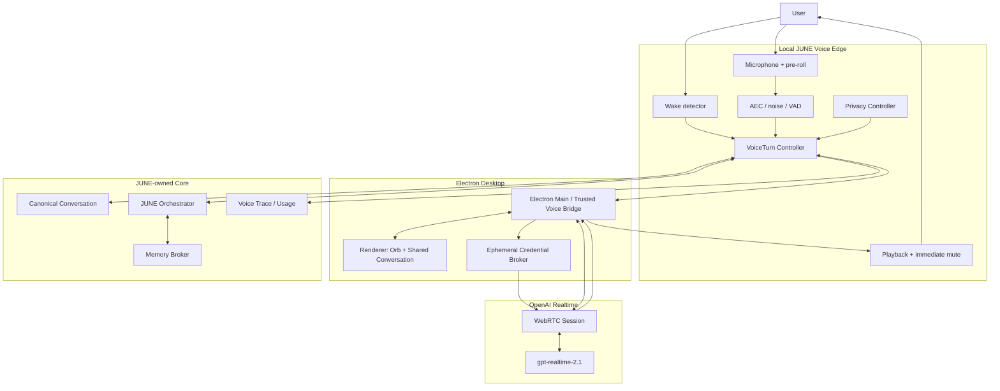
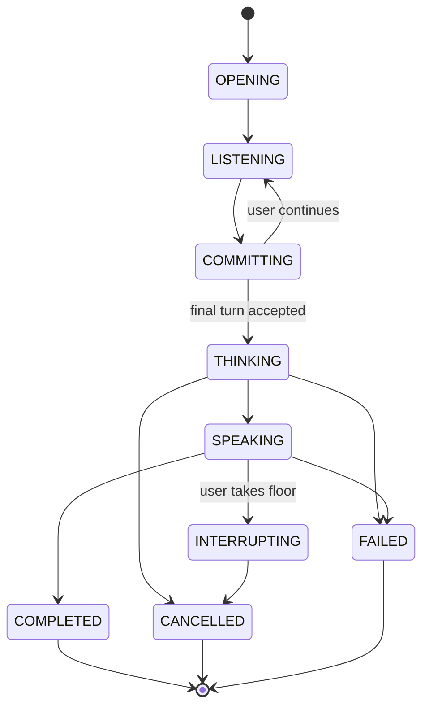

# JUNE 0.1 — Voice System Design

**Product baseline:** JUNE 0.1  
**Document version:** 0.1  
**Status:** Founder-approved Voice V1 system design  
**Date:** 15 August 2026  
**Canonical repository:** `C:\dev\june`  
**Related authority:** [`JUNE_MASTER_ARCHITECTURE.md`](JUNE_MASTER_ARCHITECTURE.md), [`MEMORY_SYSTEM_DESIGN.md`](MEMORY_SYSTEM_DESIGN.md), [`ORCHESTRATOR_SYSTEM_DESIGN.md`](ORCHESTRATOR_SYSTEM_DESIGN.md)
**Authority relationship:** This document refines [`JUNE_MASTER_ARCHITECTURE.md`](JUNE_MASTER_ARCHITECTURE.md) for the Voice subsystem. It cannot silently contradict the Master, which remains the top-level JUNE 0.1 authority for product and cross-system boundaries; any conflict must be resolved explicitly.

> **Purpose**  
> This document is the implementation-level design authority for JUNE Voice V1. It defines the local audio edge, OpenAI Realtime integration, canonical voice-turn lifecycle, shared voice/text conversation behaviour, interruption and cancellation, privacy modes, delegation to the JUNE Orchestrator, memory integration, failure recovery, observability, migration, testing, and acceptance gates.

> **Voice V1 decision**  
> JUNE Voice V1 uses **OpenAI Realtime API** with **`gpt-realtime-2.1`** over **WebRTC** as the primary live speech-to-speech conversation layer. The exact model identifier and account availability must be reverified immediately before integration. JUNE—not OpenAI—owns canonical conversation state, memory, permissions, tasks, actions, transcripts, and what the user actually heard.

> **Core rule**  
> **OpenAI supplies the temporary live conversation. JUNE supplies identity, continuity, privacy, task authority, memory, cancellation truth, and recovery.**

---

## Contents

1. Executive decision  
2. Scope and non-goals  
3. Founder-approved Voice V1 decisions  
4. Design principles  
5. System ownership and boundaries  
6. Target topology  
7. Windows process topology  
8. Canonical identifiers and event envelope  
9. Voice session lifecycle  
10. Canonical `VoiceTurn` lifecycle  
11. Local audio front end  
12. Wake activation and follow-up activation  
13. OpenAI Realtime adapter  
14. WebRTC and credential flow  
15. Shared conversation integration  
16. Turn detection and endpointing  
17. Interruption and barge-in contract  
18. Streaming output and playback  
19. Follow-up conversation mode  
20. Orchestrator delegation  
21. Memory integration  
22. Privacy, consent, and provider egress  
23. Security and local control plane  
24. Failure and recovery behaviour  
25. Performance and observability  
26. Testing, benchmarks, and acceptance gates  
27. Migration from the current repository  
28. Bounded implementation sequence  
29. Final decisions and deferred details  
30. Future extensions  
Appendices: event vocabulary, state transitions, adapter contract, test catalogue, evidence basis

---

# 1. Executive decision

JUNE Voice V1 is a **local-control, cloud-conversation** system.

```text
User
  │
  ▼
Local JUNE Voice Edge
  ├── wake word
  ├── microphone and speaker ownership
  ├── local pre-roll
  ├── acoustic echo cancellation
  ├── speech activity / interruption signal
  ├── immediate local mute
  ├── privacy gate
  └── orb / UI state
  │
  ▼ after activation
JUNE VoiceTurn Controller
  ├── conversation_id
  ├── turn_id
  ├── generation_id
  ├── state machine
  ├── cancellation
  ├── stale-event rejection
  └── heard-duration truth
  │
  ├──────────────────────────────┐
  ▼                              ▼
OpenAI Realtime Adapter      Canonical Conversation
  │                              │
  ├── WebRTC audio              ├── final user transcript
  ├── provider events           ├── assistant transcript
  ├── native speech output      ├── interrupted state
  └── response cancellation     ├── tool/task events
                                 └── channel continuity
  │
  ▼ when work is needed
june_delegate
  │
  ▼
JUNE Orchestrator
  ├── memory
  ├── permissions
  ├── tasks
  ├── scheduling
  ├── money
  ├── research / Fireworks
  └── OpenCode coding capability
```

This design deliberately separates four concerns:

1. **Local reflexes.** Wake, mic/speaker control, immediate mute, privacy, and basic acoustic handling remain local.
2. **Human conversation.** OpenAI Realtime handles live speech-to-speech interaction, timing, tone, and ordinary conversational responses.
3. **Canonical state.** JUNE stores the real conversation, turn state, transcripts, interruption history, and heard duration.
4. **Durable agency.** The Orchestrator controls memory, permissions, tasks, actions, and specialist capabilities.

The primary product objective is:

> **The user should experience one smooth, human-feeling personal assistant that listens naturally, answers quickly, can be interrupted immediately, remembers relevant context, and can hand deeper work to JUNE without the conversation falling apart.**

JUNE does not attempt to make every future provider or fallback path part of Voice V1. OpenAI is the only native realtime provider implemented for the first complete product. Provider independence is preserved through JUNE-owned contracts rather than simultaneous multi-provider implementation.

---

# 2. Scope and non-goals

## 2.1 In scope for Voice V1

- Local wake-word activation.
- Local microphone and speaker ownership.
- Direct speech-to-speech interaction through OpenAI Realtime.
- WebRTC media transport in the Electron desktop application.
- Ephemeral OpenAI client credentials.
- One canonical conversation for voice and typed chat.
- Partial and final user transcripts.
- Assistant response transcript and spoken-progress tracking.
- Natural follow-up turns without repeating `Hey JUNE` after every reply.
- Immediate local interruption and remote generation cancellation.
- Stale audio rejection by JUNE-owned turn/generation identifiers.
- Natural Conversation and Privacy-Enhanced modes.
- Clear local-listening versus cloud-active indicators.
- Narrow delegation to the JUNE Orchestrator.
- Bounded memory retrieval without allowing memory writes to delay first audio.
- Recovery from provider disconnects without losing canonical conversation state.
- Content-minimised latency, reliability, and usage telemetry.
- Windows-native acceptance on the actual founder machine and network.

## 2.2 Explicit non-goals for Voice V1

- Implementing Qwen, Gemini, Azure, Grok, Hume, or another realtime provider.
- Building a full modular STT → Fireworks → TTS fallback before OpenAI Voice V1 is complete.
- Supporting Hindi, Hinglish, or multilingual voice in the initial strong version.
- Training a proprietary end-to-end speech model.
- Making OpenAI the canonical memory or conversation store.
- Giving the realtime provider unrestricted access to tools.
- Sending pre-wake room audio to the cloud.
- Persisting raw microphone audio by default.
- Treating inferred emotion as an objective fact or durable memory.
- Solving final multi-device or always-on cloud voice.
- Final production wake-model training/licensing inside the first integration PR.
- Replacing the JUNE Orchestrator with provider-native agent state.

## 2.3 Existing working baseline

The current JUNE application already has a functioning Windows voice path and passed a founder smoke test covering wake, microphone, STT, chat, cloud model use, TTS, settings, and UI. However, the current path remains transitional:

```text
local ONNX wake
→ fixed command window
→ local faster-whisper
→ separate hidden OpenCode voice session
→ complete buffered model reply
→ local Kokoro/Misaki full WAV
→ local WebSocket event
→ renderer playback
```

Known architecture gaps include:

- fixed four-second command capture;
- a separate invisible voice-only conversation;
- full-response buffering before speech;
- a single complete WAV rather than native realtime audio;
- fragmented cancellation;
- wake/listening suppression during playback;
- no genuine barge-in;
- unauthenticated local side-channel events;
- no JUNE-owned provider-neutral voice-turn controller.

Voice V1 replaces these limitations incrementally rather than through an unbounded rewrite.

---

# 3. Founder-approved Voice V1 decisions

| Decision | Voice V1 position |
|---|---|
| Product priority | Voice and Memory are JUNE's primary USPs |
| Provider | OpenAI |
| Service | OpenAI Realtime API |
| Model | `gpt-realtime-2.1`; reverify exact availability before integration |
| Desktop media transport | WebRTC |
| Language | English first |
| Conversation relationship | Voice and text are two inputs to the same visible conversation |
| UI | Orb overlays the conversation; when it recedes, transcript, reply, tasks, and actions remain visible |
| Interruption | User speech silences JUNE immediately and opens a new turn |
| Task semantics | Voice interruption does not automatically cancel a durable task |
| Follow-up | User does not repeat `Hey JUNE` after each response during an active follow-up window |
| Cloud use | Cloud quality is allowed and preferred after activation |
| Pre-wake audio | Must remain local by default |
| Raw audio storage | Off by default |
| Privacy modes | Natural Conversation and Privacy-Enhanced modes are user-selectable |
| Canonical ownership | JUNE owns conversation, memory, tasks, permissions, actions, and heard state |
| Tools | Realtime provider receives one narrow `june_delegate` interface |
| Deep reasoning | Fireworks-hosted LLM through JUNE when deeper work is needed |
| Coding | OpenCode remains a specialised coding capability |
| Emotional behaviour | OpenAI native audio cues are used; no Hume sidecar in Voice V1 |
| Provider challengers | Deferred until the complete OpenAI product works |

---

# 4. Design principles

## 4.1 JUNE owns continuity

Provider sessions are temporary. If OpenAI disconnects, JUNE reconstructs the active conversation from canonical JUNE state.

## 4.2 Local silence beats remote cancellation

The speaker must be silenced locally before waiting for a cloud round trip. Remote cancellation happens afterward to stop future generation and cost.

## 4.3 Every event belongs to a turn

Audio, transcripts, provider messages, tool calls, TTS output, playback, cancellation, and UI updates carry JUNE-owned identifiers.

## 4.4 What was generated is not what was heard

JUNE separately tracks generated text/audio and delivered/heard progress. The next turn must not assume the user heard unplayed content.

## 4.5 Conversation is fast; action is durable

OpenAI may answer ordinary conversation directly. Tasks, permissions, actions, retries, and long-running work belong to the Orchestrator.

## 4.6 Partial speech is provisional

Partial transcripts may update the UI and prefetch memory. They cannot create durable memory, start consequential work, or become canonical user messages.

## 4.7 Privacy is a state machine

JUNE explicitly distinguishes local wake listening, cloud-active conversation, muted state, follow-up state, and closed state.

## 4.8 Provider details stay behind an adapter

OpenAI event names, IDs, and transport mechanics do not become JUNE's cross-system event model.

## 4.9 Voice latency is end-to-end

The key product metric is not one model's inference time. It is the user's end of speech to first meaningful audible response, plus interruption to silence.

## 4.10 Models interpret; JUNE enforces

The realtime model may infer whether the user means “stop talking”, “pause the research”, or “cancel that task”. JUNE's deterministic task and action systems perform the state transition.

---

# 5. System ownership and boundaries

| Concern | Canonical owner |
|---|---|
| Wake phrase and pre-wake audio | Local Voice Edge |
| Audio device selection and capture | Local Voice Edge |
| Playback and immediate local mute | Local Voice Edge / Playback Engine |
| Active voice-session state | Voice Session Controller |
| User turn identity | VoiceTurn Controller / Conversation Service |
| Provider session/response IDs | OpenAI adapter metadata only |
| Final user transcript | Canonical Conversation Service |
| Assistant text transcript | Canonical Conversation Service |
| Generated audio | Provider stream; ephemeral unless explicitly recorded |
| Heard duration / spoken prefix | Playback Engine + Conversation Service |
| Long-term memory | Memory Service |
| Durable tasks and actions | JUNE Orchestrator |
| Permissions and approvals | Orchestrator Policy/Consent Engine |
| Deep research/reasoning | Research capability / Fireworks adapter |
| Coding | OpenCode capability adapter |
| Voice UI state | Renderer projection of canonical voice events |
| API credentials | Trusted local/backend credential broker |
| Voice telemetry | Local content-minimised observability system |

The OpenAI session may receive a temporary projection of recent conversation, system instructions, selected memory, and tool results. It is not allowed to become the only place where any canonical JUNE fact exists.

---

# 6. Target topology



## 6.1 Separation of planes

```text
MEDIA PLANE
Microphone frames, provider audio, playback buffers

CONVERSATION PLANE
Turns, transcripts, visible messages, spoken progress

CONTROL PLANE
Privacy, cancellation, delegation, permissions, tasks

DATA PLANE
Conversation history, memory, task/action records, audit
```

No media-plane object may silently become canonical conversation or task state.

---

# 7. Windows process topology

## 7.1 Approved product behaviour

- Closing the visible JUNE window leaves the JUNE background service running in the Windows tray.
- Explicit `Quit JUNE` closes active voice sessions, stops cloud audio, flushes canonical state, and shuts down owned processes.
- JUNE 0.1 does not operate while the PC is powered off.
- Microphone and cloud state remain visible while active, even when the main window is hidden.

## 7.2 Recommended process responsibilities

```text
Electron renderer
    UI only: orb, transcript, controls, conversation display

Electron main / trusted desktop host
    WebRTC session ownership
    ephemeral token request
    audio device bridge where appropriate
    secure IPC endpoint
    playback control
    provider adapter coordination

JUNE background service
    canonical VoiceTurn state
    conversation state
    privacy/consent state
    Orchestrator delegation
    memory retrieval requests
    durable event/audit persistence

Local audio worker (if separated)
    wake model
    pre-roll
    AEC / VAD / interruption signal
    device monitoring
```

The exact module/process placement is an implementation decision. The ownership boundaries are not.

## 7.3 Single-owner invariants

At any moment, exactly one trusted JUNE component owns:

- the active microphone stream;
- the active provider session;
- the active playback queue;
- the current `VoiceTurn` state machine;
- generation cancellation;
- cloud egress state.

Two competing supervisors or audio owners are not allowed.

---

# 8. Canonical identifiers and event envelope

## 8.1 Required identifiers

| Identifier | Meaning |
|---|---|
| `user_id` | Single user now; mandatory for future safety |
| `conversation_id` | Canonical visible JUNE conversation |
| `voice_session_id` | One activated voice session/follow-up window |
| `turn_id` | One final user contribution and its assistant response |
| `generation_id` | One attempt to produce a response for a turn |
| `provider_session_id` | OpenAI metadata only |
| `provider_response_id` | OpenAI metadata only |
| `task_id` | Durable Orchestrator task, if delegated |
| `capability_call_id` | One bounded capability invocation |
| `event_id` | Globally unique JUNE event |

A provider response restart uses a new `generation_id` under the same `turn_id`.

## 8.2 Event envelope

```json
{
  "schema": "june.event.v1",
  "event_id": "uuidv7",
  "event_type": "voice.assistant.audio.delta",
  "user_id": "uuidv7",
  "conversation_id": "uuidv7",
  "voice_session_id": "uuidv7",
  "turn_id": "uuidv7",
  "generation_id": "uuidv7",
  "sequence": 184,
  "causation_id": "uuidv7",
  "correlation_id": "uuidv7",
  "provider": "openai",
  "provider_session_id": "optional",
  "provider_response_id": "optional",
  "wall_time": "2026-08-15T00:00:00.000Z",
  "monotonic_ns": 1234567890123,
  "privacy_class": "personal",
  "payload": {}
}
```

## 8.3 Event invariants

- `sequence` is monotonic within a producer stream.
- Events from an inactive `generation_id` cannot mutate playback or visible assistant state.
- A cancelled generation cannot return to `SPEAKING`.
- A closed voice session cannot upload new microphone audio.
- Provider IDs cannot be used as canonical JUNE IDs.
- Partial transcripts never create durable tasks, actions, or memories.
- Final transcript acceptance is idempotent.

---

# 9. Voice session lifecycle

## 9.1 Session states

```text
INACTIVE
ARMED_LOCAL
ACTIVATING
CLOUD_ACTIVE
FOLLOW_UP
MUTED
DEACTIVATING
CLOSED
ERROR
```

## 9.2 State meanings

| State | Meaning |
|---|---|
| `INACTIVE` | No active voice session; wake service may be disabled |
| `ARMED_LOCAL` | Local wake listening enabled; no cloud audio |
| `ACTIVATING` | Wake/button activation accepted; local pre-roll and cloud connection setup |
| `CLOUD_ACTIVE` | Activated conversation; cloud audio behaviour follows selected privacy mode |
| `FOLLOW_UP` | JUNE remains available for a natural follow-up after speaking |
| `MUTED` | Microphone/cloud upload disabled; session may remain visually open |
| `DEACTIVATING` | Stop new media, cancel generation, flush canonical state |
| `CLOSED` | Session is terminal |
| `ERROR` | Session failed and requires recovery, fallback, or closure |

## 9.3 Legal transitions

```text
INACTIVE → ARMED_LOCAL
ARMED_LOCAL → ACTIVATING
ACTIVATING → CLOUD_ACTIVE | ERROR | CLOSED
CLOUD_ACTIVE → FOLLOW_UP | MUTED | DEACTIVATING | ERROR
FOLLOW_UP → CLOUD_ACTIVE | ARMED_LOCAL | MUTED | DEACTIVATING
MUTED → CLOUD_ACTIVE | FOLLOW_UP | DEACTIVATING
ERROR → ACTIVATING | ARMED_LOCAL | CLOSED
DEACTIVATING → ARMED_LOCAL | CLOSED
```

## 9.4 Activation sources

- local wake phrase;
- explicit microphone/orb button;
- keyboard shortcut;
- explicit continuation from a still-active follow-up window;
- future hands-free channel activation.

Every activation is recorded with its source and privacy mode.

---

# 10. Canonical `VoiceTurn` lifecycle

## 10.1 Turn states

```text
OPENING
LISTENING
COMMITTING
THINKING
SPEAKING
INTERRUPTING
COMPLETED
CANCELLED
FAILED
```

## 10.2 Lifecycle



## 10.3 Turn-open rule

A new `turn_id` opens when authenticated local audio control determines that the user has begun an input contribution in an active session.

## 10.4 Commit rule

A user message becomes canonical only when:

1. end-of-turn is accepted;
2. final transcript is available or a documented transcript-unavailable path is used;
3. the turn has not been superseded by a correction/restart;
4. the event carries the active `turn_id`;
5. privacy and session state allow processing.

## 10.5 Terminal invariants

- Every opened turn reaches one terminal state.
- `COMPLETED`, `CANCELLED`, and `FAILED` are terminal.
- A terminal turn cannot accept late audio or transcript events.
- Interrupted assistant output records the spoken prefix/heard duration.
- A durable delegated task has a separate lifecycle and may outlive the turn.

---

# 11. Local audio front end

## 11.1 Responsibilities

- microphone selection and monitoring;
- speaker/output selection;
- sample-rate/channel conversion;
- local wake processing;
- volatile pre-roll buffer;
- local acoustic echo cancellation or provider-compatible echo control;
- optional noise suppression;
- speech activity signal;
- immediate interruption candidate signal;
- playback reference feed for AEC;
- local hard mute;
- device-change, unplug, sleep, and resume detection.

## 11.2 Audio ownership

Raw microphone frames are handled by the trusted local audio path. The renderer does not receive permanent credentials or unrestricted raw-audio access beyond what the selected WebRTC implementation requires.

## 11.3 Pre-roll

A short rolling pre-roll may exist only in volatile memory to avoid clipping the first syllable after activation. It must:

- remain local before activation;
- be bounded in duration;
- be overwritten continuously;
- never be logged by default;
- be included in cloud upload only after activation and according to the selected privacy mode.

The exact pre-roll duration is an implementation tuning decision.

## 11.4 Device changes

If the active microphone or output device disappears:

1. stop or pause cloud media immediately;
2. make the failure visible;
3. preserve the canonical turn state;
4. attempt a safe device fallback only under a documented policy;
5. never silently switch to an unexpected microphone without user-visible indication.

---

# 12. Wake activation and follow-up activation

## 12.1 Wake boundary

Before activation:

```text
microphone → local wake / activity processing only
cloud audio → none
```

After accepted activation:

```text
local pre-roll + active speech → OpenAI according to privacy mode
```

## 12.2 Production wake requirement

The checked-in/current wake path is a prototype and may use a stand-in model. Voice V1 integration may preserve it temporarily, but release readiness requires a validated production `Hey JUNE` model or licensed equivalent.

Required production evaluation includes:

- false accepts per hour on negative audio;
- false rejects on target voices;
- television and speaker echo;
- fan, keyboard, café, and traffic noise;
- near-field and far-field microphone positions;
- accent and speaking-rate variation;
- false-cloud-egress rate caused by false wake.

## 12.3 Button activation

Manual activation must use the same canonical voice-session and privacy state machine as wake activation. It is not a separate shortcut path.

## 12.4 Follow-up activation

During `FOLLOW_UP`, local speech onset may open the next `turn_id` without another wake phrase. The user must be able to see that JUNE remains available.

---

# 13. OpenAI Realtime adapter

## 13.1 Adapter responsibility

The adapter translates between JUNE-owned events and OpenAI-specific session/media/events.

It owns:

- session creation and update;
- provider model/voice configuration;
- provider event parsing;
- input/output transcript events;
- audio frame translation;
- response creation/cancellation;
- truncation/heard-state reconciliation where supported;
- tool/delegation request translation;
- usage and provider error reporting;
- reconnection and session replacement.

## 13.2 Provider-neutral surface

```text
RealtimeVoiceAdapter
    connect(config) -> SessionHandle
    start_input(turn_context)
    send_audio(frame)
    commit_input(turn_context)
    update_context(context_projection)
    cancel_generation(generation_id)
    submit_tool_result(call_id, result)
    close(reason)

Events:
    session.ready
    user.speech.started
    user.speech.ended
    user.transcript.partial
    user.transcript.final
    assistant.text.delta
    assistant.audio.delta
    assistant.completed
    assistant.cancelled
    tool.requested
    usage.updated
    provider.error
    session.lost
```

## 13.3 OpenAI-specific details hidden behind the adapter

- WebRTC SDP/session establishment;
- OpenAI response/item IDs;
- provider VAD event names;
- audio delta representation;
- response-cancel/truncation event names;
- usage schema;
- provider session limits;
- model voice identifiers.

No JUNE system above the adapter may depend directly on these details.

## 13.4 Provider session projection

JUNE may project into the active provider session:

- current system/personality instructions;
- bounded recent conversation context;
- relevant hot memory/profile context;
- selected per-turn memory evidence;
- capability delegation schema;
- concise capability results;
- task status needed for the current reply.

The projection is purpose-limited and reconstructable.

---

# 14. WebRTC and credential flow

## 14.1 Credential rule

The permanent OpenAI API key must not live in the Electron renderer or be exposed to untrusted renderer code.

## 14.2 Session flow

```text
Renderer requests voice activation
        ↓
Trusted Electron main / local broker checks consent
        ↓
Trusted broker requests or creates ephemeral credential
        ↓
Renderer/trusted media host establishes WebRTC
        ↓
Provider session is bound to JUNE voice_session_id
        ↓
Canonical JUNE state remains outside provider session
```

## 14.3 Credential properties

Ephemeral credentials must be:

- short-lived;
- scoped to the intended realtime session where supported;
- generated only after consent and activation checks;
- omitted from normal logs;
- inaccessible to arbitrary local processes;
- invalidated/allowed to expire after session close.

## 14.4 Control connection

JUNE's trusted control path may monitor provider tool events and session state separately from the renderer/media path where the provider supports that pattern. The realtime model receives only the `june_delegate` interface rather than direct capability credentials.

---

# 15. Shared conversation integration

## 15.1 One conversation

Speaking and typing are two input methods for the same `conversation_id`.

Voice does not create an invisible permanent provider/OpenCode session.

## 15.2 User transcript behaviour

- Partial transcript is provisional UI state.
- Revisions replace the provisional text in place.
- Final transcript creates one canonical user message.
- A failed transcription does not create a fabricated user message.
- The user can correct a final transcript through the normal conversation UI.

## 15.3 Assistant message behaviour

- Assistant text may stream into the visible message.
- The message records `generation_id` and delivery state.
- If interrupted, the visible message is marked `Interrupted`.
- Canonical metadata records generated text, spoken prefix/heard duration, and interruption point.
- Unheard generated content is not represented to the next model as if the user heard it.

## 15.4 Tool and task events

Delegation and capability results remain attached to the originating turn/task:

```text
User message
  └── JUNE acknowledgement
      └── task started
          ├── progress
          ├── approval request if needed
          └── final result
```

The user can continue another conversation while a durable task runs.

## 15.5 Restart/reconnection

A provider session restart reconstructs context from:

- canonical conversation;
- active turn/task state;
- relevant memory projection;
- provider-independent personality/instruction state;
- spoken/heard state.

It does not rely on undocumented provider-only history.

---

# 16. Turn detection and endpointing

## 16.1 Fixed capture is retired

The fixed four-second command window is not part of Voice V1's target architecture.

## 16.2 Layered endpointing

```text
Local VAD / speech onset
        ↓
Acoustic/semantic turn-end confidence
        ↓
Provider realtime turn events and transcript evidence
        ↓
JUNE final commit decision
```

## 16.3 Required conversational cases

The endpointing system must handle:

- natural pauses;
- `uh`, `um`, and thinking sounds;
- mid-sentence correction;
- long-form questions;
- short confirmations;
- backchannels such as `yeah` or `mm-hm`;
- background speech;
- coughs and non-speech noise;
- Indian English names and cadence;
- user speech during assistant playback.

## 16.4 Commit conservatism

An early endpoint is more damaging than a modest delay when the user is still speaking. However, excessive silence damages naturalness. The final thresholds are measured and tuned rather than hard-coded from vendor defaults.

## 16.5 Speculative work

Stable partial speech may be used for:

- UI transcript updates;
- speculative memory retrieval;
- warming a query or capability classifier;
- preloading likely context.

It may not:

- create a durable task;
- execute a capability;
- write memory;
- send a consequential action;
- become canonical conversation history.

---

# 17. Interruption and barge-in contract

## 17.1 Interruption is a transaction

True interruption requires coordinated changes across playback, provider generation, conversation state, and turn ownership.

```text
User begins speaking over JUNE
        ↓
Local detector raises interruption candidate
        ↓
Playback ducks/stops immediately
        ↓
JUNE classifies floor-taking vs brief backchannel
        ↓
If true interruption:
    invalidate queued old audio
    cancel provider generation
    truncate/reconcile unheard content
    mark assistant turn interrupted
    open new user turn
```

## 17.2 Local hard-stop target

The product target is:

```text
user interruption onset → audible JUNE silence <=120 ms p95
```

This target is enforced locally. Remote cancellation confirmation may arrive later.

## 17.3 Stale audio rule

Any audio frame associated with an inactive or cancelled `generation_id` is dropped unconditionally before playback.

## 17.4 Backchannels

A short acknowledgement such as `yeah`, `right`, or `mm-hm` may not be intended to take the floor. Voice V1 may begin with a conservative rule set and improve with measured adaptive classification.

When uncertain and the user clearly begins a longer utterance, silence JUNE first. The system may decide afterward whether to cancel or continue.

## 17.5 Task distinction

```text
Stop talking
    → cancel/stop voice generation and playback

Pause the research
    → pause durable research task and preserve checkpoint

Cancel the research
    → request durable task cancellation

Discard it
    → remove retained task artifacts according to policy
```

The realtime model interprets intent. The Orchestrator applies the canonical task transition.

## 17.6 Completed effects

Interrupting spoken output does not undo an action that already committed. The next response must truthfully reflect completed effects.

---

# 18. Streaming output and playback

## 18.1 Native output path

OpenAI Realtime produces audio directly. JUNE plays the stream incrementally rather than waiting for a complete WAV.

## 18.2 Playback queue

The local playback engine owns:

- per-generation audio queue;
- sequence validation;
- buffer depth;
- underrun detection;
- immediate queue purge;
- local volume duck/mute;
- heard-duration accounting;
- playback device recovery.

## 18.3 Per-generation isolation

Audio resources are keyed by `generation_id`. Voice V1 must not reuse one fixed output file for multiple turns.

## 18.4 Heard state

JUNE records enough information to determine:

- playback started time;
- playback stopped time;
- approximate audio duration delivered;
- transcript position/spoken prefix where available;
- whether the response completed or was interrupted.

## 18.5 Text display

The visible assistant text may arrive from provider transcripts/deltas. It remains a JUNE message projection and must reconcile with interruption state.

## 18.6 Modular fallback reservation

A future modular STT → LLM → TTS adapter may use phrase-safe streaming. It is not built in the initial OpenAI Voice V1 path, but the same JUNE `VoiceTurn` and playback contracts must support it later.

---

# 19. Follow-up conversation mode

## 19.1 Product behaviour

After JUNE finishes speaking, the user can continue naturally without repeating `Hey JUNE`.

## 19.2 State

The session moves to `FOLLOW_UP` for an adaptive, clearly indicated period.

## 19.3 Mode-specific behaviour

### Natural Conversation Mode

The activated realtime session may continue receiving conversation audio while the active indicator remains visible.

### Privacy-Enhanced Mode

Local speech detection gates upload. A short local pre-roll prevents clipping after detected speech onset.

## 19.4 Exit conditions

- follow-up timeout;
- explicit goodbye/end instruction;
- mute;
- user closes/dismisses active voice;
- privacy mode change requiring restart;
- provider/session failure;
- explicit `Quit JUNE`.

## 19.5 Exact duration

The initial timeout is a measured tuning decision. It must be configurable and may adapt to recent conversational cadence.

---

# 20. Orchestrator delegation

## 20.1 Narrow tool

The realtime model receives one conceptual tool:

```json
{
  "name": "june_delegate",
  "description": "Ask JUNE's orchestrator to retrieve private state, perform specialised work, or create/manage a durable task.",
  "parameters": {
    "objective": "string",
    "capability_hint": "memory|scheduling|money|search|research|coding|other",
    "operation_class": "read|local_write|protected_write|long_running",
    "desired_result": "speak|display|both"
  }
}
```

Security-critical IDs, authenticated user identity, policy context, and capability tokens are attached by JUNE—not generated by the model.

## 20.2 Immediate acknowledgement

The Orchestrator should quickly return one of:

```text
accepted
clarification_required
confirmation_required
rejected
already_running
```

This lets the voice model respond naturally without blocking on a long task.

## 20.3 Long-running work

Example:

```text
User: Research the strongest evidence for dinosaur extinction.
OpenAI: I'll look into that properly.
JUNE Orchestrator: creates durable research task.
Research: progresses independently.
Voice: remains available for conversation.
Result: returns to the original task/conversation and is spoken/displayed when appropriate.
```

## 20.4 Direct conversational answers

OpenAI may answer ordinary conversation and quick general questions directly when no private state, durable task, or specialised capability is required.

## 20.5 Authority boundary

The realtime provider cannot:

- grant itself new permissions;
- execute capabilities directly;
- access unrestricted memory;
- commit external writes;
- treat a remembered preference as approval;
- change durable task state outside the Orchestrator contract.

---

# 21. Memory integration

## 21.1 Session-start context

At voice-session start, JUNE may provide a small hot-context projection:

- preferred name;
- language;
- speaking/response preferences;
- current high-priority project;
- explicitly approved voice-personality preferences.

## 21.2 Per-turn retrieval

Stable partial speech may trigger speculative read-only retrieval. Final retrieval uses the final canonical turn.

Ordinary target:

```text
4–8 relevant memories
roughly 600–1,200 context tokens
local retrieval <=100 ms p95
```

## 21.3 Write timing

Durable memory extraction begins only after `turn.finalized`. It is asynchronous and cannot delay first audio.

## 21.4 Emotional cues

The realtime model may adapt tone to vocal cues. Emotional inference is normally:

- ephemeral;
- per-turn/per-session;
- confidence-weighted;
- not a diagnosis;
- not automatically durable memory.

If the user explicitly states a durable fact—such as `I've been stressed for weeks; remember that`—the Memory policy decides whether consent and sensitivity rules permit storage.

## 21.5 Provider egress

Only relevant selected memory is sent to the active voice provider. JUNE records which memory IDs were used and whether they left the device.

---

# 22. Privacy, consent, and provider egress

## 22.1 User-visible states

```text
Local wake listening
Cloud conversation active
Microphone muted
Voice session closed
```

These states must not be visually ambiguous.

## 22.2 Natural Conversation Mode

- no cloud audio before activation;
- continuous activated audio may flow during a clearly active session;
- best turn-taking, pause, and overlap experience;
- explicit session-active indication;
- cloud stream ends on mute, dismissal, timeout, or session close.

## 22.3 Privacy-Enhanced Mode

- no cloud audio before activation;
- local VAD/speech onset gates active-session audio upload;
- short local pre-roll may be attached after detected speech;
- user accepts potential responsiveness/naturalness trade-off.

## 22.4 Raw audio persistence

JUNE does not persist microphone audio by default.

Persistent recording/debug audio requires:

- explicit short-lived user consent;
- visible diagnostic state;
- bounded retention;
- secure storage;
- automatic expiry/deletion;
- no use for model training without separate explicit consent.

## 22.5 Transcript persistence

- partial transcripts are ephemeral;
- final user transcript enters canonical conversation according to conversation policy;
- Temporary Conversation follows the Memory/Conversation no-persistent-memory contract;
- provider-side retention settings must be reviewed before release.

## 22.6 Encryption claim

JUNE must not describe ordinary managed cloud inference as Signal-style end-to-end encryption. Product language should state precisely:

- local processing before activation;
- encrypted transport;
- provider processing;
- provider retention configuration;
- JUNE raw-audio retention policy;
- local memory ownership.

## 22.7 Fail-closed behaviour

Missing consent, credentials, or valid privacy configuration means no cloud microphone upload.

---

# 23. Security and local control plane

## 23.1 Secure IPC

The current unauthenticated loopback side-channel must not become the authoritative voice/action control bus.

Preferred Windows pattern:

```text
Windows named pipe or equivalent local IPC
+ ACL restricted to current user/JUNE service
+ per-run high-entropy secret
+ protocol version handshake
+ sequence/replay protection
+ typed schema validation
```

## 23.2 Renderer trust boundary

The renderer may request operations and display state. It must not:

- own permanent API keys;
- issue unauthenticated cancellation/action events;
- open the memory/runtime database directly;
- create provider sessions without trusted consent checks;
- bypass the Action Gateway.

## 23.3 Event forgery

Every security-sensitive local event must be authenticated and tied to:

- active process/session identity;
- expected sequence;
- current `voice_session_id`;
- current `turn_id`/`generation_id`;
- protocol version.

## 23.4 Prompt and tool injection

Provider transcripts and model tool calls are untrusted proposals. `june_delegate` arguments are validated against a trusted schema and policy before work admission.

## 23.5 Secrets

OpenAI permanent credentials, refresh tokens, and future provider credentials live in an OS-backed secret store or trusted backend—not in memory, prompts, renderer state, or ordinary logs.

---

# 24. Failure and recovery behaviour

| Failure | Required behaviour |
|---|---|
| Wake false positive | Show activation; if no valid speech, end quickly; never create durable memory/task from noise |
| WebRTC connection fails before session | Keep local state; make failure visible; retry within bounded policy or return to local wake |
| Provider session drops mid-turn | Stop cloud send/playback safely; preserve canonical transcript/turn; reconnect with a new provider session/generation where safe |
| Input transcript never finalises | Ask the user to repeat; do not fabricate a request |
| Provider produces text but audio fails | Keep visible text only if canonical and appropriate; surface voice failure |
| Provider audio arrives late after cancel | Drop by `generation_id` |
| Playback device disappears | Stop/hold playback; show device failure; preserve turn state |
| Microphone disappears | Stop upload; show listening failure; do not silently select an unexpected mic |
| User interrupts during provider tool call | Stop speech; durable Orchestrator task continues unless intent targets it |
| Orchestrator unavailable | Realtime model may continue ordinary conversation under a restricted policy; no private/durable action delegation |
| Memory retrieval times out | Continue without memory rather than blocking ordinary first audio; record miss |
| Windows sleeps | Close or suspend provider session safely; recover local audio devices and canonical state on resume |
| App window closes | Voice/background service behaviour follows tray policy; active mic/cloud state remains visible in tray/system UI |
| Explicit Quit | Cancel active generation, stop cloud audio, close session, flush canonical state, then shut down |

## 24.1 Reconnection rule

A reconnect creates a new provider session and normally a new `generation_id`. JUNE does not pretend the old provider session survived.

## 24.2 Partial result rule

If a complete safe phrase was already heard before failure, canonical conversation records that heard prefix and the failure. JUNE must not silently replay it from the beginning unless the user requests.

## 24.3 Bounded retries

Connection and provider retries are finite and observable. Repeated failure transitions to a visible degraded/closed state.

---

# 25. Performance and observability

## 25.1 Primary metrics

| Metric | Definition |
|---|---|
| `wake_ack_ms` | Wake accepted to visible listening state |
| `speech_start_detect_ms` | Actual speech onset to local event |
| `transcript_first_ms` | Speech onset to first useful partial transcript |
| `turn_commit_ms` | Actual user end to canonical turn commit |
| `first_audio_ms` | Actual user end to first meaningful audible assistant sample |
| `interrupt_silence_ms` | User interruption onset to effective speaker silence |
| `remote_cancel_ms` | Interruption to provider cancellation issue/acknowledgement |
| `transcript_lag_ms` | Spoken content to visible transcript |
| `audio_buffer_ms` | Current buffered playable output |
| `audio_underruns` | Playback gaps caused by buffer starvation |
| `false_endpoint_rate` | User was still speaking when turn committed |
| `overwait_ms` | Delay after user truly finished |
| `stale_audio_drops` | Late frames rejected by generation state |
| `reconnect_success_rate` | Session recovery without canonical corruption |
| `entity_exact` | Exact names/numbers/dates correctness |
| `voice_cost` | Provider usage attributed to session/turn |

## 25.2 Trace points

```text
voice.session.activation.requested
voice.session.cloud.connected
wake.detected
speech.started
transcript.first_partial
transcript.final
turn.committed
memory.retrieve.started
memory.retrieve.finished
assistant.generation.started
assistant.first_audio.received
playback.started
interruption.detected
playback.silenced
provider.cancel.issued
provider.cancel.confirmed
turn.completed
voice.session.closed
```

## 25.3 Telemetry privacy

Production telemetry records IDs, timing, provider/model, error codes, usage, and state. It does not contain raw audio, raw transcripts, memory contents, or assistant reply text by default.

## 25.4 Initial targets

| Metric | Voice V1 target |
|---|---:|
| Wake accepted to visible listening | `<=150 ms p95` |
| End of ordinary turn to first meaningful audio | `<=700 ms p50`, `<=1.2 s p95` |
| Interruption to audible silence | `<=120 ms p95` |
| Live transcript lag | approximately `<=350 ms median` |
| Important names/numbers | `>=97%` exact |
| Quiet English WER | `<=6%` |
| Real-room/noisy English WER | `<=10%` |
| Blind naturalness | `>=4.2/5` |
| Stale audio accepted after cancellation | `0` |
| Pre-activation cloud audio in privacy test | `0` |

These are product targets, not provider guarantees.

---

# 26. Testing, benchmarks, and acceptance gates

## 26.1 Test layers

1. Pure state-machine/unit tests.
2. Fake provider event tests.
3. Fake audio/playback tests.
4. Deterministic cancellation/fault tests.
5. Provider sandbox integration tests.
6. Real Windows device tests.
7. Long-session and network-degradation tests.
8. Human listening and conversation evaluation.

## 26.2 Fake provider harness

The harness must inject timed events such as:

```text
+000 ms user speech starts
+080 ms transcript partial
+240 ms final transcript
+430 ms assistant text/audio begins
+700 ms user interrupts
+720 ms local playback stops
+850 ms old provider audio arrives
+900 ms provider session disconnects
```

Required assertion:

```text
The +850 ms old audio is never played.
The assistant message is marked interrupted.
A new turn becomes active.
The canonical user transcript appears once.
A delegated durable task remains intact unless separately cancelled.
```

## 26.3 Required invariant tests

- late audio after cancellation;
- out-of-order provider events;
- duplicate final transcript;
- session restart during listening;
- session restart during speaking;
- interruption before first audio;
- interruption during tool/delegation acknowledgement;
- repeated rapid interruptions;
- cough/noise false interruption;
- backchannel versus floor-taking;
- long hesitation and self-correction;
- microphone unplug/replug;
- speaker device switch;
- Windows sleep/resume;
- close window to tray during active session;
- explicit Quit during active session;
- privacy-mode toggle;
- no consent/credential fail-closed;
- no raw content in normal logs;
- no durable memory/task from partial transcript;
- hidden voice session is not created;
- typed and spoken turns share context;
- provider session reconstruction from canonical state.

## 26.4 Audio corpus

The JUNE corpus should include:

- Indian English speakers and names;
- other intended English accents;
- currency, dates, addresses, percentages, model names, branches, and acronyms;
- quiet room, fan, keyboard, traffic, café, and TV speech;
- near-field and far-field microphones;
- hesitations, corrections, interruptions, backchannels, and long turns;
- personal-assistant requests, memory questions, scheduling, research, and coding delegation.

## 26.5 Network matrix

Run from the actual Windows target under:

- normal broadband;
- mobile hotspot;
- added RTT;
- jitter;
- packet loss;
- temporary disconnect;
- Wi-Fi/network transition.

Report p50, p90, p95, and p99—not averages alone.

## 26.6 Human evaluation

Blind evaluators score:

- naturalness;
- warmth;
- intelligibility;
- pacing;
- emotional alignment;
- timing;
- interruption recovery;
- long-session fatigue;
- Indian-name pronunciation;
- willingness to use daily.

## 26.7 Release hard gates

- zero stale audio accepted after a cancelled generation;
- zero intentional pre-activation cloud microphone traffic;
- zero permanent API keys exposed to renderer logs/state;
- one canonical user message per final voice turn;
- no durable task or memory from partial transcript;
- shared voice/text conversation survives restart;
- interruption silences locally even if provider cancellation fails;
- privacy mode is visibly and technically enforced;
- provider disconnect never destroys canonical conversation history;
- task effects remain truthful after speech interruption.

---

# 27. Migration from the current repository

## 27.1 Strategy

Use a strangler migration. Preserve the working local path while introducing JUNE-owned contracts around it.

## 27.2 Current-to-target mapping

| Current component | Migration treatment |
|---|---|
| Current wake daemon | Preserve temporarily behind Local Voice Edge adapter |
| Fixed command window | Retire after streaming turn detection proves stable |
| Local faster-whisper | Preserve as measured legacy/fallback during migration |
| Separate hidden OpenCode voice session | Retire when shared canonical conversation is active |
| Buffered SSE reply | Retire for native realtime path |
| Kokoro full-WAV output | Preserve only as legacy fallback/test baseline |
| Fixed TTS output path | Retire; use per-generation streamed resources |
| Renderer audio playback | Refactor behind Playback Engine contract |
| Unauthenticated side-channel | Replace/harden before authoritative voice/action control |
| Existing overlay/orb states | Map to canonical voice session/turn events |

## 27.3 Migration stages

1. Inventory current voice paths, files, events, state ownership, and tests.
2. Add content-free baseline timing instrumentation.
3. Introduce canonical IDs and `VoiceTurn` state machine around current components.
4. Add stale-event rejection and per-generation playback ownership.
5. Merge voice into the visible canonical conversation while still using current local speech components.
6. Replace/harden local control IPC.
7. Add the OpenAI Realtime adapter behind the same contracts.
8. Add true local interruption and full-duplex audio handling.
9. Add privacy modes and follow-up behaviour.
10. Integrate Orchestrator delegation and Memory retrieval.
11. Run shadow/parallel acceptance against the existing path.
12. Retire legacy components only after replacement proof and rollback artifacts exist.

## 27.4 No destructive cut-over

The existing working voice path remains available until:

- OpenAI Voice V1 passes the real Windows acceptance matrix;
- conversation history is correct;
- interruption invariants pass;
- privacy tests pass;
- provider outage/reconnect tests pass;
- rollback is documented.

---

# 28. Bounded implementation sequence

> **Implementation-order authority:** This section is a Voice-subsystem-local sequence. [`JUNE_MASTER_ARCHITECTURE.md`](JUNE_MASTER_ARCHITECTURE.md), Section 23, controls the global JUNE build order. Orchestrator, secure IPC, canonical conversation, and Memory dependencies must land according to the Master order. The numbered Voice PR headings below are local sequence labels, not global repository PR numbers.

Each PR is a separate session and must remain independently reviewable.

## PR 1 — Voice design authority

- Add `VOICE_SYSTEM_DESIGN.md`.
- Link it from the master architecture.
- Record final/deferred decisions.
- No runtime changes.

## PR 2 — Current voice inventory and baseline telemetry

- Map wake, capture, STT, model, TTS, playback, UI, and side-channel ownership.
- Add monotonic timing and content-free error/usage telemetry.
- Preserve behaviour.

## PR 3 — Canonical voice identifiers and event envelope

- Introduce `voice_session_id`, `turn_id`, and `generation_id`.
- Add provider-neutral typed events.
- Keep existing voice path.

## PR 4 — `VoiceTurn` state machine and cancellation core

- Legal transitions.
- Cancellation owner.
- Stale-event rejection.
- Fake-provider race tests.

## PR 5 — Per-generation playback ownership

- Remove fixed shared output-resource assumptions.
- Queue isolation.
- Immediate purge/mute.
- Heard-duration accounting.

## PR 6 — Shared voice/text conversation

- Remove hidden voice-only canonical session.
- Partial/final transcript semantics.
- Interrupted assistant message semantics.
- Mixed typed/voice continuity.

## PR 7 — Secure local voice control channel

- Authenticated local IPC.
- Renderer trust boundary.
- Replay/stale protection.
- Retire authoritative use of unauthenticated side-channel.

## PR 8 — OpenAI credential and adapter skeleton

- Ephemeral credential broker.
- Provider-neutral adapter interface.
- Session/event translation tests.
- No microphone rollout yet.

## PR 9 — OpenAI WebRTC audio vertical slice

- Activated microphone input.
- Native audio output.
- Visible transcript.
- Basic conversation.
- JUNE-owned canonical state.

## PR 10 — True interruption and full-duplex local audio

- Immediate local silence.
- Provider cancellation.
- Queue invalidation.
- AEC/echo handling candidate.
- Repeated interruption tests.

## PR 11 — Follow-up and privacy modes

- Natural Conversation Mode.
- Privacy-Enhanced Mode.
- Visible cloud/mic states.
- Timeout/mute/close semantics.

## PR 12 — Orchestrator delegation

- `june_delegate` bridge.
- Immediate accepted/clarify/confirm responses.
- Durable task distinction.
- No direct provider capability authority.

## PR 13 — Memory integration

- Session hot context.
- Bounded per-turn retrieval.
- Provider-egress usage record.
- No write-path latency regression.

## PR 14 — Wake/audio hardening

- Production wake candidate integration or release-blocking validation plan.
- device changes;
- Windows sleep/resume;
- noise/echo acceptance.

## PR 15 — Full Windows acceptance and cut-over

- long sessions;
- network degradation;
- privacy tests;
- cancellation torture tests;
- recovery and rollback;
- legacy-path retirement decision.

The exact number of PRs may change after repository inspection, but the dependency order and one-bounded-PR rule remain.

---

# 29. Final decisions and deferred details

## 29.1 Final for JUNE 0.1

- OpenAI is the only Voice V1 provider.
- OpenAI Realtime API is the service.
- `gpt-realtime-2.1` is the selected model, subject to final availability verification.
- WebRTC is the desktop media transport.
- Wake/audio/privacy controls remain local.
- Pre-wake room audio does not intentionally leave the device.
- Voice and typed chat share one canonical visible conversation.
- Every interaction has JUNE-owned session/turn/generation IDs.
- Interruption silences locally before remote cancellation.
- Cancelled/stale audio can never play.
- Follow-up conversation does not require repeated wake phrase.
- Natural Conversation and Privacy-Enhanced modes are user-selectable.
- Raw microphone audio is not persisted by default.
- OpenAI receives only a temporary context projection.
- Realtime tools are limited to `june_delegate`.
- JUNE owns memory, tasks, actions, permissions, and canonical transcripts.
- Fireworks handles deeper work through JUNE; OpenCode handles coding through JUNE.
- Partial transcripts cannot create memory, tasks, or consequential actions.
- Voice cancellation and task cancellation remain separate.
- No Hume sidecar or alternate voice provider in Voice V1.

## 29.2 Provisional implementation choices

- exact OpenAI voice preset;
- detailed personality/system prompt;
- exact AEC implementation;
- exact VAD/turn-detection combination;
- exact production wake model and licensing/training path;
- exact pre-roll duration;
- exact follow-up timeout;
- exact renderer/main/background-service module placement;
- exact audio codec/buffer sizes selected by provider/WebRTC implementation;
- exact transcript reconciliation details exposed by the selected OpenAI API revision;
- legacy local STT/TTS fallback retention after Voice V1 cut-over.

## 29.3 Deferred

- alternate native realtime providers;
- modular STT → Fireworks → TTS fallback;
- multilingual voice;
- cross-device voice continuity;
- always-on cloud JUNE;
- custom voice cloning;
- advanced emotion sidecars;
- on-device frontier realtime speech model;
- mobile-native voice client.

---

# 30. Future extensions

## 30.1 Provider challengers

After the complete OpenAI product works, JUNE may benchmark provider adapters using the same canonical events and acceptance suite. Provider replacement must not change conversation, memory, task, or permission ownership.

## 30.2 Modular fallback

A future path may use:

```text
streaming STT
→ JUNE / Fireworks text reasoning
→ streaming TTS
```

It must still use the same `VoiceTurn`, playback, cancellation, privacy, and conversation contracts.

## 30.3 Mobile and multi-device

A future mobile client requires device identity, secure session handoff, canonical conversation sync, and a deliberate always-on cloud trust model.

## 30.4 Personal voice and pronunciation

Future memory may provide user-specific names, pronunciations, vocabulary, pacing, and style. Canonical preferences remain inspectable data rather than being hidden only in model weights.

## 30.5 Advanced full-duplex behaviour

Future versions may improve backchannel recognition, overlap handling, emotional timing, and proactive conversational cues. These remain constrained by JUNE-owned turn and task authority.

---

# Appendix A — Canonical voice event vocabulary

```text
voice.session.activation.requested
voice.session.activated
voice.session.cloud.connected
voice.session.follow_up.entered
voice.session.muted
voice.session.deactivating
voice.session.closed
voice.session.error

wake.detected
wake.rejected

voice.user.speech.started
voice.user.speech.ended
voice.user.transcript.partial
voice.user.transcript.final

voice.turn.opened
voice.turn.committing
voice.turn.committed
voice.turn.interrupted
voice.turn.completed
voice.turn.cancelled
voice.turn.failed

voice.assistant.generation.started
voice.assistant.text.delta
voice.assistant.audio.delta
voice.assistant.playback.started
voice.assistant.playback.progress
voice.assistant.playback.stopped
voice.assistant.generation.completed
voice.assistant.generation.cancelled

voice.interruption.candidate
voice.interruption.confirmed
voice.interruption.backchannel

voice.delegate.requested
voice.delegate.accepted
voice.delegate.clarification_required
voice.delegate.confirmation_required
voice.delegate.rejected
voice.delegate.result.ready

voice.provider.usage
voice.provider.error
voice.provider.session_lost
voice.provider.session_recovered
```

---

# Appendix B — State-transition summary

## Session

```text
INACTIVE
  → ARMED_LOCAL
  → ACTIVATING
  → CLOUD_ACTIVE
  ↔ FOLLOW_UP
  ↔ MUTED
  → DEACTIVATING
  → ARMED_LOCAL | CLOSED
```

## Turn

```text
OPENING
  → LISTENING
  → COMMITTING
  → THINKING
  → SPEAKING
  → COMPLETED

Any active state
  → CANCELLED | FAILED

SPEAKING
  → INTERRUPTING
  → CANCELLED
```

---

# Appendix C — Realtime adapter contract summary

```text
connect
close
start_input
send_audio
commit_input
update_context
cancel_generation
submit_tool_result

emits:
  session.ready
  user.speech.started
  user.speech.ended
  user.transcript.partial
  user.transcript.final
  assistant.text.delta
  assistant.audio.delta
  assistant.completed
  assistant.cancelled
  tool.requested
  usage.updated
  provider.error
  session.lost
```

---

# Appendix D — Core test catalogue

```text
VT-001 final transcript creates one user message
VT-002 partial transcript creates no durable message
VT-003 partial transcript creates no task or memory
VT-004 cancelled generation cannot return to speaking
VT-005 late audio is dropped
VT-006 interruption records heard prefix
VT-007 voice stop does not cancel research task
VT-008 explicit task cancel reaches Orchestrator
VT-009 typed turn follows voice turn in same conversation
VT-010 provider reconnect reconstructs canonical context
VT-011 session close stops cloud audio
VT-012 no-consent activation fails closed
VT-013 permanent key never enters renderer logs
VT-014 Temporary Conversation follows memory policy
VT-015 microphone device loss is visible and safe
VT-016 speaker loss preserves turn state
VT-017 close-to-tray preserves intended background behaviour
VT-018 explicit Quit closes media and flushes state
VT-019 privacy mode change follows legal transition
VT-020 repeated interruption never plays stale output
VT-021 backchannel does not incorrectly destroy turn under accepted policy
VT-022 user self-correction commits final wording only
VT-023 memory timeout does not block first audio indefinitely
VT-024 orchestrator unavailable blocks private/durable delegation safely
VT-025 raw audio is absent from ordinary telemetry
```

---

# Appendix E — Evidence and decision basis

This design consolidates the founder-approved JUNE Voice V1 decisions and the conclusions of the completed voice research:

- direct realtime speech-to-speech is the chosen primary human-conversation path;
- OpenAI is the quality-first production baseline for JUNE 0.1;
- JUNE must own conversation, memory, tasks, permissions, and provider-independent event semantics;
- native realtime conversation and durable agent work are separate planes;
- immediate local interruption, stale-audio rejection, and heard-duration tracking are architectural requirements;
- fixed-window capture, hidden voice sessions, full-response buffering, and whole-WAV playback are transitional limitations;
- voice quality must be validated end-to-end on the actual Windows/India deployment;
- memory retrieval is bounded and speculative reads are allowed, but durable writes use only final turns;
- the future may add provider challengers or modular fallback without replacing JUNE's contracts.

The authoritative top-level product and cross-system boundaries remain in `JUNE_MASTER_ARCHITECTURE.md`. Orchestrator and Memory implementation details remain authoritative in their respective standalone documents.
