# JUNE 0.1 Internal MVP Implementation Plan

Status: Founder-approved internal MVP execution baseline for the current JUNE 0.1 build.

## 1. Executive verdict

**Verdict:** The requested internal MVP is technically coherent as a temporary compatibility slice through the approved JUNE architecture. It is not a smaller production release. It proves the product loop on one known Windows machine while retaining the production/public-release roadmap in [VOICE_IMPLEMENTATION_PLAN.md](VOICE_IMPLEMENTATION_PLAN.md).

**Seven-day realism:** A safe founder demo is possible within seven calendar days, but the complete script is not a responsible Friday promise. The repository already has a local wake path, Electron microphone consent, main-process credential storage, renderer audio seams, UI actions, and a durable local memory store. It does not have WebRTC, a Realtime session controller, a trusted wake-to-WebRTC handoff, true interruption, Voice-to-chat projection, a safe app-command boundary, or a safe explicit-memory boundary. Those missing integrations concentrate risk on the same lifecycle and renderer files.

**Confidence:** 50% in the best case for the complete must-have script, assuming the target OpenAI account and model work immediately on the founder's existing Windows/audio setup; 30% under the likely case; about 80% for the reduced fallback demo. These are planning estimates, not measured delivery probabilities. The likely complete schedule is seven to ten working days, even though a best-case five-working-day path exists.

**Exact MVP outcome:** An internal-only, opt-in `realtime_mvp` route lets the founder activate JUNE by the existing local wake path or an explicit UI control, speak with OpenAI Realtime, interrupt and ask a follow-up, mute or end the Voice session, see final user and assistant text in the chat pinned at activation, execute one command from a fixed JUNE-only UI allowlist, explicitly remember/recall/correct/forget one founder-approved low-sensitivity structured fact across restart through the **MVP Legacy Memory Adapter**, and return to the unchanged legacy Voice route. Existing profiles remain on `legacy` by default.

The requested target, `gpt-realtime-2.1`, is currently documented as a Realtime speech-to-speech model with function calling and a Realtime endpoint. Browser-style clients are supported over WebRTC through either client secrets or a trusted-backend unified `/v1/realtime/calls` bootstrap. This plan chooses the unified path in Electron main: current client secrets can create multiple sessions until expiry, have a minimum ten-second TTL, and attached session configuration can be overridden by the client, so they are not honestly “single-use/session-bound.” Actual JUNE account access remains **Unknown** until an authorized live check. See the official [model page](https://developers.openai.com/api/docs/models/gpt-realtime-2.1), [Realtime WebRTC guide](https://developers.openai.com/api/docs/guides/realtime-webrtc), and [client-secret reference](https://developers.openai.com/api/reference/resources/realtime/subresources/client_secrets/methods/create).

Recommended portfolio counts are non-exclusive lenses; a PR can be both critical-path and conflict-serialized.

| Measure | Count | IDs / meaning |
| --- | ---: | --- |
| Required PRs | 10 | MVP-01 through MVP-10 |
| Critical-path PRs | 7 | MVP-01 through MVP-06, then MVP-10 |
| Fully independent PRs | 1 | MVP-01 has no MVP prerequisite and can implement/merge from base; every other required PR has a safety, contract, or integration dependency |
| Preparation-parallel but merge-dependent PRs | 7 | MVP-02, MVP-03, MVP-04, MVP-07, MVP-08, MVP-09, and MVP-10 |
| Serialized/conflicting PRs | 6 | MVP-01 through MVP-06 have an ordered safety/contract/consent/credential/media/wake chain and share lifecycle, preload, media, logging, or wake seams |
| Stretch PRs | 1 | MVP-11, the interrupted-response marker |

“Preparation-parallel” here counts substantial independently useful branches outside the active critical-path implementation. MVP-05/06 permit small fake/test sketches before dependencies, but remain critical-path work and are deliberately not added to that seven-PR preparation count.

- **Earliest audible OpenAI checkpoint:** late Day 2 in the best case on a Draft branch using explicit UI activation; Day 3 is the likely first accepted checkpoint. It is not an MVP acceptance claim until MVP-05 merges.
- **Earliest app-control checkpoint:** late Day 3 with a fake proposal; Day 4 for a live Realtime proposal after MVP-08.
- **Earliest persistent-memory checkpoint:** end of Day 2 for an isolated backend-only restart test; late Day 4 for accepted-final Voice-to-memory-to-restart behavior after MVP-09.
- **Largest risks:** account/model/data-control availability; Electron WebRTC/CSP/ICE behavior; two microphone owners or a failed handoff; late audio after interruption; current unauthenticated side-channel events; permanent-key leakage; the size of wake/interruption integration; plaintext and inconsistent legacy memory APIs; and conflicts in `main/index.ts`, preload, `NightjarOrb.tsx`, and the Realtime controller.
- **Reduced fallback demo:** explicit UI activation → one audible Realtime exchange → MVP-05 local Stop → final transcript and reply visible if MVP-07 is green → Voice Off/Quit cleanup → transact the route to legacy Voice. Spoken barge-in/follow-up, Realtime wake, mute/unmute/end controls, app commands, memory, and the interrupted marker are cut before any safety invariant is weakened.

No live provider, microphone, hardware, GUI, or runtime behavior was tested while producing this plan.

## 2. MVP definition

### Must-have behavior

1. Preserve and test the current Voice route before adding media.
2. Voice Off and explicit Quit close the owned or adopted Python wake microphone, any active or pending renderer capture, remote playback, peer/data channels, and the current Voice session.
3. Existing profiles remain on `legacy`; `realtime_mvp` requires both an internal feature enable and explicit user selection.
4. A separate, versioned, provider-and-purpose-specific consent authorizes only post-activation microphone audio to OpenAI. Local wake audio never goes to OpenAI.
5. Electron main stores the Realtime permanent key in a dedicated, non-catalogued `safeStorage` record that generic BYOK renderer IPC cannot list, set, remove, or read. Only dedicated main-owned provision/remove/bootstrap functions can touch it; the existing generic `openai` BYOK slot remains text-chat-only and cannot satisfy Realtime. Main returns a bounded SDP answer—not any API credential—to the renderer.
6. One microphone lease moves deterministically from local wake capture to one renderer `MediaStream` and back. An explicit UI activation uses the same release-before-acquire path.
7. A minimal JUNE-owned session/user-turn/accepted-input/response-generation kernel rejects stale events and prevents stale audio from becoming audible. Local playback is silenced before provider cancellation.
8. The founder can have a natural spoken exchange, interrupt audible output, ask a follow-up without another wake phrase during a bounded follow-up window, and mute or end the session.
9. Final accepted user text and final assistant text appear once in the chat captured at Voice activation as an explicitly temporary renderer projection; changing chat selection cannot retarget them. They are not claimed as canonical OpenCode context.
10. OpenAI may propose only four no-argument JUNE UI commands: `open_settings`, `close_settings`, `show_chat`, and `open_code`. Trusted JUNE code validates and executes them exactly once. One command must work in the demo.
11. The **MVP Legacy Memory Adapter** supports bounded `remember`, `retrieve`, `list`, `correct`, and `forget` for three founder-approved low-sensitivity structured predicate families: answer-length preference, person relationship, and compile-time-allowlisted current city. Writes require JUNE's accepted-final input, not provider transcript finality.
12. A restart proves the memory persists; correction overwrites the current adapter-owned value; forget removes its active entity/searchability so it remains absent from adapter retrieval and active legacy recall after restart.
13. Normal logs contain no raw audio, full transcript, full reply, credential, or memory content.
14. The founder can return to the legacy route without deleting it or migrating real data.

### Stretch behavior for the same week

- **MVP-11:** show one deduplicated “response interrupted” marker in the current chat. It starts only after all required gates pass.

### Visible-continuity classification

| Candidate | Classification | Reason |
| --- | --- | --- |
| Final spoken user transcript in activation-pinned current chat | Required MVP | It makes the Voice turn inspectable and supports command/memory review without implementing the complete Conversation architecture |
| Final assistant response in the same pinned chat | Required MVP | It gives basic continuity and exposes duplicates or stale generations during the founder demo without cross-chat retargeting |
| Minimal interrupted-response marker | Stretch | `UiMessage` has no heard/interrupted metadata today; the marker is useful but not worth delaying safe interruption itself |

### Explicitly deferred behavior

The internal MVP defers the full JUNE Orchestrator; `june_runtime.db`; the complete R0-R3 permission framework; Action Gateway/Ledger; durable tasks and external-action retry/reconciliation; Telegram; scheduling/reminders; money tracking; Deep Research; general OpenCode delegation; email, external calendar, browser automation, commerce, and payments; full secure-IPC migration; canonical Conversation migration; Memory V1; SQLCipher/DPAPI memory migration; LanceDB/final embeddings; Memory Centre; broad provider-independent events; production Hey JUNE training/licensing; broad device/driver/noise/network coverage; installer/signing/updater/public release; multi-device/cloud operation; alternative Voice providers; agent teams; and computer use.

The following candidate commands are also deferred: LAB → Mechanical/CAD navigation, generic Back, New Conversation, browser/filesystem/shell actions, and any dynamic tool discovery. CAD is not a top-level route, Back has no global semantic, and New Conversation introduces a Voice/OpenCode session race that is unnecessary for the product proof.

The MVP adds no remote/background service that operates while the host process or PC is off. When the PC is off, JUNE performs no Voice, app-command, or memory operation.

### What “working” means

“Working” means every gate in Section 14 passes with isolated tests and an authorized manual run on the founder's named Windows machine. A single happy-path call is insufficient. The route must fail closed on missing consent, missing/renderer-manageable Realtime key, feature state, media lease, stale identity, or unknown tool proposal; it must return to legacy without leaving a microphone or audio sink active.

The full founder demo script is:

```text
Activate JUNE
→ have a natural spoken exchange
→ interrupt JUNE
→ ask a follow-up
→ issue one allowlisted app command
→ remember one explicit preference
→ restart JUNE
→ recall the preference
→ forget the preference
→ switch back to legacy Voice
```

No step is removed from the required target. The wake step may use explicit UI activation only in the reduced fallback because the source has no trusted wake-to-WebRTC handoff today.

### Honest claims

If all required gates pass, the MVP may claim: “JUNE has an internal, opt-in, one-machine proof of low-latency OpenAI Realtime conversation, interruption, a small allowlisted UI-control path, and explicit local legacy-memory CRUD with rollback.”

It may not claim production readiness, public security, universal hardware support, production wake quality, canonical conversation durability, encrypted or securely erased memory, autonomous agency, general computer control, provider independence, retention guarantees beyond the verified account state, or public JUNE 0.1 acceptance.

## 3. Current codebase evidence

All statements below are based on source inspection. “Confirmed” means directly visible in the repository; “Unknown” requires live provider, Windows, hardware, or product review.

| Area | Current evidence | MVP consequence |
| --- | --- | --- |
| Existing wake | **Confirmed:** [`WakeWordDetector`](../../phase2-mcp/nightjar_capabilities/wakeword.py) runs a local ONNX pipeline. [`MicStream`](../../phase2-mcp/wake_daemon.py) opens continuous 16 kHz mono capture; `handle_wake` captures 33 × 120 ms frames after detection. Model resolution may fall back to a bundled “hey buddy” stand-in when no configured `hey_june.onnx` exists. | Reuse and freeze the detector. Validate the founder's actual model/phrase. Do not build wake training or pre-roll this week. |
| Existing Voice flow | **Confirmed:** `handle_wake` performs local faster-whisper STT through [`voice.transcribe`](../../phase2-mcp/nightjar_capabilities/voice.py), sends text to a persistent hidden OpenCode session, waits for the whole reply, runs whole-text Kokoro TTS, writes a shared WAV, and publishes its path over [`sidechannel.py`](../../phase2-mcp/sidechannel.py). | Keep this as `legacy`. Realtime must be a separate feature-gated path, not an in-place rewrite. |
| Current microphone owners | **Confirmed:** Python `MicStream` owns the wake microphone. On `wake`, [`orbAdapter.startMic`](../../phase3-ui/src/renderer/src/lib/orbAdapter.ts) independently calls `getUserMedia` for visualization. | There are already two possible capture owners. MVP-01 closes both on Off/Quit; the completed MVP uses release-before-acquire and one renderer stream for Realtime plus metering. |
| Playback/interruption | **Confirmed:** legacy playback is a renderer `<audio>` element with a local `ttsPlayId`; wake tears down current TTS. Side-channel TTS events have no JUNE session/turn/generation identity. The daemon suppresses wake scoring during playback, so true barge-in is absent. | Realtime needs its own generation-gated sink. Immediate local silence precedes provider cancel; late callbacks never re-arm an old generation. |
| Lifecycle | **Confirmed:** [`index.ts`](../../phase3-ui/src/main/index.ts) enters `before-quit`, waits on generic `Supervisor.stop()`, then calls `app.quit()` again. It sends no renderer shutdown request/acknowledgement. [`Supervisor.stop`](../../phase3-ui/src/main/supervisor.ts) stops only owned child handles, while `stopService` handles adopted listeners; `test-supervisor.ts` treats general adopted services surviving `stop()` as intended. `NightjarOrb` currently relies on component cleanup for renderer media. | MVP-01 must add a bounded renderer-first shutdown request/ack with window-destroy fail-closed fallback, then a wake-specific Quit stop, without changing generic adopted-service ownership semantics. MVP-05/06 reuse the same seam. |
| Consent | **Confirmed:** [`voiceConsent.ts`](../../phase3-ui/src/main/voiceConsent.ts) is fail-closed and single-flight for current local-mic consent. [`voiceConsentCopy.ts`](../../phase3-ui/src/shared/voiceConsentCopy.ts) says wake/STT are local and only text may reach cloud. | Current consent does not authorize raw post-wake audio. Add a separate versioned cloud-audio consent; no silent migration. |
| Credentials | **Confirmed:** [`byok.ts`](../../phase3-ui/src/main/byok.ts) encrypts generic provider values with Electron `safeStorage` where available and exposes `getKey` only in main. [`preload/index.ts`](../../phase3-ui/src/preload/index.ts) still exposes generic provider set/remove, and the BYOK form holds newly typed key text transiently in renderer state. Hiding that form would not prevent direct generic IPC replacement of the same `openai` slot and could regress text-chat BYOK. | Create a separate non-catalogued main-only Realtime key record and dedicated trusted provision/remove/read functions; generic BYOK list/status/set/remove and model/child routing cannot address it. Use it only for main-owned unified SDP/session bootstrap. Missing secure provisioning or unavailable `safeStorage` denies live Realtime. Keep renderer CSP unchanged unless a real WebRTC test proves one minimal policy addition is required. |
| Conversation/session path | **Confirmed:** [`ConnectionContext`](../../phase3-ui/src/renderer/src/context/ConnectionContext.tsx) creates an OpenCode client/session and owns one SSE stream. [`SessionsContext`](../../phase3-ui/src/renderer/src/context/SessionsContext.tsx) demultiplexes only by OpenCode `sessionID`; reconnect can copy visible renderer messages into a fresh engine session. Voice events do not enter it. | Add a renderer-only deduplicated projection for final text. Do not call it canonical or imply OpenCode receives the same Voice context. |
| App navigation and Voice controls | **Confirmed:** [`AppShell`](../../phase3-ui/src/renderer/src/shell/AppShell.tsx) privately owns `tab`; [`TabBar`](../../phase3-ui/src/renderer/src/shell/TabBar.tsx) allows Chat, Projects, LAB, and Code. Settings uses `ModelContext.showKeys/setShowKeys`, but the existing AppShell close callback also increments `capsRefresh`; reducing close to `setShowKeys(false)` would change behavior. `SessionsContext.newSession` supports a new chat. LAB → Mechanical is private state inside `LabScreen`; no global Back exists. Current Voice UI has master Off but no Realtime-style mute, unmute, or end-session controller. | Expose only four existing, low-risk app callbacks and register the existing composite `closeSettings()` semantics. Defer CAD, Back, and New Conversation; implement mute/end inside the new Voice controller rather than the app router. |
| Existing memory APIs | **Confirmed:** [`memory.py`](../../phase2-mcp/nightjar_capabilities/memory.py) exposes save/search/list/delete/count; its default `kind="note"` is invalid for the vendored entity allowlist. [`mcp_server.py`](../../phase2-mcp/mcp_server.py) exposes only save/search/list. Update exists only below the JUNE facade. Search and list return inconsistent shapes. | Use a typed adapter, fixed valid-kind mapping, bounded exact-key/list reads, one atomic adapter mutation seam, adapter-owned records, and explicit correction/forget. Do not expose the general MCP surface to Realtime. |
| Memory persistence/recall | **Confirmed:** `NIGHTJAR_DATA_DIR` defaults to `~/.nightjar`; the legacy store is plaintext WAL-mode SQLite `memory.db` plus derived vectors. [`nightjar-auto-recall.ts`](../../phase2-mcp/workspace/.opencode/plugin/nightjar-auto-recall.ts) injects up to three recalled items into OpenCode messages. Because the legacy wake daemon submits its final STT command to OpenCode, legacy Voice receives that recall path by source flow. | Restart persistence is usable, but encryption, sensitivity policy, correction history, and safe erasure are absent. Realtime bypasses global auto-recall and uses only the temporary adapter. |
| Test seams | **Confirmed:** Voice consent and Supervisor accept injected stores/fakes; orb tests inject WebSocket/media/audio dependencies; `OpenCodeVoice` accepts a fake base URL; `handle_wake` has fake mic/STT/TTS/publish seams. | Deterministic provider, clock, ID, media-owner, and tool-proposal fakes can be added without real audio or user data. |

### Confirmed defects relevant to the first week

1. Explicit Quit may leave an adopted wake daemon and microphone alive, and main has no deterministic renderer-first media-shutdown acknowledgement before service shutdown.
2. Voice Off closes the Python daemon but does not tear down an already-active renderer mic; a pending `getUserMedia` can resolve after Off.
3. The current legacy wake window can have both Python and renderer microphone handles.
4. `wake_daemon.handle_wake` logs full transcript/command content.
5. Current side-channel events lack authentication and canonical identity. A forged `transcription` can still drive the orb overlay while Voice is off; the side channel cannot authorize cloud activation, app commands, or memory.
6. Late same-session OpenCode SSE events can cross legacy turns; TTS uses one shared output path.
7. Voice is invisible in the current chat.
8. Legacy memory's default `note` kind is invalid, update/delete are not fully exposed, limits are not safely clamped, no secret filter exists, and a vector-index error may occur after a durable database commit.

### Tests inspected

- Python Voice/wake: [`test_wake_capture.py`](../../phase2-mcp/tests/test_wake_capture.py), [`test_wakeword_samples.py`](../../phase2-mcp/tests/test_wakeword_samples.py), [`test_wake_mute.py`](../../phase2-mcp/tests/test_wake_mute.py), [`test_wake_sse_utf8.py`](../../phase2-mcp/tests/test_wake_sse_utf8.py), [`test_g2p_observability.py`](../../phase2-mcp/tests/test_g2p_observability.py), [`test_tts_spellout.py`](../../phase2-mcp/tests/test_tts_spellout.py), and [`test_tts_no_gpl.py`](../../phase2-mcp/tests/test_tts_no_gpl.py).
- Electron lifecycle/privacy: [`supervisor.voice-gate.test.ts`](../../phase3-ui/src/main/supervisor.voice-gate.test.ts), [`voice.consent.test.ts`](../../phase3-ui/src/main/voice.consent.test.ts), [`voice.status.test.ts`](../../phase3-ui/src/main/voice.status.test.ts), [`supervisor.logging.test.ts`](../../phase3-ui/src/main/supervisor.logging.test.ts), and [`services.wakedaemon-env.test.ts`](../../phase3-ui/src/main/services.wakedaemon-env.test.ts).
- Renderer audio/session: [`orbAdapter.micGate.test.ts`](../../phase3-ui/src/renderer/src/lib/orbAdapter.micGate.test.ts), [`orbAdapter.ttsAttach.test.ts`](../../phase3-ui/src/renderer/src/lib/orbAdapter.ttsAttach.test.ts), [`orbAdapter.ttsError.test.ts`](../../phase3-ui/src/renderer/src/lib/orbAdapter.ttsError.test.ts), [`opencode.timeouts.test.ts`](../../phase3-ui/src/renderer/src/lib/opencode.timeouts.test.ts), and [`sessionScope.test.ts`](../../phase3-ui/src/renderer/src/lib/sessionScope.test.ts).
- Credentials/memory/live scripts: [`test-byok-insecure.ts`](../../phase3-ui/test-byok-insecure.ts), [`test_mcp_client.py`](../../phase2-mcp/tests/test_mcp_client.py), [`test-orb.ts`](../../phase3-ui/test-orb.ts), and [`test-supervisor.ts`](../../phase3-ui/test-supervisor.ts). These are not adequate isolated acceptance tests and were not run during planning.

There is no current focused test for adopted-wake Quit cleanup, Voice Off during pending renderer acquisition, WebRTC, stale Realtime audio, barge-in, app authorization, Voice-to-chat projection, or memory finality/correction/forget/restart/secret rejection.

### Unknowns requiring authorized live validation

- Access to `gpt-realtime-2.1`, the exact current Realtime account limits, and accepted OpenAI retention/data-control settings.
- Electron WebRTC, CSP, SDP/ICE, output routing, OS mic indicator, and device teardown on the founder's Windows build.
- Handoff delay, wake clipping, echo, VAD behavior, first-audio latency, and interruption latency on the real mic/speaker/network.
- Whether the configured founder wake model is the intended Hey JUNE model or the fallback.
- The safest final ConversationStore and Memory V1 migration path. Those are deliberately not decided by this MVP.

OpenAI states that API data is not used for training by default unless an organization opts in, while default abuse-monitoring logs may be retained for up to 30 days; the Realtime endpoint is listed as eligible for Zero Data Retention. The actual JUNE organization setting must be checked before live egress. See the official [data controls guide](https://developers.openai.com/api/docs/guides/your-data#default-usage-policies-by-endpoint).

## 4. MVP architecture

### Smallest safe topology

```text
Existing local wake detector OR explicit UI activation
    ↓  local only; no pre-activation cloud audio
Trusted Electron-main media lease + MVP Voice kernel
    ↓  release/ack before acquire; VoiceSession/Turn/Generation IDs
Versioned cloud-audio consent + legacy/realtime route gate
    ↓
Renderer offer SDP → dedicated main-only Realtime key + fixed session config → OpenAI unified bootstrap → bounded answer SDP
    ↓
One renderer MediaStream → OpenAI Realtime over WebRTC
    ↓
Generation-gated local playback → immediate silence → provider cancel
    ↓
Typed final text / fixed tool proposals
    ├─→ renderer-only current-chat projection
    ├─→ fixed JUNE app-command router
    └─→ MVP Legacy Memory Adapter
             ↓
       local legacy SQLite/FTS profile store
```

### JUNE-owned authority

- Electron main owns route selection, cloud-audio consent, the dedicated non-catalogued Realtime-key record, trusted provisioning/removal, unified OpenAI SDP/session bootstrap, the media lease, session/user-turn/response-generation identity, accepted-final admission, proposal validation, idempotency, memory bridge invocation, and renderer-first shutdown order.
- The renderer owns one WebRTC peer, one microphone `MediaStream`, local level metering and a bounded local speech-onset detector from that same stream, a generation-gated remote-audio sink, and presentation. Renderer/provider messages and local onset signals are inputs, not authority.
- The Python wake edge owns only local wake detection while it holds the lease. For Realtime activation it must be a current main-owned process launched with a per-run secret; it closes capture and sends a typed authenticated release acknowledgement to main. An adopted or secretless daemon is stopped and replaced under ownership or Realtime wake is denied. The current unauthenticated side channel remains presentation-only.
- JUNE validates app-command and memory schemas in trusted code. Provider function calls are proposals. Risk classification is JUNE-derived; provider text cannot grant permission or broaden the allowlist.
- JUNE creates the only accepted-final input event after checking current identity, user role, finality, cancellation, deduplication, and post-activation origin.

### Provider-owned temporarily

- OpenAI Realtime performs streaming speech recognition, conversational response generation, speech synthesis, provider-side endpointing/turn detection, and function-call proposal generation for this internal slice. JUNE's local onset detector owns immediate audible silence; provider VAD does not replace that local safety action.
- Provider response IDs are mapped to JUNE generation IDs but never become canonical JUNE identity or authorization.
- Only `gpt-realtime-2.1` is in scope. No alternate provider abstraction beyond the minimum fakeable port is implemented this week.

### Intentionally absent production components

The MVP has no full Orchestrator, Capability Registry, durable runtime DB, Action Gateway/Ledger, canonical ConversationStore, background multi-window media host, complete authenticated local IPC migration, MemoryBroker, Memory V1, general MCP/OpenCode delegation, production wake pipeline, public device matrix, or release infrastructure.

### Internal-only shortcuts

1. A small main/renderer coordinator replaces the complete canonical Voice event stack.
2. UI-started Realtime is accepted as the first checkpoint before wake integration.
3. Wake activation may require a chime and “speak after the chime”; no pre-roll transfer is attempted.
4. Final Voice text is a renderer projection, not durable OpenCode model context.
5. App commands are four fixed, no-argument callbacks rather than an Orchestrator capability.
6. Memory supports three structured predicate families through a one-shot, bounded local bridge; it is not arbitrary autobiographical memory.
7. The known founder machine/network is the only claimed environment.
8. The side channel remains for legacy visuals only and is explicitly denied authority.

These shortcuts are acceptable only while the route is internal, opt-in, feature-gated, and reversible. They block external testers where Section 15 says so.

## 5. Production-plan reduction map

The [41-PR production plan](VOICE_IMPLEMENTATION_PLAN.md) remains unchanged and authoritative for production/public release.

| Full-plan area/PRs | Internal MVP treatment | Reason | Deferred debt |
| --- | --- | --- | --- |
| VOICE-01 | **Build now unchanged in intent** as MVP-01 | The two confirmed microphone shutdown defects already exist and every later route depends on fixing them | Full production device/process matrix remains in VOICE-34/40 |
| VOICE-02 | **Build now simplified** inside MVP-02 | Remove raw-content logging and add content-free timings/counters needed to judge the slice | Full baseline distributions and long-run observability remain required |
| VOICE-03 through VOICE-05 | **Merge in simplified form** into MVP-02 | Minimum session/user-turn/accepted-input/response-generation/finality/cancel contracts and fakes are inseparable for safe Realtime; the complete event vocabulary is not needed | Canonical events, full VoiceTurn persistence, and production adapters remain |
| VOICE-06 and VOICE-07 | **Replace temporarily** with MVP-07 renderer projection | Complete Conversation migration would dominate the week; final text still needs visible deduplication | Canonical shared store, server/model-context parity, resume, interruption/heard metadata |
| VOICE-08 through VOICE-12 | **Build only mandatory slices** in MVP-01, MVP-05, and MVP-06 | One media lease, narrow trusted control, truthful state, shutdown, and stale-safe playback are mandatory; general background runtime is not | Single-instance background host, tray breadth, full IPC migration, device lifecycle |
| VOICE-13 through VOICE-27 | **Defer**, except a temporary subset of validation/default-deny ideas in MVP-08 | The full Orchestrator is not required for four local UI callbacks and would make the week impossible | Entire deterministic agency, durable execution, policy/gateway/ledger/recovery program remains mandatory before broad agency/public release |
| VOICE-28 | **Build the mandatory MVP credential invariant in narrow form** as MVP-04 | Main-only permanent key and trusted-main session bootstrap cannot be weakened; this is not production-equivalent credentialing | Provider-neutral breadth, production account matrix, public credential provisioning |
| VOICE-29 | **Build the mandatory MVP privacy invariant in narrow form** as MVP-03 | Existing consent does not cover raw audio; separate consent and revocation are mandatory; this is not production-equivalent consent | Full background/tray/accessibility and multi-provider consent presentation |
| VOICE-30 | **Build now simplified** as MVP-05 | One explicit-UI, known-machine WebRTC path is the earliest useful product proof | Broad recovery, media-host isolation, device selection, soak, production thresholds |
| VOICE-31 | **Build now simplified** as MVP-07 | Final text must be visible, but a canonical ConversationStore is too large | Durable canonical Voice/text history and exact model-context continuity |
| VOICE-32 | **Defer** | No general `june_delegate` or real capability delegation is needed | Fake and real delegation remain in the production sequence |
| VOICE-33 and VOICE-37/38 | **Build minimum behavior** in MVP-06 | Local silence, provider cancel, bounded follow-up, mute/end, and truthful state define smooth Voice | Full intent semantics, accessibility breadth, task-cancel separation UI, tuning |
| VOICE-34 through VOICE-36 | **Build only cleanup/handoff required for the founder machine** in MVP-05/06 | Unknown hardware/network breadth cannot fit; overlap and stale audio still cannot be waived | Device/driver, AEC/VAD, recovery, jitter/loss, sleep/resume, soak matrices |
| VOICE-39 | **Replace temporarily** with MVP-09 **MVP Legacy Memory Adapter** | The prompt requires explicit memory, while full Memory V1 is intentionally later | Read-context port, MemoryBroker, evidence/scoping, encrypted stores, use ledger, migration |
| VOICE-40 and VOICE-41 | **Build a narrow internal gate** in MVP-10; route state begins in MVP-03 | The MVP needs deterministic proof and rollback, not shadow deployment or public default cutover | Full acceptance matrix, controlled rollout, automatic rollback, production default decision |

Nothing in this map retires a production PR. “Build now” means the MVP keeps the relevant invariant; it does not mean the full production acceptance has been met.

## 6. Canonical minimum contracts

These contracts are deliberately named `mvp.*` or scoped to the internal route. They apply PR #172's clarifications—operation kind remains separate from execution mode, risk is derived by JUNE, and latency records contain wall time plus process-local monotonic time—without redefining canonical production contracts.

### Voice identity

```text
MvpVoiceSession
  voice_session_id: opaque JUNE-generated ID
  route: legacy | realtime_mvp
  state: inactive | acquiring | active | muted | follow_up | closing | closed | failed
  started_wall_time
  started_monotonic_ns

MvpVoiceTurn
  voice_session_id
  user_turn_id: opaque JUNE-generated ID for one post-activation user input/exchange
  accepted_final_input_id: absent until trusted admission
  state: listening | transcript_final | accepted | responding | completed | cancelled | failed

MvpVoiceGeneration
  voice_session_id
  user_turn_id
  accepted_final_input_id
  response_generation_id: opaque JUNE-generated assistant-output ID
  provider_response_id: optional untrusted correlation only
  playback_epoch: process-local monotonic counter
  state: requested | responding | interrupted | completed | failed
```

- Electron main creates `voice_session_id`, `user_turn_id`, `accepted_final_input_id`, and `response_generation_id`; the provider and side channel cannot mint authority. A user turn has no `actor` field and is not reused as an assistant turn.
- Media-open requests carry current session/activation/lease identity. Audible output carries current session, user turn, accepted input, response generation, and playback epoch. Tool proposals carry current session, user turn, accepted input, response generation, and proposal/call identity. Each operation validates only the identities it actually requires.
- Barge-in first invalidates the prior assistant response generation, then opens a new user turn. Interrupting prior assistant output does not invalidate the new user's later accepted final input.
- IDs are volatile across process restart. No durable Voice recovery is claimed.

### Transcript-final versus accepted final input

```text
provider transcript.final
  = provider says its text is stable
  ≠ JUNE authority to write or execute

mvp.voice.input.accepted_final
  = current session + current user turn + new accepted_final_input_id
  + post-activation source + nonempty final text
  + that user input not cancelled/withdrawn + deduplicated once
```

Input transcription is enabled for every MVP tool-capable session. Only `mvp.voice.input.accepted_final` may feed an app proposal or memory mutation. It is keyed to the current user input, not to the assistant generation it may interrupt, and is a temporary local admission event—not the canonical `conversation.turn.finalized` event from the production architecture. Partial transcripts may update ephemeral UI only and are never durable inputs. A tool proposal arriving before its matching accepted final is held only in a bounded in-memory buffer pending that admission or is denied on timeout; it never executes early.

### Stale-audio rejection

WebRTC RTP audio frames do not carry JUNE generation IDs. JUNE therefore binds each peer/receiver to one current Voice session, maps provider response IDs to JUNE response generations on the data channel, and controls audibility with a local playback epoch. Interruption, mute, end, Off, route change, or Quit first drives sink gain to zero/disconnects it and increments `playback_epoch`; provider cancel and supported output-buffer clear follow. The receiver remains muted while old output drains. A stale callback, promise, response event, or track cannot re-arm the sink, and new audio is enabled only after a current response-start maps to the new generation and prior output is confirmed cleared/drained. If the implementation cannot prove buffered old RTP will never become audible again, it closes/recreates the peer before playback. The gate is zero stale audio becoming audible, not a false claim that every RTP packet can be generation-rejected.

### Explicit cloud-audio consent

```text
CloudAudioConsent
  schema_version
  provider: openai
  purpose: realtime_conversation
  granted: boolean
  granted_at / revoked_at
  disclosure_version
```

The disclosure must say that after explicit UI or trusted wake activation, microphone audio streams to OpenAI; streaming continues while JUNE speaks so local barge-in can work and during the visible follow-up window; follow-up expiry, mute, end, Voice Off, route change, revoke, and Quit stop it; explicitly requested, filtered MVP memory results may be sent to OpenAI; local wake/pre-activation audio and automatic memory recall are not sent. The trusted main process evaluates consent together with internal feature enable, selected route, availability of the dedicated securely provisioned Realtime key, active media lease, and current session. Missing, corrupt, stale-version, denied, or revoked state returns `deny`. Existing local-mic consent never migrates to cloud consent. Revocation triggers the same ordered teardown as Voice Off.

### Tool proposal ordering and result

```text
MvpToolResult
  proposal_id / provider_call_id
  voice_session_id / user_turn_id / accepted_final_input_id / response_generation_id
  operation_kind: app_command | memory_read | memory_write
  status: succeeded | denied | failed
  result: exact operation-specific bounded schema, or absent
  error_code: bounded enum, or absent
```

Every admitted proposal receives exactly one terminal result on the current provider call. Replays return the cached terminal result without re-execution. Denials and failures contain no raw transcript, memory content, key, stack, or provider payload. A memory read may return only the already-capped, re-filtered result schema. Tool results and retrieved memory never change consent, route, command allowlists, risk classification, identity, or authorization.

### App command proposal and allowlist

```text
AppCommandProposal
  proposal_id
  voice_session_id / user_turn_id / response_generation_id
  accepted_final_input_id
  operation_kind: app_command
  execution_mode: local_immediate
  command: open_settings | close_settings | show_chat | open_code
  arguments: {}
```

Trusted JUNE code validates exact fields, current IDs, accepted finality, a no-extra-fields schema, and replay state. It derives the command's local low-risk class and dispatches one registered callback. Unknown command, non-empty arguments, duplicate proposal, stale generation, provider-asserted permission, or missing callback is denied. No shell, filesystem, browser, OpenCode, external app, message, purchase, or dynamic discovery is reachable.

### Explicit memory operation

```text
MvpMemoryProposal =
  RememberOrCorrect {
    action: remember | correct
    operation_kind: memory_write
    predicate
    subject_key
    value
  }
  | Forget {
    action: forget
    operation_kind: memory_write
    predicate
    subject_key
    value: forbidden
  }
  | Retrieve {
    action: retrieve
    operation_kind: memory_read
    selector: optional { predicate, subject_key }
  }
  | List {
    action: list
    operation_kind: memory_read
    predicate / subject_key / value: forbidden
  }

All variants also carry:
  proposal_id
  voice_session_id / user_turn_id / response_generation_id
  accepted_final_input_id
  execution_mode: local_bounded

MvpMemoryIntentAdmission
  accepted_final_input_id
  action
  trusted source span from the accepted user text
  normalized predicate / subject_key / value
  main-generated durable operation_id
```

- The provider proposal is never sufficient. Trusted JUNE code admits only a small supported explicit grammar over the accepted user text: remember phrases, correction phrases, forget phrases, and read/list questions. It extracts the action-specific source span itself and verifies that every proposed value is present in that span or is an exact allowlisted normalization. Ambiguous, non-explicit, or mismatched intent/value is denied and JUNE asks for a new explicit utterance. Assistant output never becomes a fact.
- Provider proposals carry no limit. JUNE constants make `retrieve` return at most three adapter-owned safe items and `list` at most twenty; both also obey a byte/token ceiling.
- The exact founder-MVP values are: `communication.answer_length = brief | balanced | detailed` with subject key `self`; `profile.current_city = bengaluru` with subject key `self` and display value `Bengaluru` (additions require reviewed compile-time changes; otherwise drop this predicate); and `person.relationship = parent | child | sibling | spouse | partner | friend | colleague`. A person display name is NFC-normalized, trimmed, internal whitespace-collapsed, 1–60 Unicode scalar values, and restricted to letters, spaces, apostrophes, and hyphens; its immutable key is the case-folded normalized name. Extra fields and values outside these founder-approved low-sensitivity personal-data shapes are impossible by schema; secret-pattern checks are defense in depth.
- The valid legacy mapping is fixed: answer length → `preference`, relationship → `person`, current city → `place`. The reserved subject is `june-mvp:v1:<predicate>:<subject_key>`, content comes only from reviewed canonical templates, and the adapter adds immutable `june_mvp_adapter_v1` plus predicate markers that provider/renderer input cannot set. External reads return normalized fields, never reserved storage metadata.
- The immutable adapter key is `(predicate, subject_key)`. Its versioned deterministic entity ID is a domain-separated SHA-256 digest of that key; the existing entity primary key enforces uniqueness, and every hit is collision-checked against immutable adapter markers before mutation. `remember` creates only when absent, returns idempotent success for the same value, and returns conflict for a different existing value. `correct` requires exactly one existing adapter-owned record, treats the same value as idempotent success, and otherwise overwrites its current value. `forget` deletes the active entity and any active search entry; an absent key is idempotent `already_absent`. Foreign, missing-for-correct, ambiguous, or colliding ownership makes no mutation. Forget is logical active-store/retrieval removal and is not called secure erasure, all-copy deletion, or no-relearning.
- Main uses the provider proposal ID only as an in-memory replay key for that exact event. The mutation-only semantic `operation_id` is a versioned SHA-256 digest over a domain separator, the high-entropy `accepted_final_input_id`, and the canonical action/predicate/subject/value tuple; provider identity is excluded. The journal stores only this digest, bounded outcome code, adapter record ID, and timestamps—never transcript, display name, subject, value, or result content. Reads are rerun and not journaled.
- One reviewed SQLite transaction performs the deterministic-ID adapter entity create/update/delete, unique operation-journal insert, and any unavoidable active search-index change. The Realtime adapter must not call the legacy split-commit save/update/delete APIs. Exact-key/list SQL is preferred and adapter FTS is omitted; if an active FTS row is unavoidable, it joins the same transaction. A retry with the same or a newly generated provider proposal reconciles to one durable result. Journal rows/metadata are never returned by memory list/retrieve.
- The provider cannot choose an arbitrary legacy record ID, access SQL, or invoke the existing auto-approved memory MCP tool.

### Legacy fallback selection

```text
VoiceRouteSelection
  route: legacy | realtime_mvp
  changed_wall_time
  reason_code: user_selected | gate_failed | internal_rollback
```

Main is authoritative. Existing/unknown/corrupt values resolve to `legacy`. Selecting legacy closes Realtime before starting or rearming legacy wake. While the route is `realtime_mvp`, a pre-MVP-06 UI-ended session leaves wake stopped; only the current authenticated, main-owned Realtime-aware daemon introduced by MVP-06 may rearm under that route. A legacy daemon rearms only after an authoritative route transaction to `legacy`. Selecting Realtime cannot open media until every gate passes. The feature flag can remove the Realtime option without deleting user memory or the legacy implementation.

### Production contracts intentionally absent

The MVP does not implement canonical Conversation events, durable Orchestrator task/action IDs, the complete capability/permission/approval schemas, durable outbox/ledger/recovery, full media-host IPC, canonical heard-duration accounting, production context-consumer contracts, or Memory V1 evidence/scope/use events. Temporary contract names must not be reused as silent production standards.

## 7. Dependency graph

Legend: thick arrows are must-merge dependencies, dotted arrows labeled “prepare” are preparation-only, ordinary arrows are checkpoint/output edges, and dotted arrows labeled “shared-file conflict” require serialization. MVP-01 is the sole fully independent merge root.

```mermaid
flowchart LR
  B["Base babc54af87f6123fd5ad3383ad92c75b2fd2be46"]
  P01["MVP-01 safety"]
  P02["MVP-02 kernel and fakes"]
  P03["MVP-03 consent and route"]
  P04["MVP-04 trusted session bootstrap"]
  P05["MVP-05 explicit-UI first audio"]
  P06["MVP-06 wake and controls"]
  P07["MVP-07 final text projection"]
  P08["MVP-08 app router"]
  P09["MVP-09 memory adapter"]
  P10["MVP-10 acceptance"]
  P11["MVP-11 interrupted marker - stretch"]
  A["Earliest audible OpenAI checkpoint"]
  C["Earliest live app-control checkpoint"]
  M["Earliest live persistent-memory checkpoint"]
  F["Founder-demo gate"]

  B -->|"fully independent root; must begin first"| P01
  B -.->|"file-independent preparation"| P02
  B -.->|"consent preparation"| P03
  P01 ==>|"safety merge gate"| P02
  P02 ==>|"minimum contracts final"| P03
  P03 ==>|"authorization before session bootstrap"| P04
  P01 ==>|"current media safe"| P05
  P02 ==>|"IDs, fakes, stale gate"| P05
  P04 ==>|"authorized SDP bootstrap"| P05
  P05 ==>|"stable media seam"| P06
  P02 -.->|"prepare UI projection"| P07
  P02 -.->|"prepare validator"| P08
  P02 -.->|"prepare isolated adapter"| P09
  P05 ==>|"typed final and proposal events"| P07
  P05 ==>|"typed proposal seam"| P08
  P05 ==>|"typed proposal seam"| P09
  P06 ==>|"conversation lifecycle"| P10
  P07 ==>|"visible continuity"| P10
  P08 ==>|"app proof"| P10
  P09 ==>|"memory proof"| P10
  P07 ==>|"projected message identity"| P11
  P06 ==>|"interruption identity"| P11
  P10 ==>|"all required gates green"| P11

  P03 -.->|"shared-file conflict: main, preload, settings"| P04
  P02 -.->|"shared-file conflict: wake logging and contracts"| P06
  P04 -.->|"shared-file conflict: main and preload"| P05
  P05 -.->|"shared-file conflict: media and wake seams"| P06
  P07 -.->|"shared-file conflict: chat message shape"| P11

  P05 --> A
  P08 --> C
  P09 --> M
  P10 --> F
```



MVP-02 can be implemented in new modules while MVP-01 is active, but the first merge remains MVP-01. MVP-03/04 can be drafted together but must merge in that order and rebase across their shared IPC/settings files. MVP-07/08/09 can prepare against MVP-02 fakes and may merge in any order after MVP-05 publishes stable final/proposal interfaces. MVP-10 test cases can be drafted throughout but merges last.

## 8. PR portfolio summary

| MVP ID | Proposed PR title | Skill profile | Dependencies | Can prepare in parallel? | Can merge independently? | Risk | Expected size |
| --- | --- | --- | --- | --- | --- | --- | --- |
| MVP-01 | `fix(voice): close microphones on disable and quit` | Core/Integration | Base | Yes, while MVP-02/03 are only Draft | Yes from base; must be the first merge | Critical privacy | M |
| MVP-02 | `feat(voice): add the internal Realtime kernel and fakes` | Mixed | Base for preparation; MVP-01 policy gate for merge | Yes; primarily new modules/tests | No, merge after MVP-01 | High state/finality | M |
| MVP-03 | `feat(voice): add cloud-audio consent and route selection` | Mixed | MVP-01 and MVP-02 merged | Yes beside MVP-02/04 | No | Critical privacy | M |
| MVP-04 | `feat(voice): add trusted OpenAI Realtime session bootstrap` | Core/Integration | MVP-02, MVP-03 | Yes as a non-callable module/fake | No | Critical credentials | M |
| MVP-05 | `feat(voice): add the explicit-UI OpenAI Realtime slice` | Core/Integration | MVP-01 through MVP-04 | Limited fake preparation | No | Critical media/stale audio | L |
| MVP-06 | `feat(voice): add trusted wake handoff and conversation controls` | Core/Integration | MVP-05 | Limited preparation against fakes | No | Critical mic/interruption | L |
| MVP-07 | `feat(ui): project final Realtime turns into current chat` | UI/Product | MVP-02 and MVP-05 | Yes after MVP-02 | No | Medium continuity | M |
| MVP-08 | `feat(app): execute a fixed allowlist of Voice UI commands` | Mixed | MVP-02 and MVP-05 | Yes after MVP-02 | No; final binding follows MVP-05 | High authority | M |
| MVP-09 | `feat(memory): add the MVP Legacy Memory Adapter` | Mixed | MVP-02 and MVP-05 | Yes; backend/tests are disjoint | No; final binding follows MVP-05 | Critical personal data | L |
| MVP-10 | `test(voice): gate the internal Realtime founder demo` | Quality/Testing | MVP-01 through MVP-09 | Yes, test design and fakes only | No; merges last | High acceptance | M |
| MVP-11 | `feat(ui): mark interrupted Voice responses` | UI/Product | MVP-06 and MVP-07; all required gates green | No required work competes with it | No | Low/medium continuity | S |

- **Total required PRs:** 10.
- **Total stretch PRs:** 1.
- **Maximum safe simultaneous implementation PRs:** 3—one core/lifecycle branch, one renderer/app branch, and one isolated memory/quality branch. This is a technical concurrency limit, not an assignment.
- **Maximum safe simultaneous merges:** 1 actual merge at a time. MVP-07, MVP-08, and MVP-09 can become merge-ready together and can merge in any order after rebasing; serialized merge execution keeps the shared tool bridge and base SHA deterministic.

## 9. Detailed PR specifications

### MVP-01 — Current Voice microphone shutdown safety

- **Status:** Required.
- **Recommended skill profile:** Core/Integration.
- **Proposed branch:** `mvp/01-voice-shutdown-safety`.
- **Proposed PR title:** `fix(voice): close microphones on disable and quit`.
- **Objective:** Fix the confirmed Off/Quit defects, add deterministic renderer-first shutdown, and remove the legacy orb's competing capture so the existing route has one microphone owner before Realtime work begins.
- **User-visible result:** Voice Off and explicit Quit make the OS microphone indication go dark; the orb never reopens capture after Off. Legacy orb animation may use state events rather than a second live meter.
- **Why it belongs in the MVP:** This is a pre-existing privacy bug, the first PR in the production plan, and a hard prerequisite for adding another media path.
- **Dependencies:** Base SHA only. It must be the first implementation PR and first merge.
- **Can begin before dependencies merge?** Yes; there are no MVP dependencies.
- **Can merge before dependencies?** Yes; it is the dependency root.
- **Likely files/components in scope:** [`supervisor.ts`](../../phase3-ui/src/main/supervisor.ts), [`index.ts`](../../phase3-ui/src/main/index.ts), [`preload/index.ts`](../../phase3-ui/src/preload/index.ts), one named shared `NightjarBridge` declaration extracted from the inline `window.nightjar` type in [`ConnectionContext.tsx`](../../phase3-ui/src/renderer/src/context/ConnectionContext.tsx) with no runtime logic change, one typed shutdown message/ack, [`NightjarOrb.tsx`](../../phase3-ui/src/renderer/src/components/orb/NightjarOrb.tsx), [`orbAdapter.ts`](../../phase3-ui/src/renderer/src/lib/orbAdapter.ts), `supervisor.voice-gate.test.ts`, and focused main/window/orb/controller tests.
- **Files/components explicitly out of scope:** Realtime, OpenAI, cloud consent, credentials, wake model/classifier changes, generic non-Voice adopted-service semantics, broad Supervisor refactoring, Conversation, Memory, app commands, dependencies, and UI redesign.
- **Behavioral changes:** The type-only bridge extraction removes the single inline renderer declaration before adding shutdown IPC; `ConnectionContext` runtime behavior does not change. Explicit Quit first sends a typed content-free shutdown request to the renderer. Renderer invalidates pending acquisition, stops playback and returned/active tracks, and acknowledges completion before main starts slower wake-specific/generic service shutdown. If acknowledgement misses a short fixed deadline, main destroys the exact window as the fail-closed media fallback, then continues verified wake/service shutdown. Voice Off uses the same renderer teardown primitive and reports stuck rather than off when cleanup is unresolved. The legacy orb no longer owns a concurrent independent microphone stream.
- **Temporary shortcuts/debt:** The full cross-process media-lease protocol lands later. This PR establishes safe shutdown and one legacy capture owner only.
- **Rollback behavior:** There is no product toggle for a privacy fix. A source revert is allowed only if tests show a regression and the app remains fail-closed with Voice disabled; never restore “off” while a mic can remain active.
- **Acceptance criteria:** One named bridge declaration compiles across preload/renderer without a cast or duplicate inline type and does not change `ConnectionContext` runtime behavior; Quit requests renderer teardown before service stop; acknowledgement completes once when responsive; timeout destroys only the target window before service shutdown continues; owned and adopted wake listeners close on Off/Quit; active and pending renderer tracks stop; a late permission result is stopped immediately; repeated Off/Quit is idempotent; non-Voice adopted services retain existing semantics; UI truth never says off while the wake health port or renderer track remains active.
- **Automated tests:** Shared bridge typecheck with unchanged `ConnectionContext` behavior; exact `before-quit` ordering with fake window/renderer; acknowledgement success, duplicate, stale, throw, window-already-gone, and timeout-to-destroy; proof service stop begins after renderer ack/destroy; application Quit-to-wake-stop regression; owned/adopted/stale wake cases; non-Voice adoption preservation; active/pending/repeated renderer teardown; stale wake after Off; playback teardown; and content-free failure reporting.
- **Manual Windows validation:** In an isolated profile, test managed and deliberately adopted wake processes, Off from Settings and orb, explicit app Quit, a pending permission dialog, restart, port 8766 closure, and the OS microphone indicator. Record OS/build/device; do not use private audio.
- **Privacy/security checks:** Request/ack and timeout logs are content-free; only the exact app window may be destroyed; no process is killed by name or broad port ownership without verifying the wake service target; failure is visible and closed.
- **Performance checks:** Renderer acknowledgement has a short fixed timeout; ack-or-destroy then total Off/Quit cleanup record content-free duration. Target the OS indicator/health port becoming inactive within two seconds on the known machine; record rather than generalize.
- **Risks:** Accidentally changing all adopted-service semantics, killing an unrelated listener, destroying the wrong window, hanging Quit on a missing ack, stale async permission acquisition, renderer status races, and reducing orb visualization.
- **Stop conditions:** Renderer media can outlive ack timeout/window destruction; shutdown waits indefinitely; the exact wake/window target cannot be verified; non-Voice adopted services would be killed; a late track can survive Off; cleanup failure is rendered as off; or a real user profile/process is required for tests.
- **Merge gate:** Focused tests plus existing affected Electron unit tests/typecheck/build pass in the implementation session; isolated Windows Off/Quit proof exists; no unrelated file changes; privacy review accepts the shutdown ordering.
- **What the next PR may assume:** Main has a bounded renderer-first shutdown/ack-or-destroy seam reusable by Realtime, current Voice mic ownership can be closed deterministically, generic adoption behavior is preserved, and the legacy orb does not create a second capture owner.

### MVP-02 — MVP Voice kernel, fakes, and content-minimized telemetry

- **Status:** Required.
- **Recommended skill profile:** Mixed.
- **Proposed branch:** `mvp/02-voice-kernel-fakes`.
- **Proposed PR title:** `feat(voice): add the internal Realtime kernel and fakes`.
- **Objective:** Implement the minimum session/user-turn/accepted-input/response-generation state machine, executable stale-audibility gate, ordered proposal/result contract, extend MVP-01's named bridge with one fixed tool-handler port, add deterministic provider/media/tool fakes, and minimize legacy/MVP telemetry content.
- **User-visible result:** No new live route. Legacy Voice behavior remains, but normal logs no longer expose full transcript/command/reply content and future Realtime behavior can be tested without network/audio.
- **Why it belongs in the MVP:** Credentials, media, commands, and memory cannot safely proceed from provider event names or uncorrelated callbacks.
- **Dependencies:** May be prepared from base in new modules; merges after MVP-01 as a policy and conflict gate.
- **Can begin before dependencies merge?** Yes, if it stays in new contract/fake/test modules and treats MVP-01 boundaries as provisional.
- **Can merge before dependencies?** No; rebase onto MVP-01 first.
- **Likely files/components in scope:** New shared `mvpVoiceContracts` schemas, the named bridge declaration created in MVP-01 extended with typed `realtimeMvp` contracts, a trusted `MvpVoiceKernel`, a fixed compile-time `MvpToolHandlerPort` registration interface, a provider-neutral fakeable port, fake ID/clock/provider/media/proposal sources, focused tests, [`wake_daemon.py`](../../phase2-mcp/wake_daemon.py) raw-log removal, and only minimal [`voice.py`](../../phase2-mcp/nightjar_capabilities/voice.py) observability if required.
- **Files/components explicitly out of scope:** `ConnectionContext` runtime/protocol behavior, OpenAI calls, WebRTC, real microphones/playback, persistent Conversation, full canonical events, Orchestrator, durable runtime state, app-command effects, memory access, dynamic tool registration, UI redesign, and alternate providers.
- **Behavioral changes:** Legacy raw transcript/command logs become outcome, size, phase, and duration fields. The MVP kernel creates separate user-turn, accepted-input, and assistant-response-generation IDs; admits accepted final once; buffers a pre-final tool proposal only within a fixed deadline or denies it; invalidates a response generation before cancellation; returns exactly one bounded `MvpToolResult`; and rejects stale/replayed callbacks in fake tests. MVP-02 extends, rather than duplicates, MVP-01's named bridge. The fixed handler port owns proposal dispatch/replay/result semantics; MVP-05 binds provider transport, while MVP-08 and MVP-09 only register separately reviewable compile-time handlers.
- **Temporary shortcuts/debt:** IDs and state are process-local/volatile; the event vocabulary is MVP-only; there is no durable recovery, heard-duration ledger, or canonical Conversation finality.
- **Rollback behavior:** The Realtime kernel remains unreachable. Legacy logging can revert only to equally content-minimized output, never to full text.
- **Acceptance criteria:** Illegal state transitions and stale IDs deny; a user turn is distinct from an assistant response generation; accepted-final is distinct from transcript-final and does not depend on the interrupted assistant generation; cancel is idempotent; every admitted/denied tool call gets one bounded terminal result and replay never re-executes; one named bridge type compiles on main/preload/renderer boundaries without casts or duplicate inline declarations; app and memory handlers can register independently without creating another dispatcher; process-local wall/monotonic timing is available; provider schemas do not leak past the adapter; logs contain no canary transcript/reply/key/audio content.
- **Automated tests:** Shared bridge typecheck; fixed handler registration rejects duplicate/unknown/dynamic operation kinds; state-transition table; deterministic IDs/clocks; partial/final/accepted-final distinctions; barge-in invalidates an old response while opening a valid new user turn; proposal-before-transcript ordering with bounded buffer/timeout; duplicate/out-of-order/session-user-turn-response-generation mismatch; cancel-before/after response; late media promise; stale output; same-call and regenerated-call replay; exactly-one success/deny/failure result; fake provider disconnect/error; and log canaries.
- **Manual Windows validation:** Optional isolated legacy turn solely to confirm user-visible behavior did not regress and logs remain content-free. No live provider or Realtime media is required.
- **Privacy/security checks:** IDs are non-content correlations; logs exclude raw paths where private, all content bodies, keys, and provider payloads; fake fixtures use synthetic data.
- **Performance checks:** Measure only state-transition overhead and content-free phase durations; state checks should be negligible relative to media, with no production latency claim.
- **Risks:** Accidentally creating a competing canonical contract, types without executable enforcement, log leakage in errors, and test fakes that cannot model late events.
- **Stop conditions:** PR #172 terminology must change; provider identity becomes authority; accepted-final cannot be represented separately; raw canaries appear in any normal log; or real network/credentials are needed.
- **Merge gate:** Architecture review confirms the namespace is temporary and compatible; deterministic fault tests pass repeatedly; privacy canaries are absent; affected Python/Electron tests pass.
- **What the next PR may assume:** A current session, user turn, accepted input, and assistant response generation can be validated separately; finality can be admitted exactly once; one shared typed renderer bridge and fixed proposal-handler port exist; tool ordering/results and stale audibility can be enforced; and all later work has deterministic fakes.

### MVP-03 — Versioned cloud-audio consent and route selection

- **Status:** Required.
- **Recommended skill profile:** Mixed.
- **Proposed branch:** `mvp/03-cloud-audio-consent-route`.
- **Proposed PR title:** `feat(voice): add cloud-audio consent and route selection`.
- **Objective:** Add main-authoritative `legacy | realtime_mvp` selection and a separate explicit disclosure/consent record for post-activation raw audio to OpenAI, without opening media or bootstrapping a provider session.
- **User-visible result:** Settings truthfully distinguishes local legacy Voice from the internal OpenAI Realtime option, explains when audio and explicitly requested filtered memory results can reach OpenAI, defaults existing users to legacy/no cloud consent, and supports revoke/return to legacy.
- **Why it belongs in the MVP:** The current disclosure authorizes local wake/STT and possible text egress, not raw microphone streaming. Consent must exist before a callable provider-session bootstrap.
- **Dependencies:** MVP-01 and MVP-02 merged. Draft shapes are sufficient only for preparation, never for merge.
- **Can begin before dependencies merge?** Copy/store tests and UI fixtures may prepare beside MVP-02.
- **Can merge before dependencies?** No; both MVP-01 and MVP-02 must merge first, then MVP-03 rebases onto their final shutdown/route/bridge contracts.
- **Likely files/components in scope:** [`voice.ts`](../../phase3-ui/src/main/voice.ts), [`voiceConsent.ts`](../../phase3-ui/src/main/voiceConsent.ts), [`voiceConsentCopy.ts`](../../phase3-ui/src/shared/voiceConsentCopy.ts), [`index.ts`](../../phase3-ui/src/main/index.ts), [`preload/index.ts`](../../phase3-ui/src/preload/index.ts), `VoiceSettings.tsx`, shared types, and focused consent/route tests.
- **Files/components explicitly out of scope:** Permanent-key retrieval, OpenAI SDP/session bootstrap, OpenAI network, WebRTC, `getUserMedia`, wake handoff, app commands, memory, background tray redesign, and public rollout.
- **Behavioral changes:** Existing/corrupt/missing route resolves to `legacy`; existing microphone consent does not imply cloud consent; grant is disclosure-version/provider/purpose scoped. Copy explicitly says streaming begins only after UI/trusted-wake activation, continues during assistant speech for local barge-in and through the visible follow-up window, stops on follow-up expiry/mute/end/Off/route change/revoke/Quit, and may include only explicitly requested filtered MVP memory results; it says local wake/pre-activation audio and automatic recall are not sent. Revoke or route change emits an ordered shutdown request; internal build flag absence hides/denies Realtime.
- **Temporary shortcuts/debt:** Consent is profile-local and only covers OpenAI Realtime conversation on the internal build. Full multi-provider/background/accessibility breadth remains.
- **Rollback behavior:** Disable the internal feature flag or select `legacy`; Realtime disappears/denies without altering legacy enablement or deleting the consent record. Revoked consent stays revoked.
- **Acceptance criteria:** The disclosure covers activation boundary, during-speech/follow-up streaming, every stop control, explicit filtered-memory egress, no pre-activation wake egress, and no automatic recall. Key presence, feature flag, renderer state, ordinary mic consent, or old preferences cannot grant cloud audio; missing/corrupt/version-mismatch denies; grant/revoke is idempotent; UI and trusted state agree; no media/network occurs in this PR.
- **Automated tests:** Exact approved disclosure-version snapshot/required clauses; existing-profile migration; missing/corrupt/stale consent; approve/deny/cancel/throw/single-flight; revoke race; route corruption; renderer replay/wrong purpose/provider; feature-off; consent-without-key placeholder; and explicit no-network/no-media canaries.
- **Manual Windows validation:** In an isolated profile, review the exact disclosure, keyboard flow, grant/revoke, restart persistence, legacy default, route switch, and truthful indicator while confirming the OS mic indicator remains off.
- **Privacy/security checks:** Founder approves wording/default; trusted main is the only consent authority; no audio, transcript, identifier, key, or account detail is logged; revoke is fail-closed.
- **Performance checks:** Consent/route reads and revocation notification are bounded and content-free. No audio latency is measured.
- **Risks:** Misleading copy, silent migration, renderer self-authorization, stale UI, route enabling without internal flag, and consent being confused with provider retention acceptance.
- **Stop conditions:** Founder has not approved disclosure/default; local and cloud consent cannot remain separate; any non-consent state can authorize; revoke cannot force shutdown; or implementing this PR would open media/network.
- **Merge gate:** Complete deny/migration/revoke matrix, founder privacy-copy approval, accessible isolated UI validation, no media/network, and explicit confirmation that all existing profiles remain legacy/no cloud consent.
- **What the next PR may assume:** Trusted main can prove current route and current explicit OpenAI cloud-audio consent before authorizing any provider-session bootstrap.

### MVP-04 — Trusted-main OpenAI Realtime session bootstrap

- **Status:** Required.
- **Recommended skill profile:** Core/Integration.
- **Proposed branch:** `mvp/04-realtime-session-bootstrap`.
- **Proposed PR title:** `feat(voice): add trusted OpenAI Realtime session bootstrap`.
- **Objective:** Establish a dedicated, non-catalogued main-only Realtime-key record and compliant provisioning/removal path, then let Electron main combine a bounded renderer offer SDP with fixed JUNE session configuration and call OpenAI's unified `/v1/realtime/calls` endpoint after every authorization gate passes. No API credential reaches the renderer.
- **User-visible result:** Realtime Settings can report unavailable/ready reason codes without displaying secrets. A fake offer can prove bootstrap behavior, but no real conversation or microphone starts in this PR.
- **Why it belongs in the MVP:** Renderer WebRTC needs a safe provider-session bootstrap; neither the permanent key nor a reusable client secret may cross main, and the existing generic renderer-settable `openai` BYOK slot cannot be trusted for this invariant.
- **Dependencies:** MVP-02 and MVP-03.
- **Can begin before dependencies merge?** The unified-call HTTP adapter and fake endpoint may prepare with the IPC handler disabled.
- **Can merge before dependencies?** No. A callable provider bootstrap must not precede consent/route authorization.
- **Likely files/components in scope:** A new main-only `RealtimeCredentialStore` with dedicated `provision`, `remove`, and bootstrap-only `read` functions over `safeStorage`; a narrow main-owned or exact out-of-band provisioning helper that accepts the key through hidden/bounded input rather than renderer/argv/env; a trusted-main unified-call adapter; [`index.ts`](../../phase3-ui/src/main/index.ts); a narrow typed offer-SDP/answer-SDP method and secret-free readiness reason in [`preload/index.ts`](../../phase3-ui/src/preload/index.ts); fake HTTP/store/clock tests; and regression tests against the generic [`byok.ts`](../../phase3-ui/src/main/byok.ts) surface.
- **Files/components explicitly out of scope:** Changing generic text-chat BYOK behavior; putting the Realtime key in the generic provider catalogue/status/list/model router/child environment; renderer handling of permanent-key or client-secret bytes; real renderer microphone/peer/audio; app/memory tools; alternate providers; broad BYOK redesign; credential import/migration from the generic `openai` slot; and live default enablement.
- **Behavioral changes:** The Realtime permanent key is a separate encrypted record addressable only through dedicated main-owned functions; no generic provider ID names it. Generic `byok:set/remove("openai")` continues to serve text chat and neither provisions, replaces, removes, nor satisfies Realtime. A current authorized MVP session may submit one bounded SDP offer tagged with JUNE session identity. Main fixes the model, input transcription, turn detection, tool definitions, safety identifier, and other reviewed session fields; reads only the dedicated Realtime record; calls `/v1/realtime/calls`; validates status, content type, size, and SDP answer shape; consumes the one local bootstrap authorization; and returns only the answer SDP. Missing securely provisioned dedicated key, unavailable `safeStorage`, consent/route/session denial, replay, or malformed offer/answer denies.
- **Temporary shortcuts/debt:** Only `gpt-realtime-2.1`, one founder-only trusted provisioning flow, one exact OpenAI endpoint, and one bootstrap flow are supported. The renderer still controls a live peer/data channel after setup, so JUNE validates its event vocabulary locally; the unified bootstrap satisfies the MVP's key-isolation/replay invariant but is not a public provisioning design or complete renderer-compromise defense.
- **Rollback behavior:** Internal route off disables the bootstrap. Legacy and generic text-chat BYOK remain unchanged. Used/replayed local bootstrap authorizations are rejected; neither dedicated nor generic permanent keys are deleted.
- **Acceptance criteria:** Permanent-key canary and any client secret are absent from all renderer code/state/devtools and renderer-bound IPC, generic provider status/list, logs, error text, child args/env, and fake provider payload bodies other than the authorized main-to-OpenAI key header; generic `openai` set/remove has zero effect on the dedicated record and cannot make Realtime ready; direct attempts to name the internal slot through generic IPC deny; insecure storage denies; offer/session configuration/answer are strictly bounded; one current local authorization creates at most one provider call; and no bootstrap is available without current consent/route/session.
- **Automated tests:** Dedicated provision/read/remove happy path through trusted input; provisioning rejects renderer IPC, argv/env, extra fields, oversize, repeat/replace without explicit trusted action, and unavailable `safeStorage`; generic `openai` set/replace/remove isolation; guessed internal provider-ID denial; no catalogue/status/model-router/child-env exposure; missing/corrupt dedicated key; route/consent/session denial; offer type/size/injection; local bootstrap-authorization expiry; endpoint timeout; malformed/oversized/non-SDP answer; replay/wrong session; fixed model/config and renderer override attempt; redaction; rate/auth/network errors; cancellation; exactly one upstream call; fake unified-call success; and an assertion that `/realtime/client_secrets` is never called.
- **Manual Windows validation:** First use the fake. If live testing is explicitly authorized, recheck official API/model/data-control behavior, provision a dedicated test key/profile through the reviewed non-renderer path, bootstrap one synthetic peer offer without opening the microphone in this PR, and inspect renderer devtools/IPC/process args/logs for permanent/client-secret canaries' absence.
- **Privacy/security checks:** The dedicated Realtime key remains main-only and non-catalogued; generic BYOK cannot address it; endpoint, method, session configuration, offer/answer schemas, and size caps are fixed; no arbitrary URL; no key in child environment; safety identifier is JUNE-generated where applicable; SDP is never written to normal logs; provider data-control state is recorded as accepted/blocked without secrets.
- **Performance checks:** Record content-free unified-bootstrap duration and categorized failure. A slow bootstrap fails within a fixed timeout and does not retry blindly.
- **Risks:** Dedicated/generic slot confusion, generic removal reaching the wrong record, API drift, credential leak, offer/answer leakage, replay, renderer IPC misuse, renderer event/config abuse after connection, unsafe initial provisioning, OS storage unavailability, account/model unavailability, and accepted provider retention not being verified.
- **Stop conditions:** Generic renderer IPC can list/set/remove/read/satisfy the Realtime record; the generic `openai` key is used as Realtime provenance; no compliant non-renderer provisioning path is approved; secure `safeStorage` is unavailable; current official flow differs materially; account/model is unavailable; the permanent key must enter an IPC response/renderer runtime/argv/env; retention/data-control state is unacceptable or unknown at live-test time; response cannot be tightly validated; or consent can be bypassed.
- **Merge gate:** Dedicated-slot isolation and approved non-renderer provisioning tests, generic BYOK regressions, fresh official-doc review confirming the unified interface, complete fake security matrix, content-redaction review, current consent authorization, feature still off for real media, and an explicitly recorded live-test go/no-go.
- **What the next PR may assume:** An authorized active MVP session can exchange one bounded offer/answer through trusted main without any API credential reaching renderer code; the permanent key remains in main.

### MVP-05 — Explicit-UI OpenAI Realtime first-audio slice

- **Status:** Required.
- **Recommended skill profile:** Core/Integration.
- **Proposed branch:** `mvp/05-realtime-first-audio`.
- **Proposed PR title:** `feat(voice): add the explicit-UI OpenAI Realtime slice`.
- **Objective:** Produce the earliest safe audible OpenAI checkpoint from an explicit UI action using one released/acquired microphone stream, WebRTC, the MVP kernel, and generation-gated playback.
- **User-visible result:** On the internal route, the founder clicks Start, speaks after a ready indication, hears one Realtime response, and can Stop/Off/Quit or switch to legacy. Final text/proposal events are emitted but not yet projected/executed.
- **Why it belongs in the MVP:** It validates the highest external unknown—OpenAI Realtime over Electron/Windows—before wake, commands, memory, or continuity consume more time.
- **Dependencies:** MVP-01 through MVP-04.
- **Can begin before dependencies merge?** Fake peer/controller scaffolding may prepare against MVP-02; no live media branch may bypass merged gates.
- **Can merge before dependencies?** No.
- **Likely files/components in scope:** New renderer Realtime controller/provider/media-sink modules, the provider-transport binding to MVP-02's fixed handler port, `NightjarOrb.tsx` or a small Voice control component, [`index.ts`](../../phase3-ui/src/main/index.ts), [`services.ts`](../../phase3-ui/src/main/services.ts), [`preload/index.ts`](../../phase3-ui/src/preload/index.ts), a conditional minimal renderer policy edit in `src/renderer/index.html` only if a real Electron WebRTC test proves it necessary, shared contracts, and focused WebRTC/media tests.
- **Files/components explicitly out of scope:** Wake-triggered activation, full barge-in/follow-up, canonical chat persistence, app execution, memory, alternate providers, device selector, AEC/VAD tuning, reconnect/soak, and public thresholds.
- **Behavioral changes:** Start asks main to stop/release the wake service and confirm closure before one renderer `getUserMedia`; the same stream feeds metering and WebRTC. Renderer creates a bounded offer, main performs the one authorized unified bootstrap, and renderer accepts the bounded answer. No API credential reaches renderer code. Input transcription is enabled. Provider proposals/results traverse MVP-02's one fixed handler port; no downstream PR creates a second dispatcher. One peer/receiver is bound to the current session; response events map provider IDs to JUNE response generations, while a playback epoch—not nonexistent RTP labels—controls audibility. Stop/Off/Quit reuse MVP-01's renderer-first teardown, close tracks/peer/data channel, invalidate IDs, and leave wake stopped while the route remains `realtime_mvp`. Legacy wake may rearm only after main commits a route transaction to `legacy`.
- **Temporary shortcuts/debt:** UI activation only; one configured input/output; one peer; one provider/model; no pre-roll, local barge-in, or known-safe Realtime wake rearm yet; known-machine support; no automatic recovery.
- **Rollback behavior:** Stop, then transact the authoritative route to `legacy`; teardown completes before legacy wake restarts. Feature-off prevents Start. Failure either leaves truthful Realtime error/off with wake stopped or performs the same ordered main-authoritative rollback transaction—never a mixed Realtime route with a legacy daemon.
- **Acceptance criteria:** No audio before activation and consent; exactly one capture stream; one audible current-response-generation reply; old response events cannot re-arm playback and buffered old RTP cannot resume after local silence/teardown; permanent key absent from renderer; Stop/Off/Quit closes all media through renderer-first ack-or-destroy; explicit rollback reaches legacy only through the route transaction; typed final/proposal events carry current IDs; a proposal cannot execute before matching accepted final and the shared port returns one bounded unavailable/deny result until an approved handler registers.
- **Automated tests:** Fake `RTCPeerConnection`, data channel, remote track, audio sink/gain, `getUserMedia`, local bootstrap-authorization expiry, SDP/ICE failure, track-ended, peer-close, late response, unlabeled queued RTP after epoch invalidation, drain/clear failure forcing peer recreation, stop race, renderer shutdown ack/timeout reuse, route change, revoke, Off/Quit, no legacy rearm under `realtime_mvp`, ordered rollback rearm, duplicate/final-before-proposal/proposal-before-final timeout, one terminal tool result through the sole port, and no-preactivation-network/audio ordering.
- **Manual Windows validation:** Authorized isolated-profile run on the founder machine: unified-main bootstrap and WebRTC network handshake, current renderer CSP first, mic permission, one stream, first audible reply, output device, Stop/Off/Quit, OS indicators, route rollback, and renderer/devtools secret inspection. Use synthetic speech, not private content.
- **Privacy/security checks:** Main checks every gate immediately before session bootstrap and media; only main has the exact OpenAI HTTP origin. Renderer CSP remains unchanged unless the real WebRTC path proves one minimal reviewed addition is required; no wildcard. Approved copy covers continuous streaming during assistant output/follow-up; no pre-wake frames; no raw audio recording; side channel has no authority; errors/logs omit SDP, transcript, reply, key, and user content.
- **Performance checks:** Record end-of-speech-to-first-audible sample for at least five synthetic turns and setup/teardown durations. The internal checkpoint seeks a median under two seconds with no turn above three seconds on the named setup, but failure is evidence—not a production SLA waiver.
- **Risks:** Electron/WebRTC incompatibility, CSP/ICE failure, overlapping mic handles, output sink that cannot suppress late packets, provider API drift, echo, and account limits.
- **Stop conditions:** More than one mic owner; any preactivation egress; permanent-key renderer exposure; local silence cannot dominate late audio; Stop/Off/Quit leaks a track/peer/audio sink; live access is unauthorized; or another provider/dependency is proposed to rescue the deadline.
- **Merge gate:** Complete fake fault matrix, privacy/credential review, actual Windows first-audio/cleanup proof if live access is approved, content-free measurements, and verified legacy rollback. If live access is unavailable, the PR may remain Draft but cannot claim first audio.
- **What the next PR may assume:** Explicit UI can safely acquire/release one Realtime media lease, prevent stale remote audio from becoming audible, emit ordered typed final/proposal/result events, and return to legacy only through an authoritative route transaction; Realtime wake remains stopped until MVP-06 adds an owned authenticated daemon.

### MVP-06 — Trusted wake handoff, interruption, follow-up, and controls

- **Status:** Required.
- **Recommended skill profile:** Core/Integration.
- **Proposed branch:** `mvp/06-wake-conversation-controls`.
- **Proposed PR title:** `feat(voice): add trusted wake handoff and conversation controls`.
- **Objective:** Reuse the local wake detector to activate the same Realtime state machine, then add immediate local barge-in, provider cancel, a bounded follow-up window, hard mute/unmute, end, and deterministic lease return.
- **User-visible result:** The founder activates JUNE locally, waits for a ready chime/indicator, speaks, interrupts JUNE, asks a follow-up without another wake phrase for a visible eight-second MVP window, mutes/unmutes, and ends the session.
- **Why it belongs in the MVP:** Wake reuse and smooth interruption/follow-up distinguish the intended JUNE product proof from a generic push-to-talk WebRTC demo.
- **Dependencies:** MVP-05.
- **Can begin before dependencies merge?** Pure handoff/control fakes and Python release tests may prepare; final media integration cannot.
- **Can merge before dependencies?** No.
- **Likely files/components in scope:** [`wake_daemon.py`](../../phase2-mcp/wake_daemon.py), a narrow authenticated per-run wake-control/release channel, [`services.ts`](../../phase3-ui/src/main/services.ts), [`index.ts`](../../phase3-ui/src/main/index.ts), [`preload/index.ts`](../../phase3-ui/src/preload/index.ts), the new Realtime controller/media sink, a bounded renderer speech-onset module driven by the existing `MediaStream`, `NightjarOrb.tsx`, Voice controls/status, and cross-language contract tests.
- **Files/components explicitly out of scope:** [`wakeword.py`](../../phase2-mcp/nightjar_capabilities/wakeword.py) model changes, pre-roll transfer, production wake training, broad side-channel hardening, full background host, general secure IPC migration, task cancellation, canonical Conversation, app commands, memory, production AEC/VAD tuning, and device matrix.
- **Behavioral changes:** Realtime wake is accepted only from the current main-owned daemon launched with the current per-run secret. Any adopted or secretless healthy daemon is first verified, stopped through the wake-specific path, and respawned under ownership; if ownership/authentication cannot be established, Realtime wake denies and explicit UI/legacy remains. On accepted local wake, Python stops/closes capture before an authenticated release acknowledgement; main then acquires the Realtime lease. During output, a small threshold/hysteresis speech-onset detector reads the same renderer stream used for WebRTC/metering—never a second microphone—and immediately zeros/disconnects the sink, invalidates the current response generation, increments `playback_epoch`, then asks the provider to cancel/clear. It opens a new user turn, but no new response generation exists until that user input is accepted and a current provider response-start is mapped. Provider VAD still performs endpointing. End closes renderer media before the current authenticated Realtime-aware daemon reacquires under `realtime_mvp`; a legacy daemon reacquires only after the route becomes `legacy`. Mute is hard capture closure, not a soft boolean. Unmute reacquires through the lease.
- **Temporary shortcuts/debt:** The founder says the request after a chime; post-wake utterance pre-roll is not transferred. Follow-up is a fixed visible eight seconds, not adaptive. The new authenticated path protects only wake/media control, not every legacy service message.
- **Rollback behavior:** If wake handoff fails, disable Realtime wake activation and retain explicit-UI Realtime plus legacy-only wake. If any interruption/control gate fails, fall back to MVP-05 or legacy; do not keep unsafe partial barge-in.
- **Acceptance criteria:** Wake audio remains local; only the current owned/tokened daemon can activate Realtime; an adopted/secretless listener is replaced or denied; Python capture is closed before renderer acquire; no overlap across ten handoffs; wake-to-ready is truthful; the same-stream local onset detector produces silence before remote cancellation and no stale resume; provider VAD does not own immediate silence; barge-in opens a new user turn and later accepted input before a new assistant response generation; follow-up opens another user turn; mute/end/off/quit close media; end returns the lease only to the daemon valid for the current route.
- **Automated tests:** Owned-current/adopted/secretless/stale-daemon launch cases; forced stop-and-respawn or deny; auth/token/replay/sequence denial; release/ack timeout; Python close before ack; acquire contention; stale release; wake while active; false/replayed side-channel wake; same-stream onset threshold/hysteresis/echo canaries; no second `getUserMedia`; immediate sink silence before cancel/clear; cancel/drain timeout and peer recreation; late remote track/RTP; interrupted-response generation versus new accepted user turn; follow-up expiry/race; hard mute/unmute; route-aware end/rearm; revoke/Off/Quit; and failure recovery to explicit UI/legacy.
- **Manual Windows validation:** Ten local handoffs; wake → chime → question; speaker and headset if already available; interruption ten times; follow-up before/after timeout; mute/unmute/end; route switch; OS mic indicator; port/track inspection; no private speech. Do not claim broad device support.
- **Privacy/security checks:** Per-run secret is main-generated, passed only to the wake process through its controlled launch, rotated on restart, not logged, and not exposed to side-channel consumers. Adoption never inherits authority. The current public loopback hub cannot authorize cloud start. Pre-wake buffers are discarded locally. The consent indicator remains visible while same-stream onset/follow-up capture continues.
- **Performance checks:** Record wake-to-ready and interruption-to-local-silence with monotonic time. MVP gate: interruption-to-silence at or below 250 ms p95 over ten attempts on the founder machine, zero audible stale resume, and measured handoff delay reported without public claims.
- **Risks:** Mic release/reacquire races, adopted-daemon ownership mistakes, clipped first request, echo-triggered local onset, false wake causing cloud activation after consent, unauthenticated legacy events, follow-up privacy confusion, and an oversized integration diff.
- **Stop conditions:** An adopted/secretless daemon can activate Realtime or retain the mic; Python cannot prove release; the side channel would gain activation authority; overlap occurs; stale audio resumes; no bounded same-stream local onset path can silence before the cloud round trip; mute leaves capture open; wake model/phrase is unusable; or the PR expands into production pre-roll/AEC/device work.
- **Merge gate:** Deterministic cross-language fault tests, repeated real Windows handoff/interruption evidence, truthful UI review, no overlap/stale audio, and verified MVP-05/legacy rollback.
- **What the next PR may assume:** One current Voice session supports trusted wake or UI activation, multiple user turns with separate assistant response generations, same-stream local-onset interruption, follow-up, mute/end, and deterministic route-aware lease return.

### MVP-07 — Final Realtime text projection into the current chat

- **Status:** Required.
- **Recommended skill profile:** UI/Product.
- **Proposed branch:** `mvp/07-voice-chat-projection`.
- **Proposed PR title:** `feat(ui): project final Realtime turns into current chat`.
- **Objective:** Pin a projection destination at Voice activation and show exactly one final accepted user transcript and one final assistant response for each current Realtime turn there, without implementing canonical Conversation storage.
- **User-visible result:** The spoken exchange is readable in Chat and remains stable while switching top-level tabs during the running renderer session.
- **Why it belongs in the MVP:** Basic visible continuity makes the founder demo understandable and exposes duplicate/stale turns; full Conversation migration is too large for the week.
- **Dependencies:** MVP-02 contracts and MVP-05 typed final events. It need not wait for MVP-06 to prepare or merge.
- **Can begin before dependencies merge?** Yes, against deterministic final/stale fixtures after MVP-02's shapes stabilize.
- **Can merge before dependencies?** No; final binding follows MVP-05.
- **Likely files/components in scope:** [`SessionsContext.tsx`](../../phase3-ui/src/renderer/src/context/SessionsContext.tsx), `ChatSurface.tsx`/message types, a focused Voice projection adapter, and renderer reducer/deduplication tests.
- **Files/components explicitly out of scope:** `ConnectionContext` runtime/protocol changes—the bridge type was already extracted in MVP-02—OpenCode writes/prompts, canonical ConversationStore, durable Voice history, server-side context repair, interrupted marker, heard-duration UI, app commands, memory, and broad chat redesign.
- **Behavioral changes:** At Voice activation—no later than the first accepted final—JUNE captures the current chat's `projection_session_id` and pins all user/assistant projections for that Voice session to it. Current final events append renderer messages tagged with JUNE IDs/source; partials never append; assistant final appends only for the same current response generation; replay/stale events are ignored. If that destination is removed or rebound, JUNE does not append to whichever chat is newly selected; it shows a bounded transient Voice overlay/status with a content-free drop reason. Projection is not submitted to OpenCode and is not promised across app restart.
- **Temporary shortcuts/debt:** Renderer-only state can diverge from OpenCode model context and may disappear on restart/rebind. The Realtime MVP projection creates no new durable Voice history; the pre-existing legacy hidden OpenCode Voice session and recalled-memory copies remain known debt.
- **Rollback behavior:** Disable the Voice projection adapter; spoken Realtime continues. Existing text-chat state remains untouched. Already-visible entries are not silently rewritten.
- **Acceptance criteria:** One accepted user message and one current assistant message per completed turn in the captured destination; correct order; no partial/duplicate/stale projection; selecting another chat cannot retarget an active Voice session; removed/rebound destination produces transient truthful status and no cross-chat append; tab switching preserves the pinned renderer view; no provider metadata/user IDs exposed; legacy text chat behavior unchanged.
- **Automated tests:** Destination capture at activation/first accepted final; partial→final→accepted order; duplicate finals; late old response generation; interrupted assistant without marker; provider retry; renderer re-render; tab switch; OpenCode reconnect/rebind; current chat selection change; destination deletion; no append into the replacement/newly selected chat; and proof that projection does not issue a model prompt or durable write.
- **Manual Windows validation:** Start Voice in one chat, speak, switch Chat/Code and select another chat, speak again, and verify projection remains pinned; remove/rebind the destination in an isolated fixture and verify truthful transient status with no cross-chat append; then select legacy and restart to observe/document the intentional non-durability.
- **Privacy/security checks:** Partial text remains volatile; no extra logs/storage; renderer text is already visible to the user but not exported; no memory write derives from projection.
- **Performance checks:** Projection should appear within 250 ms of receipt of the trusted final event in synthetic tests and not block playback.
- **Risks:** Mutating `SessionsContext` incorrectly, appending into the wrong selected chat after reconnect/rebind, duplicating on reconnect, misleading the user about model context, and scope expanding into canonical Conversation.
- **Stop conditions:** Projection requires writing a fake OpenCode history, changes provider context silently, cannot deduplicate by JUNE IDs, or risks losing existing chat messages. If blocked, remove/defer projection from the reduced demo rather than alter canonical architecture casually.
- **Merge gate:** Reducer/session regressions pass, accessibility/readability review, no OpenCode write, explicit internal-only labeling in code/docs, and rebase onto the stable MVP-05 event contract.
- **What the next PR may assume:** Final accepted Voice text can be presented once in the activation-pinned chat without retargeting, but it is not canonical or durable.

### MVP-08 — Fixed JUNE app-command router

- **Status:** Required.
- **Recommended skill profile:** Mixed.
- **Proposed branch:** `mvp/08-app-command-router`.
- **Proposed PR title:** `feat(app): execute a fixed allowlist of Voice UI commands`.
- **Objective:** Convert current-response-generation OpenAI function proposals into exactly four schema-validated, no-argument, local JUNE UI callbacks with default denial and replay protection.
- **User-visible result:** The founder can say one supported instruction such as “Open Settings” or “Show Code,” and JUNE changes only its own visible UI once.
- **Why it belongs in the MVP:** It proves bounded Voice control of JUNE without importing the Orchestrator or general tool authority.
- **Dependencies:** MVP-02 proposal contract and MVP-05 typed provider-proposal seam.
- **Can begin before dependencies merge?** Yes. Pure schemas, reducer/callback registry, and fake proposal tests can prepare after MVP-02.
- **Can merge before dependencies?** No; final provider binding follows MVP-05. It may merge before or after MVP-07/MVP-09 after rebasing.
- **Likely files/components in scope:** A static app-command validator and MVP-02 handler registration, [`AppShell.tsx`](../../phase3-ui/src/renderer/src/shell/AppShell.tsx), `ModelContext.tsx`, [`TabBar.tsx`](../../phase3-ui/src/renderer/src/shell/TabBar.tsx) types, the already-defined narrow main/preload authorized-command message, and focused schema/UI callback tests.
- **Files/components explicitly out of scope:** LAB/Mechanical/CAD, Projects, generic Back, New Conversation, mute/end/off (Voice controller responsibilities), filesystem, shell, browser, OpenCode/MCP, external apps/messages, purchasing, dynamic tools, general permissions, and Orchestrator.
- **Behavioral changes:** The Realtime session advertises only `open_settings`, `close_settings`, `show_chat`, and `open_code`. Main waits for/matches accepted final, checks current IDs and replay, and sends a typed authorized callback through the MVP-02/05 port. Renderer executes only a registered exact enum; `close_settings` calls the existing AppShell close behavior, including one capability refresh, rather than merely setting `showKeys=false`; unknown/malformed/extra arguments deny. Every provider call receives exactly one bounded `MvpToolResult`; duplicate delivery returns the prior result without another UI effect.
- **Temporary shortcuts/debt:** Low-risk fixed commands execute without the full R0-R3 policy/approval UI. The registry is deliberately not extensible by configuration or provider discovery.
- **Rollback behavior:** Feature flag removes the four function definitions and disables dispatcher delivery; Voice conversation continues. Pending/unknown proposals receive one safe denied result.
- **Acceptance criteria:** Each command executes once when current/valid; `close_settings` closes and performs the existing capability-refresh side effect exactly once; same-ID and regenerated/reordered duplicate proposal has one effect and a replayed terminal result; all unknown, aliased, parameterized, stale, pre-final/accepted-final-timeout, or unauthorized proposals have zero effect and one bounded denial; no route to arbitrary code/data exists; exact user-visible state matches the command.
- **Automated tests:** Strict schema/no extra fields; every allowlisted command; composite close callback closes and increments refresh once; duplicate close does not refresh twice; unknown/case-confused/prompt-injected command; parameter smuggling; stale session/user-turn/accepted-input/response-generation IDs; proposal before accepted final with admit/timeout races; transcript-final without accepted-final; duplicate/reordered proposal and exactly-one terminal result; missing callback; renderer reload; route disable; and proof no shell/network/OpenCode call occurs.
- **Manual Windows validation:** From Realtime, invoke each supported command with synthetic language, verify one UI change, try CAD/Back/New Conversation/browser/shell requests and confirm refusal/no effect, then switch to legacy.
- **Privacy/security checks:** Proposal text/arguments are not logged; risk is JUNE-derived; no provider permission field is accepted; renderer cannot register arbitrary commands at runtime; only local UI state changes.
- **Performance checks:** Authorized callback should visibly execute within one second of accepted proposal on the known machine; replays/denials are immediate and content-free.
- **Risks:** Generic registry creep, prompt injection, command aliases broadening authority, duplicate effects, renderer IPC spoofing, and shared AppShell/preload conflicts.
- **Stop conditions:** Any arbitrary command/path/argument becomes reachable; provider chooses risk/permission; accepted-final is not enforced; exact-once cannot be proved; or adding one command requires Orchestrator/general navigation redesign.
- **Merge gate:** Complete allow/deny/replay matrix, threat review, exact allowlist founder approval, renderer tests, rebase onto stable proposal bridge, and no external effect capability.
- **What the next PR may assume:** A current accepted Voice turn can request one of four local UI effects through a default-deny, exactly-once boundary—nothing more.

### MVP-09 — MVP Legacy Memory Adapter

- **Status:** Required.
- **Recommended skill profile:** Mixed.
- **Proposed branch:** `mvp/09-legacy-memory-adapter`.
- **Proposed PR title:** `feat(memory): add the MVP Legacy Memory Adapter`.
- **Objective:** Provide explicit, structured, bounded, secret-filtered remember/retrieve/list/correct/forget operations against the existing local store, admitted only from the current accepted-final user turn and persistent across restart.
- **User-visible result:** In an isolated profile, the founder can remember one approved low-sensitivity answer-length preference, ask what JUNE remembers, restart and recall it, correct it or an allowlisted city/relationship value, and forget it.
- **Why it belongs in the MVP:** Explicit memory is part of the product proof, but the existing MCP/plugin surface lacks safe finality, filtering, correction/delete exposure, bounded shapes, and reliable latency.
- **Dependencies:** MVP-02 accepted-final/proposal contract and MVP-05 typed provider-proposal seam. It is behaviorally independent of MVP-08 app commands.
- **Can begin before dependencies merge?** Yes. The isolated backend adapter, schema/filter, idempotency, and restart tests can prepare after MVP-02; final main/provider binding waits for MVP-05.
- **Can merge before dependencies?** No. MVP-02 owns the fixed handler port and MVP-05 owns provider transport; MVP-09 adds only its memory handler. MVP-08 and MVP-09 may therefore merge in either order after rebasing, without either creating a dispatcher/preload seam.
- **Likely files/components in scope:** [`memory.py`](../../phase2-mcp/nightjar_capabilities/memory.py), a new one-shot Python `mvp_memory_adapter` using JSON stdin/stdout, an adapter-owned mutation journal in the legacy database, a reviewed adapter-specific single-transaction SQLite mutation seam, a main-process `execFile` bridge with no shell, fixed schemas/intent admission/filters, isolated Python/Electron tests, and the narrow proposal handler. Exact-key/list SQL is bounded; the adapter must not use legacy split-commit CRUD, Ollama, FAISS, or adapter FTS. A vendored knowledge-graph edit is allowed only if a small public transactional seam is safer than private/global state; otherwise MVP-09 stops.
- **Files/components explicitly out of scope:** General [`mcp_server.py`](../../phase2-mcp/mcp_server.py) tool expansion, [`nightjar-auto-recall.ts`](../../phase2-mcp/workspace/.opencode/plugin/nightjar-auto-recall.ts) redesign, automatic/inferred memory, arbitrary free text, provider-chosen legacy IDs, legacy-row/data migration beyond one additive versioned mutation-journal table and immutable reserved markers, SQLCipher/DPAPI, Memory V1, LanceDB, Memory Centre, general context injection, and OpenCode submodule changes.
- **Behavioral changes:** Adapter accepts only the exact enums, normalization, legacy-kind/subject/template mapping, and mutation conflict semantics in Section 6. A deterministic collision-checked adapter entity ID plus reserved marker enforces unique `(predicate, subject_key)` ownership. One SQLite transaction mutates/deletes that entity, any unavoidable active search row, and the unique digest journal result. Realtime never invokes legacy split-commit save/update/delete, the existing auto-approved memory MCP, or global auto-recall. Every proposal returns one bounded `MvpToolResult`; memory results can inform only the reply to that explicit request and never grant authority.
- **Temporary shortcuts/debt:** Entity rows and the additive mutation journal are plaintext legacy SQLite and may remain in WAL/free pages/backups after feature disable. The journal retains a digest and metadata until later migration/explicit cleanup. Correction is destructive overwrite with no history. Forget removes the active entity/searchability but is not secure erasure or suppression of relearning. A bounded one-shot process and exact-key/list SQL replace MemoryBroker; no canonical evidence/scope/use ledger exists.
- **Rollback behavior:** Disable/remove the Realtime memory tool/bridge. Rollback deletes neither pre-existing nor adapter-created active data nor journal rows; later migration or explicit reviewed cleanup owns them. It prevents new Realtime-adapter reads/writes, but the shared legacy store means unchanged OpenCode search/auto-recall may retrieve still-active founder-approved low-sensitivity adapter rows; that provider-egress debt is disclosed. A forgotten row must no longer enter that active recall path. Legacy Voice remains selectable but does not gain direct access to the new adapter bridge.
- **Acceptance criteria:** Only an accepted-final current user input with trusted supported memory intent and grounded value mutates; an accepted non-memory utterance plus a hallucinated tool has zero effect; partial/provider-final/assistant/stale/duplicate/mismatched-value inputs do not mutate; exact enums/mappings and absent/same/conflict semantics work; unsupported/narrative/secret-shaped content is never written to the legacy memory DB, active search/vector artifacts, journal content fields, or normal adapter logs; retrieve/list use JUNE-owned caps, exclude journal metadata, and re-filter; restart persistence works; the corrected value remains current; a forgotten item is absent from adapter reads and active legacy search/auto-recall input after restart; mutation plus journal is atomic; concurrent/retried calls cannot duplicate; pre-existing untagged rows/tables remain unchanged; no real profile is touched.
- **Automated tests:** Unique temporary `NIGHTJAR_DATA_DIR` set before import; additive journal create/upgrade/reopen across representative temporary legacy schemas with unrelated tables/rows unchanged; invalid/empty/oversize/unknown/action-field schema; exact enum/kind/subject/template/person-normalization fixtures; remember absent/same/different conflict, correct existing/same/missing/foreign, forget present/absent; provider-supplied path/env/working-directory/tag/source/limit override rejection; broken legacy `note` default avoidance; finality/identity/user-role and proposal-before-accepted-final matrix; accepted non-memory plus hallucinated tool; proposal value not grounded in trusted source span; two people with independent relationship keys; compile-time city allowlist plus street/road/lane/apartment/multiword-address canaries; password/OTP/API key/OAuth/bearer/recovery/private-key/session-cookie canaries; Unicode/case/spacing and medical/political/financial smuggling; unsafe seeded row filtered; JUNE-owned caps; journal digest stores no canary/subject/value/result content; durable replay using the same and a different provider proposal ID; simultaneous same-key calls from two processes; crash/timeout at each transaction boundary followed by new-process reconciliation with exactly one entity/journal/result; no Ollama/network/FAISS/adapter-FTS mutation; two-process restart; forgotten canary absent from adapter reads and legacy search/auto-recall input; journal rows excluded from list/retrieve; process timeout/kill/bounded I/O/no shell; pre-existing valid-kind save/search/list/delete compatibility; unchanged untagged rows; exactly-one bounded provider result; and log canaries.
- **Manual Windows validation:** Use only an isolated disposable profile: remember one approved low-sensitivity preference only after final acceptance, restart JUNE, recall, correct, restart, forget, restart, and confirm absence; interrupt before acceptance; duplicate a proposal; run with Ollama unavailable; inspect logs. The founder demo also stays in that isolated profile; it never writes the existing real store.
- **Privacy/security checks:** Make the schema unable to express free narrative: exact answer enum, trusted normalized person name plus relationship enum, and compile-time `bengaluru` city enum; these remain personal data and are allowed only as founder-approved low-sensitivity shapes. Secret-pattern filters are defense in depth; re-filter reads before provider egress. Trusted main selects the profile data directory and exact executable/script—no provider/renderer path, environment, working-directory, reserved marker, or limit override. Content travels on bounded stdin, not argv/env; no shell; no content in normal logs/journal; no arbitrary SQL/MCP; adapter-owned mutation only; results never alter any authorization state.
- **Performance checks:** No adapter call occurs on a non-memory turn. An explicit memory turn has a strict operation timeout and separately measured operation-to-ack latency; JUNE never acknowledges remembered/corrected/forgotten success before durable commit/reconciliation. Exact-key/list operations stay bounded with Ollama offline and never call or mutate/rebuild FTS/FAISS unless an unavoidable same-transaction active FTS cleanup was explicitly reviewed; record duration/count only.
- **Risks:** Plaintext personal data, incomplete secret-pattern defense, legacy schema coupling, transaction/index coupling, commit-status ambiguity, duplicate rows, unsafe correction/delete, recall egress, and tests touching the real profile.
- **Stop conditions:** No trustworthy accepted-final signal or deterministic explicit-intent/value grounding; existing general memory tool can be reached from Realtime; unsupported narrative/secret shapes bypass the schema; exact enums/mappings/conflict semantics are unapproved; provider/renderer can influence a path/environment/reserved marker; any test opens the real user DB; legacy split-commit CRUD, Ollama, network, FAISS, or non-atomic active search mutation is required; no safe reviewed transactional/exact-key seam exists; commit status remains ambiguous; concurrent calls can violate uniqueness; existing unrelated MCP/legacy recall behavior changes; forgotten content remains in active legacy recall after restart; correction/forget can affect a foreign record; raw content logs; or restart/correction/forget fails. Remove Memory from the reduced demo rather than ship save-only behavior.
- **Merge gate:** Separate personal-data review, complete isolated CRUD/finality/filter/idempotency/restart suite, proof of no real-profile access, fake then isolated Windows Voice validation, stable proposal interface, and explicit labeling as **MVP Legacy Memory Adapter**.
- **What the next PR may assume:** A current accepted user turn can perform bounded explicit atomic CRUD on adapter-owned founder-approved low-sensitivity legacy memory, with local restart persistence, exactly-once terminal results, and known disclosed debt—not Memory V1.

### MVP-10 — Internal acceptance and rollback gate

- **Status:** Required.
- **Recommended skill profile:** Quality/Testing.
- **Proposed branch:** `mvp/10-internal-acceptance`.
- **Proposed PR title:** `test(voice): gate the internal Realtime founder demo`.
- **Objective:** Combine the per-PR proof into one deterministic fault suite and one isolated known-machine rehearsal, with no late architecture or behavior hidden in the acceptance PR.
- **User-visible result:** The founder has a repeatable demo script, a clear internal-only status, measured known-machine observations, a proven legacy rollback, and an honest list of failed/deferred gates.
- **Why it belongs in the MVP:** Individual unit success does not prove cross-process shutdown, consent order, handoff, stale rejection, exact-once tools, restart memory, or rollback.
- **Dependencies:** MVP-01 through MVP-09.
- **Can begin before dependencies merge?** Test design, synthetic fixtures, fake fault schedules, and the manual checklist may prepare from Day 1. Its combined fake suite is a pre-merge gate for MVP-06, MVP-07, MVP-08, and MVP-09 once each interface is available; failures are fixed and verified on the owning PR, not hidden here.
- **Can merge before dependencies?** No; it rebases last and must not carry substitute implementations.
- **Likely files/components in scope:** Dedicated MVP integration/fault tests, shared fake provider/media/wake/memory fixtures, isolated-profile helpers, acceptance checklist/evidence template, and only minimal testability seams returned to their owning PRs before merge.
- **Files/components explicitly out of scope:** New product features, architecture changes, production thresholds, default cutover, broad device/noise/network matrix, real user data, new dependencies, installer/release work, Orchestrator, Memory V1, and stretch UI.
- **Behavioral changes:** None beyond enabling the already-reviewed internal flag for an authorized test profile. The combined fake matrix gates downstream behavior before merge; failures and minimal testability seams go back to the PR that owns them.
- **Temporary shortcuts/debt:** One founder machine, one provider/model, one test profile, small synthetic utterance set, and internal provisional latency gates. The report cannot generalize.
- **Rollback behavior:** One trusted route setting/feature flag closes Realtime and restores legacy. Acceptance explicitly rehearses rollback after normal use and injected failure; it never deletes the legacy path.
- **Acceptance criteria:** Every Section 14 gate passes; the complete founder script succeeds twice with clean restart boundaries; safety invariants show zero failures; app and memory proposals are exact-once; feature-off/legacy works after a failed Realtime session; all missing evidence is a blocker, not a footnote.
- **Automated tests:** Full fake lifecycle; renderer-first Quit ack/timeout-to-destroy ordering; consent/dedicated-key/route matrix; fake trusted-main unified bootstrap; WebRTC handshake/failure; no-preactivation egress; one-owner lease; wake release/ack; stale/out-of-order audio; interruption/follow-up/mute/end; final projection; allow/deny/replay commands; memory finality/secret/restart/correct/forget; provider disconnect/timeout; Off/Quit; and rollback.
- **Manual Windows validation:** Authorized isolated test profile, dedicated test key provisioned only through the approved non-renderer path, named OS/Electron build/mic/output/network, complete script twice, at least ten accepted turns and ten interrupts, restart, legacy switch, Off/Quit/OS indicator, logs/devtools/IPC/process inspection, and no private user content.
- **Privacy/security checks:** Provider data controls accepted before live run; no real user DB; permanent key absent from renderer; no pre-wake audio; one owner; secret canaries remain synthetic and absent from logs/store; side channel cannot authorize; memory operations remain explicit.
- **Performance checks:** Report sample size and p50/p95 for end-of-speech-to-first-audio, interruption-to-silence, wake handoff, teardown, app action, and memory operation. Provisional internal gates are median first audio under two seconds, no measured turn over three seconds in the small set, interruption p95 at or below 250 ms, app action under one second, and zero stale audio. These are not production acceptance thresholds.
- **Risks:** Flaky real-time tests, late fixes hidden in test PR, selective happy-path reporting, live provider variability, real-profile pollution, and pressure to waive a hard safety failure.
- **Stop conditions:** Any safety/privacy/finality/rollback invariant fails or flakes; live account/provider use is unauthorized; hardware/provider unavailable; evidence needs real personal data; full script fails by the Day 5 noon gate; or someone proposes changing acceptance to make a failure pass.
- **Merge gate:** MVP-06/07/08/09 each passed the relevant combined fake matrix before its merge; repeated full deterministic suite, two clean founder-script rehearsals when live access exists, reviewed evidence with Unknowns, no P0/P1 safety issue, route remains internal/opt-in, and founder/architecture go-no-go—not an engineer assignment.
- **What the next PR may assume:** Only that this exact internal configuration passed its documented gates. Production hardening and public-release work still follow the 41-PR roadmap.

### MVP-11 — Interrupted-response marker

- **Status:** Stretch.
- **Recommended skill profile:** UI/Product.
- **Proposed branch:** `mvp/11-interrupted-marker`.
- **Proposed PR title:** `feat(ui): mark interrupted Voice responses`.
- **Objective:** Add one accessible, deduplicated marker to a projected assistant message when the current generation was audibly interrupted.
- **User-visible result:** Chat shows that JUNE's prior spoken response was interrupted rather than silently appearing complete.
- **Why it belongs in the MVP:** It improves trust and continuity, but safe silence/cancel is more important than display metadata.
- **Dependencies:** MVP-06, MVP-07, and MVP-10 merged with all required acceptance gates green, plus explicit approval to spend remaining capacity.
- **Can begin before dependencies merge?** Fixtures may be sketched, but no implementation should compete with required work.
- **Can merge before dependencies?** No.
- **Likely files/components in scope:** Voice projection adapter, `ChatSurface.tsx`/`UiMessage` metadata, accessible copy/style, and focused reducer/render tests.
- **Files/components explicitly out of scope:** Heard-duration accounting, transcript editing, canonical Conversation state, task cancellation, CAD/LAB, broad chat redesign, and production interruption analytics.
- **Behavioral changes:** Current-generation interruption updates the matching projected assistant entry once; stale/duplicate interruption does nothing. The marker does not claim exactly how much audio was heard.
- **Temporary shortcuts/debt:** Binary renderer-only state, lost on restart, with no canonical heard-duration record.
- **Rollback behavior:** Disable/remove marker rendering; interruption behavior and messages remain.
- **Acceptance criteria:** One accessible marker on the correct message; none on stale/completed/unheard wrong-generation messages; no duplicate; no message content loss.
- **Automated tests:** Interrupt before/after assistant final, duplicate/stale generations, two rapid turns, text-only message, tab switch, renderer reload, and screen-reader label.
- **Manual Windows validation:** Interrupt one response, inspect marker/readability/keyboard/screen-reader behavior if available, then verify normal completion has no marker.
- **Privacy/security checks:** No new content/log/storage; only current JUNE IDs reach the reducer.
- **Performance checks:** Marker update remains below 250 ms after the trusted interruption event and does not delay silence.
- **Risks:** Incorrectly marking unplayed text, message-shape regression, and scope creep into canonical heard accounting.
- **Stop conditions:** Any required gate is not green; marker changes interruption timing; canonical contracts are required; or it conflicts with MVP-07 fixes.
- **Merge gate:** All required MVP gates remain green, focused UI/accessibility tests pass, and the founder explicitly prefers this stretch over leaving capacity for stabilization.
- **What the next PR may assume:** Nothing production-canonical; only a transient visual interruption hint exists.

## 10. Dependency and parallelism matrix

“Fully independent of” below means implementation/file independence. MVP-01 is the only required PR that can also merge without another MVP PR; MVP-02 can prepare from base but is held behind the first-safety-merge policy.

| PR | Depends on | Fully independent of | May prepare beside | Must serialize with | Merge order |
| --- | --- | --- | --- | --- | --- |
| MVP-01 | Base | MVP-02 contract modules; MVP-09 backend | MVP-02, MVP-03 Drafts | MVP-03/04/05/06 where main/preload/orb lifecycle overlaps | First |
| MVP-02 | Base for prep; MVP-01 for merge | Renderer navigation and memory backend when kept in new modules | MVP-01, MVP-03, MVP-07/08/09 fixtures | MVP-06 for `wake_daemon.py` log edits | Second |
| MVP-03 | MVP-01 and MVP-02 merged | Chat projection and memory backend | MVP-02 Draft work, non-callable MVP-04, MVP-07/08/09 | MVP-01, MVP-04, MVP-05, MVP-06 | After MVP-01/02; before MVP-04 |
| MVP-04 | MVP-02, MVP-03 | Chat projection and Python memory backend | Fake adapter beside MVP-03/05 prep | MVP-03 and MVP-05 in main/preload | After MVP-03; before MVP-05 |
| MVP-05 | MVP-01 through MVP-04 | Backend portions of MVP-08/09 | MVP-07/08/09 Drafts and MVP-10 fixtures | MVP-01/03/04/06 in main/preload/media | After MVP-04; before all live integrations |
| MVP-06 | MVP-05 | MVP-07 projection reducer and MVP-09 backend | MVP-07/08/09 once MVP-05 is stable | MVP-02 on `wake_daemon.py`; MVP-05 on controller/main/preload | After MVP-05; before final acceptance |
| MVP-07 | MVP-02, MVP-05 | MVP-08 app UI when files stay separate; MVP-09 backend | MVP-06, MVP-08, MVP-09, MVP-10 | MVP-11 on message shape | Any order with MVP-08/09 after MVP-05 |
| MVP-08 | MVP-02, MVP-05 | Memory storage/filters and Voice projection | MVP-06, MVP-07, MVP-09, MVP-10 | MVP-09 only at small handler-composition registration; MVP-03/05 if rebased late | Any order with MVP-07/09 after MVP-05 |
| MVP-09 | MVP-02, MVP-05 | App command behavior and chat projection | MVP-06, MVP-07, MVP-08, MVP-10 | MVP-08 only at small handler-composition registration; neither creates the port/dispatcher | Any order with MVP-07/08 after MVP-05 |
| MVP-10 | MVP-01 through MVP-09 | No required behavior | All PRs as test-plan/fixture preparation | Every branch at final rebase; no shared product fixes | Last required PR |
| MVP-11 | MVP-06, MVP-07, and MVP-10; required gates green | App commands and memory | Only after required work is stable | MVP-07 message shape | Last, optional |

### Direct parallelism answers

- **Which PRs can be worked on at the same time?** Up to three branches: a core safety/media branch; a new-module contract or renderer branch; and an isolated memory/test branch. Day 1 can prepare MVP-01, MVP-02, and MVP-03. After MVP-02 stabilizes, MVP-07, MVP-08, and the backend portion of MVP-09 are strong preparation-parallel candidates. This describes work classes, not assignments.
- **Which branches may be open simultaneously?** All proposed branches may exist as Drafts, but only one of MVP-01/03/04/05/06 should be merge-ready at a time. MVP-07/08/09 may be open and merge-ready together after MVP-05.
- **Which branches must rebase?** MVP-02 after MVP-01; MVP-03 after MVP-01/02; MVP-04 after MVP-03; MVP-05 after MVP-04; MVP-06 after MVP-05; MVP-07/08/09 after MVP-05 and again after any earlier branch changes their small registration/preload seam; MVP-10 after all required merges; MVP-11 after MVP-06/07/10.
- **Which PRs touch the same files?** MVP-01/03/04/05/06 converge on Electron main/preload/Voice UI. MVP-02/06 touch `wake_daemon.py`; MVP-01 performs the sole type-only `ConnectionContext` extraction before any preload consumer. MVP-05/06 share the new media controller. MVP-07/11 share chat message types. MVP-08/09 may share only small handler-composition registration; MVP-02/05 already own the port/transport.
- **Which PRs can merge in either order?** MVP-07, MVP-08, and MVP-09 after MVP-05, provided each rebases and their stable interfaces remain unchanged. MVP-11 is never part of this set.
- **Which PRs cannot safely start until a prior contract is final?** Callable dedicated-key/session-bootstrap IPC waits for MVP-03 authorization; live WebRTC waits for MVP-01–04; trusted wake/control waits for MVP-05; final provider bindings for projection/app/memory wait for MVP-05; acceptance execution waits for all required behavior. Preparation and tests may start earlier within their explicit boundaries.

## 11. File-conflict map

“Avoid until contract lands” is a complexity warning, not an assignment. It means a contributor unfamiliar with the lifecycle/authority invariants should stay in tests/new modules until the named contract is reviewed.

| File / component | MVP PRs likely to edit | Required serialization | Stable interface to reduce conflict | Avoid until contract lands? |
| --- | --- | --- | --- | --- |
| [`phase2-mcp/wake_daemon.py`](../../phase2-mcp/wake_daemon.py) | MVP-02 raw-log/telemetry; MVP-06 release/ack and Realtime wake branch | MVP-02 → MVP-06 | Extract content-free phase logger and a tiny `WakeLeaseControl` seam; keep `handle_wake` legacy | Yes; wait for MVP-02 contracts and MVP-05 lease semantics |
| [`phase2-mcp/nightjar_capabilities/voice.py`](../../phase2-mcp/nightjar_capabilities/voice.py) | MVP-02 only if content-minimized timing requires it | Finish MVP-02 before any legacy audio repair | Keep legacy STT/TTS API unchanged; Realtime uses a new adapter | Yes; otherwise freeze |
| [`phase2-mcp/nightjar_capabilities/memory.py`](../../phase2-mcp/nightjar_capabilities/memory.py) | MVP-09 | None with other MVP source if isolated | Add normalized adapter-facing exact reads and one reviewed entity+journal transaction; do not expose private `_kg` or legacy split-commit CRUD to Electron | Yes; wait for memory schema/finality review |
| [`phase2-mcp/sidechannel.py`](../../phase2-mcp/sidechannel.py) | No planned edit; MVP-06 only if a presentation event needs a harmless typed field | Any change serial with MVP-06 | Treat as non-authoritative; use a separate authenticated wake-control path | Yes; freeze by default |
| [`phase2-mcp/workspace/.opencode/plugin/nightjar-auto-recall.ts`](../../phase2-mcp/workspace/.opencode/plugin/nightjar-auto-recall.ts) | No planned edit; MVP-09 verifies Realtime bypass | Serialize any unavoidable change solely in MVP-09 | New Realtime path never invokes this plugin | Yes; freeze |
| [`phase3-ui/src/main/index.ts`](../../phase3-ui/src/main/index.ts) | MVP-01, MVP-03, MVP-04, MVP-05, MVP-06; tiny MVP-08/09 registrations only if unavoidable | Strict 01 → 03 → 04 → 05 → 06; rebase 08/09 hooks | Register narrow coordinator/bridge modules; keep policy in modules rather than handlers | Yes; highest-conflict file |
| [`phase3-ui/src/main/services.ts`](../../phase3-ui/src/main/services.ts) | MVP-05 release/rearm support; MVP-06 authenticated per-run wake env/control | MVP-05 → MVP-06 | One media-lease service interface and one token/env injection point | Yes; after lease contract |
| [`phase3-ui/src/main/supervisor.ts`](../../phase3-ui/src/main/supervisor.ts) | MVP-01 wake-specific shutdown; MVP-05/06 only if lease health requires a narrow query | MVP-01 before 05/06 | Preserve generic adoption semantics; expose verified wake stop/status methods | Yes; lifecycle-sensitive |
| [`phase3-ui/src/main/voice.ts`](../../phase3-ui/src/main/voice.ts) | MVP-03 route/consent state; MVP-01 only if shutdown status needs it | MVP-01 → MVP-03 | Separate local Voice enabled state from `VoiceRouteSelection`/cloud consent | Yes; after consent model review |
| [`phase3-ui/src/main/voiceConsent.ts`](../../phase3-ui/src/main/voiceConsent.ts) | MVP-03 | None after MVP-01 | Add a separate `CloudAudioConsentGate`; do not overload `MicConsent` | Yes; privacy authority |
| [`phase3-ui/src/main/byok.ts`](../../phase3-ui/src/main/byok.ts) | No intended behavior edit; MVP-04 regression tests only | Freeze generic text-chat BYOK behavior | Generic `openai` remains renderer-manageable text-chat-only and cannot address/satisfy the separate Realtime record | Yes; do not overload it |
| New main-only `RealtimeCredentialStore` | MVP-04 | MVP-03 authorization first; then MVP-05 bootstrap consumer | Dedicated non-catalogued `safeStorage` record with trusted provision/remove/bootstrap-only read; no generic provider ID or renderer IPC | Yes; key-isolation authority |
| [`phase3-ui/src/preload/index.ts`](../../phase3-ui/src/preload/index.ts) | MVP-01 shutdown ack, MVP-03, MVP-04, MVP-05, MVP-06, and tiny authorized handler messages for MVP-08/09 | Strict 01 → 03 → 04 → 05 → 06; 08/09 rebase | One named typed `realtimeMvp` bridge from MVP-02 with narrow methods/events and schema validation | Yes; wait for MVP-01/02 contracts |
| [`phase3-ui/src/renderer/src/lib/orbAdapter.ts`](../../phase3-ui/src/renderer/src/lib/orbAdapter.ts) | MVP-01 legacy teardown/second-owner removal; otherwise freeze | Finish MVP-01 before media work | Put Realtime in a new controller; keep orb adapter legacy/presentation-only | Yes until MVP-01 merges |
| [`phase3-ui/src/renderer/src/context/ConnectionContext.tsx`](../../phase3-ui/src/renderer/src/context/ConnectionContext.tsx) | MVP-01 type-only extraction of inline `window.nightjar`; no runtime edit | MVP-01 before every preload/renderer consumer | Import one named shared bridge declaration; runtime OpenCode connection/SSE logic remains frozen | Yes after MVP-01 extraction |
| [`phase3-ui/src/renderer/src/context/SessionsContext.tsx`](../../phase3-ui/src/renderer/src/context/SessionsContext.tsx) | MVP-07 | MVP-07 before MVP-11 | Capture/pin one `projection_session_id`; reducer keys by JUNE IDs and never retargets after selection/rebind; no OpenCode prompt | Yes; wait for MVP-02/05 event contract |
| `phase3-ui/src/renderer/src/components/orb/NightjarOrb.tsx` | MVP-01, MVP-05, MVP-06 | Strict 01 → 05 → 06 | Consume a stable Voice status/controller hook; no direct authority | Yes; mic/UI race hotspot |
| `phase3-ui/src/renderer/src/components/VoiceSettings.tsx` | MVP-03, MVP-05, MVP-06 | 03 → 05 → 06 | Stable route/consent/status commands from preload | Yes; privacy copy/state |
| [`phase3-ui/src/renderer/src/shell/AppShell.tsx`](../../phase3-ui/src/renderer/src/shell/AppShell.tsx) | MVP-08 | None if MVP-07 stays in SessionsContext | Static registered callbacks for four commands; expose the existing composite `closeSettings()` including capability refresh | No after MVP-08 schema is final |
| `phase3-ui/src/renderer/src/context/ModelContext.tsx` | MVP-08 | MVP-08 only | Reuse existing Settings state through AppShell's real open/close callbacks; do not reduce close to `setShowKeys(false)` or add a general command bus | No after schema lands |
| `phase3-ui/src/renderer/src/components/ChatSurface.tsx` | MVP-07; MVP-11 stretch | MVP-07 → MVP-11 | Extend a source/status field once; reducer owns dedupe | Yes until projection contract lands |
| `phase3-ui/src/renderer/index.html` | MVP-05 reviewed WebRTC/network policy only if required | MVP-05 only | Unified HTTP bootstrap stays in main; add only the minimum WebRTC-related policy proven necessary, never a wildcard | Yes; security review required |
| [`phase2-mcp/mcp_server.py`](../../phase2-mcp/mcp_server.py) | No planned edit | Freeze | Realtime uses the dedicated memory adapter, not new general MCP tools | Yes; out of MVP scope |
| [`engine-workspace/opencode.json`](../../engine-workspace/opencode.json) | No planned edit | Freeze | Realtime does not route through OpenCode tools/plugins | Yes; avoid authority drift |

The highest collision cluster is `index.ts` + preload + Voice UI. The plan deliberately creates standalone coordinator, dedicated-key/bootstrap, media, projection, command, and memory modules; MVP-02 owns the bridge/handler port and MVP-05 owns provider transport so later PRs add small registrations rather than recreate shared infrastructure.

## 12. Five-working-day execution schedule

This is a best-case schedule, not a guarantee. Each “must merge” assumes its own tests and review pass. One actual merge happens at a time.

### Day 1

- **Critical path:** Implement and merge MVP-01 first. Prepare MVP-02 in new modules; merge it only after rebasing onto MVP-01. Begin MVP-03 consent/store/copy fixtures.
- **Parallel preparation:** MVP-07 projection reducer fixtures, MVP-08 schema tests, and MVP-09 temporary-store/schema/filter tests may begin only against the MVP-02 draft contracts; none may bind live behavior.
- **Must merge:** MVP-01. MVP-02 is an end-of-day target and must merge before Day 2 live integration proceeds.
- **May remain Draft:** MVP-03, MVP-07, MVP-08, MVP-09, MVP-10 checklist.
- **Dependencies:** First safety, then kernel. No key, provider, media, or user-data access.
- **Required merge gate:** Adopted/owned wake and active/pending renderer capture close on Off/Quit; generic adopted services remain; user-turn/accepted-input/response-generation, stale-audibility, tool-result, and content-log fake suites pass.
- **End-of-day demo:** Turn legacy Voice on/off; explicit Quit; show no lingering health port/mic; run a synthetic fake turn that drops late generation output and admits accepted final once.
- **Go/no-go checkpoint:** If MVP-01 is not green, all live Realtime work stops. If MVP-02 is not contract-stable, Day 2 remains consent/fake work only.
- **Fallback if blocked:** Keep Voice off, isolate the exact shutdown defect, and do not compress the fix into a later media PR.

### Day 2

- **Critical path:** Merge MVP-03, then MVP-04. Rebase and exercise MVP-05 against fake WebRTC; if gates and authorization exist, run the first known-machine live checkpoint late in the day.
- **Parallel work:** Continue MVP-07/08/09 implementation against fakes. MVP-10 adds fault schedules and isolated-profile helpers.
- **Must merge:** MVP-03 and MVP-04. MVP-05 may remain Draft until actual cleanup/stale-audio proof exists.
- **May remain Draft:** MVP-05 and all downstream PRs.
- **Dependencies:** Consent/route precedes callable dedicated-key/session-bootstrap access; trusted session bootstrap precedes live media.
- **Earliest OpenAI audio checkpoint:** Late Day 2, explicit UI only, contingent on current official/account/data-control approval and Windows WebRTC. Day 3 is more likely.
- **Go/no-go checkpoint:** By end of day, either one audible current-response-generation reply shuts down cleanly or wake/app/memory live integration pauses until the Day 3 noon freeze decision while work concentrates on a safe explicit-UI slice.
- **Fallback if blocked:** Keep the fake provider authoritative for testing; do not expose a permanent key, use a different provider, weaken consent, or add a second media stack.

### Day 3

- **Critical path:** Finish/merge MVP-05, then integrate MVP-06's authenticated wake release/reacquire and controls. This is the highest-risk day.
- **Parallel work:** MVP-07 final text projection, MVP-08 static UI callbacks, MVP-09 isolated CRUD/main bridge, and MVP-10 tests continue without editing core media files.
- **Must merge:** MVP-05. MVP-06 merges only if repeated handoff/interruption gates pass.
- **May remain Draft:** MVP-06 through MVP-10.
- **Dependencies:** No wake or provider tool binding until MVP-05 publishes stable media/final/proposal interfaces.
- **Wake/interruption/app-control integration target:** Wake → release/ack → ready chime → one stream; immediate local silence/cancel; follow-up; mute/end. A fake app proposal may execute late Day 3, but live app control is not the Day 3 merge requirement.
- **Go/no-go checkpoint:** If explicit-UI Realtime is not safely audible by noon, freeze Realtime wake, app, and memory integration. If wake handoff is not stable by end of day, retain legacy-only wake and use explicit UI in the reduced demo.
- **Fallback if blocked:** Preserve only the proven MVP-05 explicit-UI exchange and local Stop, conditional final text projection, Off/Quit, and route rollback; never claim spoken interruption/follow-up/end controls or let the unauthenticated side channel start cloud audio.

### Day 4

- **Critical path:** Best case only: finish MVP-10's relevant combined fake matrix against MVP-06, fix failures on MVP-06, merge it if green, then rebase and merge MVP-07, MVP-08, and MVP-09 one at a time only after each passes its relevant combined gate.
- **Parallel work:** MVP-10 runs the combined fake matrix before each product merge; manual checks use only an isolated profile. Four product merges on Day 4 is an optimistic capacity ceiling, not the likely case.
- **Must merge:** For the complete script, MVP-06/07/08/09. If a gate fails, the owning PR gets the narrow fix or affected behavior leaves the required-Friday scope rather than merging partially.
- **May remain Draft:** MVP-10; MVP-11 remains unopened unless every required gate is already green.
- **Dependencies:** Stable accepted-final/final/proposal events; the shared dispatcher/preload hook rebases after each merge.
- **Basic memory and visible continuity target:** Final transcript/reply visible; one live allowlisted UI command; explicit approved low-sensitivity remember/retrieve/correct/forget survives a process restart. Backend-only memory should already be proven from Day 2.
- **Go/no-go checkpoint:** By noon, if core Voice is not green, cut in this order: memory from the Friday fallback, the entire exact-four app-control feature, then visible projection. Never merge an ad-hoc one-command schema, and never cut shutdown, consent, key isolation, one-owner handoff, stale rejection, or rollback.
- **Fallback if blocked:** Reduced Voice demo; memory remains Draft if correction/forget/finality/filtering is unsafe. Do not call save+recall alone complete memory.

### Day 5

- **Critical path:** Use the morning only for narrowly scoped fixes on the owning MVP-01–09 branch, rebase and rerun the relevant combined fake gate, then merge MVP-10 after all retained required PRs are green. No new architecture on Day 5 and no behavior fixes hidden in MVP-10.
- **Parallel work:** Repeated deterministic suite, Windows regression, privacy-log review, rollback rehearsal, and evidence recording. No stretch until acceptance is complete.
- **Must merge:** MVP-10 for an accepted complete MVP; any earlier required PR still Draft means the full script is not complete.
- **May remain Draft:** MVP-11 and any cut feature. A Draft is reported honestly, not hidden.
- **Dependencies:** All retained behavior merged and rebased; authorized provider/account/profile available.
- **Integration, regression, rollback, and founder demo:** Run all gates, then the complete script twice. Switch to legacy after normal and injected provider failure. Verify Off/Quit and no lingering audio/mic.
- **Go/no-go checkpoint:** Noon. If any critical safety/privacy/finality/rollback gate fails or flakes, do not claim the MVP. Run only the reduced safe demo or the fake/legacy evidence.
- **Fallback if blocked:** Explicit UI activation → one audible Realtime exchange → MVP-05 local Stop → final text only if MVP-07 is green → Off/Quit → authoritative route transaction to legacy. Spoken interruption/follow-up, Realtime wake, mute/unmute/end controls, app commands, memory, and the interrupted marker are omitted. If OpenAI is unavailable, show deterministic fake state plus legacy audible Voice and explicitly state that OpenAI audio was not proven.

### Schedule variants

- **Best-case five-working-day schedule:** Day 1 safety/kernel; Day 2 consent/dedicated-key bootstrap/first-audio Draft; Day 3 accepted first audio plus wake/controls; Day 4 best-case projection/app/memory merges after their combined fake gates; Day 5 owning-PR fixes then acceptance. Conditional confidence: 50%.
- **Likely schedule:** Seven to ten working days. Days 1–3 reach accepted explicit-UI audio; Days 4–6 stabilize wake/interruption; Days 6–8 integrate projection/app/memory; Days 9–10 run acceptance and fix owning PRs. One-week confidence for the complete script: 30%.
- **Reduced Friday-demo schedule:** Days 1–2 safety/consent/session bootstrap; Days 2–3 explicit-UI Realtime; Day 4 optional final projection; Day 5 cleanup/rollback. Spoken interruption/follow-up, Realtime wake, mute/unmute/end controls, all app commands, memory, and interrupted marker move to the following week.
- **Work that must continue the following week:** Any cut required PR; then production-grade authenticated control/background runtime, canonical Conversation, device/acoustic/network hardening, full acceptance, production wake, Orchestrator, Memory V1, and the remaining 41-PR roadmap. Passing the MVP does not skip those phases.

## 13. MVP test strategy

No runtime test was run while writing this plan. Implementation tests must use unique temporary profiles/data/logs/databases and synthetic canaries; they must never open the founder's real store by accident.

| Scenario | Minimum automated proof | Mock/fake allowed? | Founder Windows machine required? |
| --- | --- | --- | --- |
| Microphone Off/Quit | Renderer-first request/ack, timeout-to-exact-window-destroy before service stop; owned/adopted wake; active/pending renderer; late permission; peer/sink teardown; idempotency; truthful stuck state | Yes for deterministic races | Yes for OS indicator, port, real track cleanup |
| Explicit cloud-audio consent | Required copy clauses, migration, deny/cancel/corrupt/version/revoke/replay, no media/network | Yes; required | Yes for disclosure/accessibility/state only; no live audio in consent PR |
| Permanent-key absence | Non-renderer provisioning, unavailable-secure-storage denial, fake unified bootstrap, renderer/IPC/devtools/log/args/env canaries, one-call authorization/replay | Yes; required | Yes for one authorized inspection through the reviewed provisioning path |
| Fake Realtime provider | Deterministic session, partial/final, audio, tool, disconnect, timeout, out-of-order/late/replay events | Yes; mandatory | No |
| Basic WebRTC happy path | Fake peer/data/track lifecycle plus one real SDP/ICE/audio session | Yes for most | Yes for actual Electron/OpenAI audio claim |
| Stale/late audio rejection | Old session/user-turn/response-generation/epoch events plus unlabeled buffered RTP after cancel/end/reconnect; drain or peer recreation | Yes; mandatory | Yes, repeated interruption confirms no audible resume |
| Interruption-to-silence | Same-stream local onset drives sink gain/disconnect before provider cancel; cancel/drain timeout cannot rearm | Yes with monotonic fake | Yes for measured audible result |
| Follow-up | New user turn and accepted input inside fixed window; separate response generation; expiry; mute/end; late speech | Yes | Yes for natural behavior and indicator |
| Wake-to-Realtime activation | Owned/tokened versus adopted/secretless daemon; auth/replay/ack timeout; mic release-before-acquire; route-aware reacquire; false side-channel denial | Yes; cross-language fakes | Yes for real wake/lease/clipping |
| Allowlisted app commands | Exact four commands, no arguments, accepted-final/current IDs, exactly-one terminal result/effect, unknown/injection deny | Yes; required | Yes for final visible callbacks |
| Explicit memory CRUD | Temp store; exact enums/mapping/conflicts; single transaction; concurrent uniqueness; normalized read/list/correct/forget; exactly-one result | Yes; local temp processes | Yes only after isolated suite, using one founder-approved low-sensitivity fact |
| No partial-transcript memory write | Partial/provider-final/assistant/stale/replayed inputs have zero rows | Yes; mandatory | One interrupted approved low-sensitivity manual case |
| Restart persistence | Process A writes temp profile, process B reads/corrects/forgets, process C confirms absence from adapter and active legacy recall | No mock of persistence; use temp disk | Yes for final app restart proof after isolated backend passes |
| Legacy fallback | Route default/corrupt; teardown before legacy rearm; failure rollback; no legacy deletion | Yes plus integration | Yes for real wake/audio |
| No private-content logging | Transcript/reply/key/memory/SDP/secret canaries absent from Python/Electron/renderer normal logs | Yes; mandatory | Inspect isolated run logs |
| Visible continuity | Pinned destination; partial/duplicate/stale rejection; deletion/rebind does not retarget; final order; no OpenCode prompt/write | Yes | Yes for current Chat/tab behavior |

### Test-layer rules

1. **Pure contract tests:** schemas, separate user-turn/accepted-input/response-generation transitions, accepted finality, proposal ordering/terminal results, replay/idempotency, risk derivation, route/consent decisions, command and memory allowlists.
2. **Deterministic component tests:** fake clock/IDs/provider/peer/media sink/mic lease/wake control, injected failures at every async boundary, no real network or OS devices.
3. **Cross-process isolated tests:** fake Python wake control and one-shot memory adapter under unique temp `NIGHTJAR_DATA_DIR`; exact cleanup; child timeout/kill; no shell.
4. **Renderer tests:** use pure controller/reducer/callback tests under the current Node Vitest setup, existing SSR render checks where applicable, and the named manual Windows UI/accessibility checks for status/controls, teardown, pinned chat projection, and static app callbacks. Do not add a DOM/testing-library dependency in MVP-10 or claim component coverage from type tests. If a required behavior genuinely needs a new DOM harness, that dependency/config change belongs explicitly to the owning renderer PR and must pass its review before merge; otherwise the behavior remains Draft.
5. **Authorized provider test:** dedicated test key/profile, synthetic speech, current official API/model/data controls checked immediately before use, one named Windows device/network. No other external action.
6. **Regression:** affected existing Python and Electron unit tests, typecheck, build, plus focused integration. Live scripts such as `test-orb.ts`, `test-supervisor.ts`, and `test_mcp_client.py` are not substitutes for isolated assertions.
7. **Evidence:** record exact OS/Electron/model/date/device/network, sample count, failures, p50/p95 where requested, and Unknowns. Do not retain raw audio or full content.

## 14. MVP acceptance gates

Gates are cumulative. “Pass” means deterministic evidence plus the named real-machine check where applicable. A missing live dependency remains **Unknown/blocked**, never a paper pass.

| Gate | Entry condition | Exact pass criteria | Evidence / hard fail |
| --- | --- | --- | --- |
| Safety gate | MVP-01/02 | Explicit Quit completes renderer teardown acknowledgement—or destroys the exact window on bounded timeout—before service shutdown; Voice Off/Quit close owned/adopted wake, active/pending renderer tracks, peer/data channels, and playback; no second capture owner; accepted-final is distinct; normal logs contain no full content | Deterministic ordering/races plus isolated Windows OS indicator/port. Any renderer media after ack/destroy, lingering/overlap, false “off,” stale gate bypass, or content canary is a hard fail |
| First-audio gate | MVP-03/04/05; live authorization | Approved complete cloud-audio disclosure; legacy default; dedicated non-catalogued Realtime key provisioned/stored without entering renderer; generic `openai` BYOK cannot satisfy/alter it; unavailable secure storage denies; no preactivation cloud audio; one renderer stream; one current-response-generation audible `gpt-realtime-2.1` response; buffered old RTP cannot reappear; Stop and authoritative legacy rollback clean | Fake matrix plus at least five synthetic live turns. No account/model/data-control approval, dedicated-slot isolation, compliant provisioning, preactivation egress, overlap, or stale playback is a hard fail |
| Smooth-conversation gate | MVP-06 | At least five consecutive natural exchanges; ten interruptions; bounded same-stream local onset silences before provider cancel; interruption p95 ≤250 ms on named setup; zero stale resume; one follow-up inside visible eight-second window; mute/end close capture and state truthfully | Fake fault ordering plus Windows recording of content-free timestamps. Echo or false onset is reported; any second mic, stale resume, soft mute, or cloud-round-trip-dependent silence fails |
| Wake integration gate | MVP-06 | Existing local detector activates same kernel only from a current owned/tokened daemon; adopted/secretless listener is stopped/replaced or denied; local capture closes and authenticates release before renderer acquire; no pre-wake audio egress; ten handoffs with zero overlap; end returns lease only to a daemon valid for the current route; unauthenticated side-channel wake cannot activate | Cross-language tests and real founder-device run. If unstable, wake stays legacy-only and the complete gate fails; explicit UI becomes fallback |
| App-control gate | MVP-08 | Exactly four advertised commands; one founder-selected command succeeds once; all four callbacks tested; proposal waits for matching accepted final; every call gets one terminal result; unknown/argument/stale/pre-final/replay/injection cases have zero effect; no external/general capability reachable | Strict schema/order/result/replay suite and Windows UI check. Any authority expansion, early execution, missing result, or duplicate effect fails and removes app control from demo |
| Basic-memory gate | MVP-09 | **MVP Legacy Memory Adapter** only; accepted-final input plus deterministic explicit intent and grounded value; exact predicate enums/mappings/conflict semantics; capped read/list; secret-shape deny; one atomic entity+journal transaction and database uniqueness under two processes; two-process and JUNE restart persistence; corrected value remains current; forgotten item remains absent from adapter and active legacy recall after restart; pre-existing rows unchanged; real profile untouched until isolated suite passes | Temp DB/process suite plus one founder-approved low-sensitivity fact. Save-only, partial/hallucinated/mismatched writes, plaintext mislabeling, arbitrary ID mutation, ambiguous/split commit, concurrency duplicate, forgotten active recall, global-index mutation, or unsafe read fails and removes memory from demo |
| Rollback gate | MVP-03/05/06/10 | Existing/corrupt state resolves legacy; route switch/revoke/provider failure locally silences and closes Realtime before an authoritative route transaction allows legacy rearm; under `realtime_mvp`, only the current owned/tokened Realtime-aware daemon may rearm; feature-off removes route; legacy still completes its known smoke path; no memory deletion during rollback | Fake failure at each phase plus authorized Windows run. Broken legacy, mixed route/daemon ownership, or Realtime activity after switch is a hard fail |
| Founder-demo gate | All required PRs | Full script in Section 2 succeeds twice from clean app starts with one restart-memory boundary; all prior gates remain green; no P0/P1; measurements/Unknowns recorded; route remains internal and opt-in | Reviewed acceptance evidence. A Draft/cut PR, flaky invariant, unsupported claim, or waived hard stop means “not complete” |

Additional provisional internal observations—not public claims—are:

- First meaningful audio: record p50/p95 over at least ten accepted turns where time permits; target median under two seconds and no observed turn above three seconds on the named setup.
- Interruption: p95 at or below 250 ms over ten attempts and zero audible stale resume.
- App callback: visible effect within one second of accepted proposal and exactly once.
- Memory: no operation runs on a non-memory turn. For explicit memory turns, report operation-to-durable-ack p50/p95; never acknowledge success before commit/reconciliation.
- Shutdown: health port, tracks, peer, sink, and OS indicator settle within two seconds on the named setup, or report/fail truthfully.

These deliberately do not import the production plan's stricter public latency, WER, naturalness, endpointing, acoustic, device, network, and soak matrix.

## 15. Production debt after MVP

Every row is intentional debt, not completed production work.

| Debt category / shortcut | Why temporarily accepted | Risk | Internal-use mitigation | Retirement path | Blocks external testers? |
| --- | --- | --- | --- | --- | --- |
| Security: narrow authenticated wake/media channel only | Full secure IPC migration cannot fit; cloud activation still needs a trusted boundary | Other legacy side-channel messages remain spoofable and could mislead UI | Side channel has presentation authority only; main ignores it for media/tools/memory; loopback/internal build | VOICE-08–10, VOICE-25, VOICE-40 and the Voice architecture's trusted-control phase | Yes for background/public Voice; limited internal founder use only |
| Realtime key uses a dedicated founder-only non-catalogued record and provisioning path | Generic renderer-managed `openai` BYOK cannot meet the invariant without breaking text-chat behavior | Narrow provisioning UX has no public recovery/import/audit; separate records can confuse operators; unavailable `safeStorage` blocks Realtime | Dedicated test key through reviewed main-owned/out-of-band hidden input; generic list/set/remove/router isolation tests; no renderer/argv/env bytes; inspect devtools/IPC/logs; fail closed | Full VOICE-28 credential/provisioning review and release security gate | Yes if external users must provision keys |
| Conversation: renderer-only final text projection | Canonical Conversation migration would consume the week | UI transcript can diverge from OpenCode/model context and disappear on restart; legacy still has a hidden OpenCode Voice session/recall copies | Label it internal/temporary; Realtime creates no new durable Voice history; dedupe by JUNE IDs; disclose the existing legacy hidden history | VOICE-06/07/31 and approved ConversationStore migration | Yes for continuity/history claims |
| Interrupted marker is stretch; no heard-duration ledger | Safe silence matters more than accurate history UI | Visible text may look complete after interrupted audio | Stretch marker; no claim about heard content | VOICE-11/31/33/38 and canonical heard-progress contract | No for founder proof; yes for polished external Voice |
| IPC: renderer hosts WebRTC; main performs unified bootstrap | Fastest safe route uses Electron's browser media stack without returning any API credential | Renderer compromise could still misuse the live peer/data channel or offer IPC; process crash recovery is narrow | One current bootstrap authorization, fixed/capped SDP and session config, local event validation, exact network policy, close on route/revoke/quit | VOICE-08/09/28/30/34/40 trusted media-host and IPC work | Yes for public threat model |
| Wake: current detector/possible stand-in; chime then speak | Existing source provides a local activation seam | False wake/reject, clipped same-utterance commands, no validated Hey JUNE quality/license | Known machine/phrase only; no pre-roll egress; explicit UI fallback | VOICE-34/35/40 plus production Hey JUNE model/licensing campaign | Yes |
| Acoustic: no production pre-roll/AEC/VAD tuning | WebRTC/provider behavior can prove product feel first | Echo, false interruption, hesitation clipping, speaker variability | Small synthetic set, headset fallback, reported device, hard stale-audio gate | VOICE-34–36/40 | Yes |
| Memory: **MVP Legacy Memory Adapter** over plaintext SQLite | Existing durable store can prove explicit value with bounded work | Personal data and additive digest journal remain unencrypted and may remain in WAL/free pages/backups after disable; schema coupling; unchanged legacy OpenCode search/auto-recall may retrieve still-active adapter rows; no evidence/scopes/use ledger | Three founder-approved low-sensitivity non-narrative predicates, isolated profile first, exact intent/value grounding, strict JUNE-owned schemas/caps, local-only, no real secrets; exclude journal from reads; disclose legacy recall egress | [MEMORY_SYSTEM_DESIGN.md](../architecture/MEMORY_SYSTEM_DESIGN.md) Phase 4 / Memory V1 and the production context/migration sequence | Yes |
| Memory correction overwrites; forget is active-entity/retrieval removal | Current facade has no version/suppression model | No history, byte erasure, backup cleanup, or no-relearning guarantee | Say “current value overwritten” and “absent from active adapter and legacy recall after restart”; adapter-owned records only | Memory V1 supersession, deletion/suppression, encrypted storage, evidence/use ledger | Yes for deletion/privacy claims |
| Memory uses no automatic recall in Realtime | Global plugin is unfiltered and OpenCode-specific | Realtime context is less personalized; legacy and Realtime differ | Explicit bounded retrieve only; provider cannot reach plugin/MCP | VOICE-39 followed by real MemoryBroker/runtime phase | No for explicit demo; yes for production continuity |
| Provider independence: OpenAI `gpt-realtime-2.1` only | User fixed the provider and one-week proof needs one path | API/account drift or outage disables route; provider events may shape temporary code | Minimum fakeable port; provider IDs remain correlation only; legacy fallback | VOICE-28/30/36 full adapter/recovery work | No for named internal test; yes for resilience/provider-neutral claims |
| Device/network scope: one Windows machine and current network | Broad matrix is impossible in five working days | Unknown microphones, drivers, output routes, sleep/resume, firewall, ICE, loss/jitter | Record exact setup; no generalization; fail closed; explicit UI/legacy fallback | VOICE-34–36/40 and public release matrix | Yes |
| Orchestrator/action: four static no-arg UI callbacks | Proves bounded JUNE control without agency platform | No durable audit, approval system, recovery, broad capability policy, or task semantics | Default-deny exact enum, JUNE-derived risk, local low-risk effects only, no dynamic registry | VOICE-13–27 | Yes for any agency/action claim; no for the exact internal callbacks |
| Voice state is volatile | Durable runtime/recovery is explicitly deferred | Crash loses session, follow-up, and projection | Close media on crash/restart; next activation creates new IDs; legacy default | VOICE-05/08/15/21/36/40 as applicable | Yes for background/recovery claims |
| Minimal telemetry and small samples | Full measurement campaign does not fit | Latency/quality conclusions may be misleading | Content-free p50/p95 with exact small sample/setup; label provisional | VOICE-02/35/36/40 | Yes for performance/public claims |
| Public-release pipeline and default cutover absent | MVP is internal proof only | No signing/update/install/rollback fleet safety | Internal flag, opt-in route, known source build, no distribution | VOICE-40/41 plus installer/signing/updater/public release gate | Yes, absolutely |

## 16. Risks and hard stop conditions

| Risk | Confirmed evidence / uncertainty | Mitigation and fallback | Hard stop condition |
| --- | --- | --- | --- |
| OpenAI model/account/API unavailable | Model/API are documented; JUNE account access is Unknown | Verify before live media; keep fake; reduced evidence uses legacy audible path | No authorized access or material API drift: no OpenAI audio claim and no alternate provider substitution |
| Provider data controls unacceptable/unknown | Official defaults and ZDR eligibility are documented; organization state is Unknown | Founder reviews current account retention/training controls; synthetic test speech only | No accepted account-level disposition before audio egress |
| WebRTC unsupported/unstable in Electron | No current WebRTC code or live test; renderer CSP permits only current self/loopback HTTP targets, while unified HTTP bootstrap now stays in main | Fake peer first; test current CSP/network policy; add only a proven minimal WebRTC-related rule, never a wildcard; explicit UI checkpoint | Cannot produce/close one clean peer/track/sink on founder build by go/no-go; do not broaden CSP speculatively or build a second transport ad hoc |
| Renderer Quit acknowledgement fails | Current `before-quit` has no renderer shutdown request/ack and renderer cleanup is component-lifecycle-based | MVP-01 renderer-first typed request; short timeout destroys only the exact window before wake/service stop; reuse in MVP-05/06 | Renderer capture/playback can survive ack timeout/window destruction, Quit hangs, or service shutdown begins first |
| Two microphone owners | Current Python + renderer capture is Confirmed | MVP-01 removes legacy second owner; lease release/ack; one renderer stream for meter+WebRTC | Any overlap, ambiguous owner, or acquisition before release acknowledgement |
| Permanent key exposure or slot confusion | Current generic `openai` slot is renderer-manageable and therefore cannot be the Realtime record | Separate non-catalogued store; dedicated trusted provisioning/removal/bootstrap-only read; generic BYOK regression isolation; unified SDP bootstrap; deny without secure storage | Generic IPC can address/satisfy/remove the Realtime record, generic `openai` is used for Realtime, or permanent/client-secret material appears in renderer/IPC/log/args/child env |
| Cloud audio without consent | Current consent is insufficient | Separate versioned consent, legacy default, recheck immediately before provider bootstrap/media | Any flag/key/renderer/provider state bypasses consent or revoke cannot close media |
| Stale audio after interruption | Current side-channel audio has no generation IDs; WebRTC RTP frames will not have JUNE IDs | Local sink silence/epoch invalidation first, provider cancel/clear second, muted drain or peer recreation, fake late events/RTP | Any old-generation audio becomes audible after interruption/mute/end/off/route change |
| Wake handoff clips/fails | Current fixed capture has no pre-roll handoff; adopted daemon has no current per-run authority | Chime then speak; stop/respawn adopted daemon under current main ownership/token or deny; explicit UI Realtime; legacy-only wake fallback | Python cannot prove release, adopted/secretless daemon can authorize or retain mic, side channel would authorize, repeated overlap, or intended phrase/model unusable |
| Echo/false interruption | Real AEC/VAD behavior Unknown | Known room/device, small trials, headset fallback, record failures | False onset/stale resume makes conversation unsafe/unjudgeable; no production tuning scope creep |
| App commands bypass allowlist | No current router exists | Four exact no-arg callbacks; strict schema/current IDs/replay; unknown deny | Any shell/filesystem/browser/OpenCode/dynamic/external effect or provider-defined permission becomes reachable |
| Memory stores partial/unsupported/secret-shaped data | Current store has no filter/finality | Accepted-final plus explicit-intent/value-grounding gate, three non-narrative schemas, read re-filter, synthetic canaries, adapter-only | Any partial/assistant/stale/ungrounded/unsupported/secret-shaped value is written to legacy memory DB/index/journal artifacts or returned by adapter retrieval |
| Existing memory lacks safe correction/deletion | Update hidden below facade; delete not MCP; plaintext/no suppression | Adapter-owned `(predicate, subject_key)` records; unique overwrite/logical active-store removal; exact claim language | Arbitrary/foreign/ambiguous mutation, restart failure, or pressure to claim secure erasure/no relearning |
| Memory commit status ambiguous | Legacy save may commit before vector-index failure | Forbid that CRUD path; one adapter-specific entity+journal/search transaction, database uniqueness, digest reconciliation before retry | Operation can return unknown then duplicate/corrupt on retry, or concurrent processes violate uniqueness |
| Cross-PR conflicts | Lifecycle, logging, main, preload, settings, and media seams serialize MVP-01 through MVP-06 | One merge at a time, standalone modules, required rebases, stable interfaces | Branch bypasses prior contracts, contains unrelated conflict resolutions, or cannot be reviewed independently |
| One-week estimate becomes dishonest | Full work spans several new cross-process surfaces | Daily stop gates; cut memory, app breadth, projection, then wake from reduced demo—in that order | By Day 5 noon any retained safety gate fails/Draft remains; report reduced demo, not complete MVP |
| Legacy fallback breaks | New route shares lifecycle/service/UI | Legacy default, teardown-before-rearm, regression in every media PR | Legacy cannot be selected and complete its known path after Realtime failure |
| Logs expose private content | Raw transcript logging is Confirmed today | MVP-02 removal, canary suite across Python/Electron/renderer/child stderr | Any normal log contains full transcript/reply/audio/key/memory/SDP content |
| Side channel gains authority | It is unauthenticated and can drive current UI | Presentation-only; separate authenticated narrow wake control | Side-channel frame can authorize provider bootstrap, open cloud mic, execute command, or touch memory |

Overall hard-stop rule: no schedule, demo pressure, or “internal only” label permits weakening Voice Off/Quit, explicit cloud-audio consent, permanent-key isolation, no-preactivation egress, one microphone owner, stale-audio rejection, app default-deny, memory finality/filtering, content-minimized logs, feature gating, or legacy rollback.

## 17. Recommended first PR

The exact first implementation PR after plan approval is:

- **Skill profile:** Core/Integration.
- **Branch:** `mvp/01-voice-shutdown-safety`.
- **Title:** `fix(voice): close microphones on disable and quit`.
- **Objective:** Close every current Voice microphone owner on Voice Off and explicit Quit before any Realtime implementation begins.
- **Exact scope:** Add a typed main→renderer explicit-Quit shutdown request and bounded acknowledgement; invalidate pending `getUserMedia`, stop a late returned/active stream and playback, then acknowledge; destroy only the exact window on timeout before proceeding; add a wake-specific stop for owned/adopted listeners without changing generic adoption; wire Voice Off to the same renderer teardown primitive; remove the orb's separate legacy capture owner or replace it with state-only visualization; surface unresolved cleanup as stuck/error; add exact orchestration/component regressions.
- **Exact exclusions:** OpenAI, Realtime, credentials, cloud consent, route UI, wake classifier/model, WebRTC, canonical contracts, app commands, memory, Orchestrator, broad Supervisor refactor, dependencies, and unrelated cleanup.
- **Tests:** Renderer-first `before-quit` ordering; ack success/duplicate/stale/throw; missing ack timeout destroys exact window before service stop; owned/adopted wake shutdown; explicit real Quit path; non-Voice adoption preservation; active/pending/late/repeated renderer teardown; stale wake after Off; playback stop; truthful error; content-free logging. Then affected existing unit suite, typecheck, and build during implementation.
- **Manual validation:** Isolated Windows profile; managed/adopted wake; Off from Settings/orb; pending permission; explicit app Quit; port 8766; OS mic indicator; restart. No private speech or real profile data.
- **Privacy constraints:** Verify exact target before stopping a process; never claim off while a mic/listener remains; never log content; fail closed; do not globally kill adopted services.
- **Stop conditions:** Target identity cannot be proved, unrelated process could be stopped, late tracks survive, UI lies, tests need real data, or scope crosses into Realtime.
- **Expected final state:** Legacy Voice behavior remains selectable; explicit Quit tears down renderer media by ack-or-exact-window-destroy before wake/service shutdown; Off uses the same primitive; Python and renderer capture/playback close deterministically; generic service adoption semantics remain; the current route has one capture owner; no Realtime code exists.
- **Safe parallel preparation while active:** MVP-02 may build new contracts/fakes/log-canary fixtures; MVP-03 may draft copy/store tests; MVP-09 may draft isolated memory schemas/tests. None may merge or enable credentials/media before MVP-01 passes.

This first PR intentionally matches the production plan's first safety repair. It is not a Realtime feature PR.

## 18. Decision points for founder review

The founder and architecture reviewer must decide:

1. Approve the recommended 10 required PRs and one stretch PR, or explicitly cut behavior and accept the corresponding incomplete founder script.
2. Confirm final must-have versus stretch scope; specifically, whether final user/assistant text remains required and the interrupted marker remains the sole stretch.
3. Accept or reject the internal shortcuts: one known Windows machine, chime-then-speak wake, volatile session state, renderer-only text projection, four static UI commands, and structured plaintext legacy memory.
4. Approve the dedicated non-catalogued Realtime-key record and its main-owned/out-of-band provision/remove design. The invariant is fixed: generic renderer BYOK list/set/remove, including the text-chat `openai` slot, cannot address or satisfy it, and live testing stops until isolation plus secure non-renderer provisioning work.
5. Approve the exact app-command allowlist: `open_settings`, `close_settings`, `show_chat`, `open_code`. Any replacement must be reviewed for its actual source seam and risk; CAD, Back, and New Conversation are not recommended this week.
6. Approve the exact **MVP Legacy Memory Adapter** behavior: `brief | balanced | detailed`; normalized 1–60-character person name plus the seven listed relationship values; compile-time `bengaluru` city value (or drop city); fixed valid legacy-kind/subject/template mapping; trusted explicit-intent/value grounding; plaintext shared legacy storage; one additive mutation digest-journal table that survives feature disable; one atomic entity+journal transaction; destructive current-value overwrite; logical active-entity/search removal; possible retrieval of still-active rows through unchanged legacy OpenCode search/auto-recall; no byte-erasure/no-relearning claim.
7. Decide whether shared current-chat projection is worth its renderer/session risk this week or should move to the reduced fallback/post-MVP scope.
8. Assign the three engineers after reviewing skill profiles and conflict boundaries. This plan makes no assignment.
9. Approve or alter the daily serial merge order and Day 2/3/4/5 go-no-go cuts.
10. Authorize or deny live OpenAI testing after reviewing the current model/account/API, dedicated-key handling, and organization retention/data-control state.
11. Approve the exact cloud-audio disclosure, legacy default, internal feature enablement, and the reduced Friday demo if a critical path slips.

## 19. MVP plan capsule

BEGIN JUNE INTERNAL MVP PLAN CAPSULE

- **Full base SHA:** `babc54af87f6123fd5ad3383ad92c75b2fd2be46`.
- **Required PR count:** 10 (`MVP-01` through `MVP-10`).
- **Stretch PR count:** 1 (`MVP-11`).
- **Critical path:** MVP-01 current safety + MVP-02 kernel + MVP-03 consent/route + MVP-04 trusted-main unified session bootstrap → MVP-05 explicit-UI first audio → MVP-06 wake/interruption/follow-up/controls → MVP-10 acceptance. MVP-07/08/09 join MVP-10 after parallel preparation.
- **Independent PRs:** 1—MVP-01 is the sole fully independent implementation-and-merge root. MVP-02 is the strongest additional file-independent preparation branch but still merges after MVP-01.
- **Preparation-parallel PRs:** 7—MVP-02, MVP-03, MVP-04, MVP-07, MVP-08, MVP-09, MVP-10.
- **Serialized/conflicting PRs:** 6—MVP-01 through MVP-06.
- **Earliest OpenAI checkpoint:** late Day 2 best-case as a Draft explicit-UI live check; Day 3 likely/accepted after MVP-05.
- **Earliest app-control checkpoint:** late Day 3 with fakes; Day 4 live after MVP-08.
- **Earliest memory checkpoint:** Day 2 backend-only restart proof; late Day 4 accepted-final live Voice persistence after MVP-09.
- **Founder demo script:** Activate JUNE → have a natural spoken exchange → interrupt JUNE → ask a follow-up → issue one allowlisted app command → remember one explicit preference → restart JUNE → recall the preference → forget the preference → switch back to legacy Voice.
- **First PR:** branch `mvp/01-voice-shutdown-safety`; title `fix(voice): close microphones on disable and quit`; close owned/adopted wake and active/pending renderer capture on Off/Quit without changing generic adopted-service semantics or adding Realtime.
- **Reduced fallback demo:** Explicit UI activation → one audible Realtime exchange → MVP-05 local Stop → final transcript/reply visible only if MVP-07 is green → Off/Quit cleanup → authoritative route transaction to legacy. Spoken interruption/follow-up, Realtime wake, mute/unmute/end controls, app commands, memory, and the interrupted marker are cut before safety is weakened.
- **Highest risks:** OpenAI account/model/data controls; Electron WebRTC/CSP/ICE; microphone handoff; stale audio; current side-channel trust; permanent-key handling; wake/interruption integration size; plaintext/inconsistent memory; shared-file conflicts; dishonest one-week pressure.
- **Main production debts:** narrow rather than full trusted IPC; volatile MVP Voice kernel; renderer-only non-canonical conversation projection plus pre-existing legacy hidden history; current/stand-in wake and no pre-roll/AEC/device matrix; OpenAI-only provider; static commands without Orchestrator; plaintext shared-store **MVP Legacy Memory Adapter** without versioning/suppression/encryption and with disclosed legacy-recall egress; small-sample observability; no public rollout/release gate.
- **Decisions awaiting founder assignment/approval:** must-have/stretch and 10+1 count; acceptable shortcuts; shared-chat requirement; exact four-command allowlist; exact three-predicate memory policy; dedicated non-catalogued Realtime-key record and trusted provision/remove UX; three-engineer assignment; daily merge order/cut gates; cloud-audio copy/default; provider retention/data-control acceptance; live-test go/no-go; reduced Friday fallback.

END JUNE INTERNAL MVP PLAN CAPSULE
